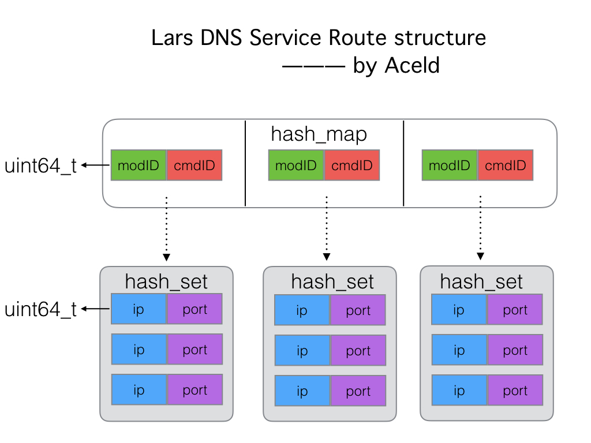

# Lars系统开发

>  (Load balance And Remote service schedule System)


**ChangLog**

| 作者   | 更新内容                 | 更新时间   |
| ------ | ------------------------ | ---------- |
| 刘丹冰 | Add-项目概述             | 2019/9/03  |
| 刘丹冰 | Add-第二章-项目构建      | 2019/9/18  |
| 刘丹冰 | Add-第三章-1-6节 Reactor | 2019/9/22  |
| 刘丹冰 | Add-第三章-7-16节        | 2019/10/15 |
| 刘丹冰 | Add-第四章-第五章        | 2019/10/30 |
| 刘丹冰 | Add-第六章-负载均衡模块  | 2019/11/29 |
| 刘丹冰 | Add-第七章-工具部分      | 2019/12/1  |
| 刘丹冰 | Add-第八章-优化建议      | 2019/12/5  |
|        |                          |            |

[TOC]


# 系统开发环境:

`Linux` : Ubuntu18.04

`protobuf` : libprotoc 3.6.1版本及以上

`mysql`: mysql  Ver 14.14 Distrib 5.7.27 版本及以上

`g++`:  (Ubuntu 7.4.0-1ubuntu1~18.04.1) 7.4.0 版本及以上


# 一、概述：

Lars是一个简单、易用、高性能的服务间远程调用管理、调度、负载均衡系统。

## 1) 优势

1. **性能强悍**

   集群支持千万并发链接，满足用户的海量业务访问需求。

2. **高可用**

   采用集群化部署，支持多可用区的容灾，无缝实时切换。

3. **灵活扩展**

   自动分发，与弹性伸缩无缝集成，灵活扩展用户用于的对外服务能力。

4. **简单易用**

   快速部署、实时生效，支持多种协议，多种调度算法，用户可以高效的管理和调整服务分发策略等。


## 2) 应用场景

### (1)、大型门户网站

​		针对大型门户网站访问量高的特点，通过弹性负载均衡将用户的访问流量均匀的分发到多个后端云服务器上，确保业务快速平稳的运行

#### 优势

- 灵活扩展

  可根据实际的用户访问量，自动扩展负载分发能力

- 高性能

  集群支持高并发连接，满足海量访问量诉求


### (2)、跨可用区同城容灾

​		弹性负载均衡可将流量跨可用区进行分发，建立实时的同城容灾机制，满足银行贸易等企业对系统的高可用性要求。

#### 优势

- 灵活扩展

  可根据实际的用户访问量，自动扩展负载分发能力

- 同城容灾

  支持跨可用区的双活容灾，实现无缝实时切换


### (3)、电商抢购

​		电商业务呈现出较强的潮汐效应。Lars通过和弹性伸缩等服务的无缝集成，自动创建后端云服务器，将流量自动分发到新的云服务器，缓解了促销高峰时期的系统压力。

#### 优势

- 弹性伸缩

  根据业务流量实时创建或移除云服务器

- 高可用

  通过健康检查快速屏蔽异常云服务器，确保业务高可用

- 高性能

  集群支持高并发连接，满足海量访问量诉求

  


## 3) Lars系统总体架构

​		对于一个部门的后台，为增强灵活性，一个服务可以被抽象为命令字：`modid+cmdid`的组合，称为**一个模块**，而这个服务往往有多个服务节点，其所有服务节点的地址集合被称为这个模块下的**路由**，节点地址简称为节点

- `modid`：标识业务的大类，如：“直播列表相关”

- `cmdid`：标识具体服务内容，如：“批量获取直播列表”

  ​	业务代码利用modid,cmdid，就可以调用对应的远程服务一个Lars系统包含一个DNSService，一个Report Service，以及部署于每个服务器的LoadBalance Agent，业务代码通过API与ELB系统进行交互

**API** ：根据自身需要的`modid,cmdid`，向ELB系统获取节点、汇报节点调用结果；提供`C++`、`Java`、`Python`接口

**LoadBalance Agent**：运行于每个服务器上，负责为此服务器上的业务提供节点获取、节点状态汇报、路由管理、负载调度等核心功能

**DNSService** ： 运行于一台服务器上（也可以用LVS部署多实例防单点），负责`modid,cmdid`到节点路由的转换

**Report Service** ： 运行于DNSService同机服务器上，负责收集各`modid,cmdid`下各节点调用状况，可用于观察、报警

`modid,cmdid`数据由`Mysql`管理，具体SQL脚本在`common/sql`路径下
至于`modid,cmdid`的注册、删除可以利用Web端操作MySQL。


如图，每个服务器（虚线）部署了一台LoadBalance Agent，以及多个业务服务

1. 开发者在Web端注册、删除、修改`modid,cmdid`的路由信息，信息被写入到MySQL数据库；
2. 服务器上每个业务biz都把持着自己需要通信的远程服务标识`modid+cmdid`，每个biz都向本机LoadBalance Agent获取远程节点，进而可以和远程目标服务通信，此外业务模块会汇报本次的节点调用结果给LoadBalance Agent；
3. LoadBalance Agent负责路由管理、负载均衡等核心任务，并周期性向DNSService获取最新的路由信息，周期性把各`modid,cmdid`的各节点一段时间内的调用结果传给Report Service
4. DNSService监控MySQL，周期性将最新路由信息加载出来；
5. Report Service将各`modid,cmdid`的各节点一段时间内的调用结果写回到MySQL，方便Web端查看、报警


# 二、项目目录构建

​	首先在一切开始之前，我们应该将最基本的项目架构创建出来。


1）创建Lars代码总目录

```bash
$cd ~/
$mkdir Lars
```


2) 创建一个模块Lars_reactor

lars_reactor是一个网络IO库，是我们要实现的，我们就先以它作为第一个子项目进行构建。

```bash
$mkdir lars_reactor
```

然后在lars_reactor模块下创建一系列文件，如下

```bash
.
├── example
│   └── testlib
│       ├── hello_lars.cpp
│       └── Makefile
├── include
│   └── tcp_server.h
├── lib
├── Makefile
└── src
    └── tcp_server.cpp
```


3）代码编写

> src/tcp_server.cpp

```cpp
#include <iostream>

void lars_hello() 
{
    std::cout <<"lars hello" <<std::endl; 
}
```

> src/tcp_server.h

```cpp
#pragma once

void lars_hello();
```


​	我们要生成一个lib库文件liblreactor.a，来提供一些reactor模块的API接口。

生成liblreactor.a的Makefile如下

> lars_reactor/Makefile

```makefile
TARGET=lib/liblreactor.a
CXX=g++
CFLAGS=-g -O2 -Wall -fPIC -Wno-deprecated

SRC=./src

INC=-I./include
OBJS = $(addsuffix .o, $(basename $(wildcard $(SRC)/*.cpp)))

$(TARGET): $(OBJS)
        mkdir -p lib
        ar cqs $@ $^

%.o: %.cpp
        $(CXX) $(CFLAGS) -c -o $@ $< $(INC)

.PHONY: clean

clean:
        -rm -f src/*.o $(TARGET)
```


4)编译

```bash
$cd lars/lars_reactor/
$make
$g++ -g -O2 -Wall -fPIC -Wno-deprecated -c -o src/tcp_server.o src/tcp_server.cpp -I./include
mkdir -p lib
ar cqs lib/liblreactor.a src/tcp_server.o
```

我们会在lib下得到一个liblreactor.a库文件。


5）调用liblreactor.a接口

```bash
$cd lars/lars_reactor/
$mkdir example/testlib -p
$cd example/testlib/
```


> hello_lars.cpp

```cpp
#include "tcp_server.h"

int main() {

    lars_hello();

    return 0;
}
```


> Makefile

```makefile
CXX=g++
CFLAGS=-g -O2 -Wall -fPIC -Wno-deprecated 

INC=-I../../include
LIB=-L../../lib -llreactor 
OBJS = $(addsuffix .o, $(basename $(wildcard *.cc)))

all:
        $(CXX) -o hello_lars $(CFLAGS)  hello_lars.cpp $(INC) $(LIB)

clean:
        -rm -f *.o hello_lars
```


编译

```bash
$ make
g++ -o hello_lars -g -O2 -Wall -fPIC -Wno-deprecated   hello_lars.cpp -I../../include -L../../lib -llreactor 
```


执行

```cpp
$ ./hello_lars 
lars hello
```


我们现在一个基本的项目目录就构建好了，大致如下

```bash
Lars/
├── lars_reactor
│   ├── example
│   │   └── testlib
│   │       ├── hello_lars
│   │       ├── hello_lars.cpp
│   │       └── Makefile
│   ├── include
│   │   └── tcp_server.h
│   ├── lib
│   │   └── liblreactor.a
│   ├── Makefile
│   └── src
│       ├── tcp_server.cpp
│       └── tcp_server.o
└── README.md
```


# 三、Lars-Reactor服务框架开发


## 1) 框架结构


## 2) Lars Reactor V0.1开发

​	我们首先先完成一个最基本的服务器开发模型，封装一个`tcp_server`类。

> lars_reactor/include/tcp_server.h

```cpp
#pragma once

#include <netinet/in.h>


class tcp_server
{ 
public: 
    //server的构造函数
    tcp_server(const char *ip, uint16_t port); 

    //开始提供创建链接服务
    void do_accept();

    //链接对象释放的析构
    ~tcp_server();

private: 
    int _sockfd; //套接字
    struct sockaddr_in _connaddr; //客户端链接地址
    socklen_t _addrlen; //客户端链接地址长度
}; 

```

​	在tcp_server.cpp中完成基本的功能实现，我们在构造函数里将基本的socket创建服务器编程写完，然后提供一个阻塞的do_accept()方法。

> lars_reactor/src/tcp_server.cpp

```cpp
#include <stdio.h>
#include <stdlib.h>
#include <string.h>
#include <strings.h>

#include <unistd.h>
#include <signal.h>
#include <sys/types.h>          /* See NOTES */
#include <sys/socket.h>
#include <arpa/inet.h>
#include <errno.h>

#include "tcp_server.h"


//server的构造函数
tcp_server::tcp_server(const char *ip, uint16_t port)
{
    bzero(&_connaddr, sizeof(_connaddr));
    
    //忽略一些信号 SIGHUP, SIGPIPE
    //SIGPIPE:如果客户端关闭，服务端再次write就会产生
    //SIGHUP:如果terminal关闭，会给当前进程发送该信号
    if (signal(SIGHUP, SIG_IGN) == SIG_ERR) {
        fprintf(stderr, "signal ignore SIGHUP\n");
    }
    if (signal(SIGPIPE, SIG_IGN) == SIG_ERR) {
        fprintf(stderr, "signal ignore SIGPIPE\n");
    }

    //1. 创建socket
    _sockfd = socket(AF_INET, SOCK_STREAM /*| SOCK_NONBLOCK*/ | SOCK_CLOEXEC, IPPROTO_TCP);
    if (_sockfd == -1) {
        fprintf(stderr, "tcp_server::socket()\n");
        exit(1);
    }

    //2 初始化地址
    struct sockaddr_in server_addr;
    bzero(&server_addr, sizeof(server_addr));
    server_addr.sin_family = AF_INET;
    inet_aton(ip, &server_addr.sin_addr);
    server_addr.sin_port = htons(port);

    //2-1可以多次监听，设置REUSE属性
    int op = 1;
    if (setsockopt(_sockfd, SOL_SOCKET, SO_REUSEADDR, &op, sizeof(op)) < 0) {
        fprintf(stderr, "setsocketopt SO_REUSEADDR\n");
    }

    //3 绑定端口
    if (bind(_sockfd, (const struct sockaddr*)&server_addr, sizeof(server_addr)) < 0) {
        fprintf(stderr, "bind error\n");
        exit(1);
    }

    //4 监听ip端口
    if (listen(_sockfd, 500) == -1) {
        fprintf(stderr, "listen error\n");
        exit(1);
    }
}

//开始提供创建链接服务
void tcp_server::do_accept()
{
    int connfd;    
    while(true) {
        //accept与客户端创建链接
        printf("begin accept\n");
        connfd = accept(_sockfd, (struct sockaddr*)&_connaddr, &_addrlen);
        if (connfd == -1) {
            if (errno == EINTR) {
                fprintf(stderr, "accept errno=EINTR\n");
                continue;
            }
            else if (errno == EMFILE) {
                //建立链接过多，资源不够
                fprintf(stderr, "accept errno=EMFILE\n");
            }
            else if (errno == EAGAIN) {
                fprintf(stderr, "accept errno=EAGAIN\n");
                break;
            }
            else {
                fprintf(stderr, "accept error");
                exit(1);
            }
        }
        else {
            //accept succ!
            //TODO 添加心跳机制
            
            //TODO 消息队列机制
            
            int writed;
            char *data = "hello Lars\n";
            do {
                writed = write(connfd, data, strlen(data)+1);
            } while (writed == -1 && errno == EINTR);

            if (writed > 0) {
                //succ
                printf("write succ!\n");
            }
            if (writed == -1 && errno == EAGAIN) {
                writed = 0; //不是错误，仅返回0表示此时不可继续写
            }
        }
    }
}

//链接对象释放的析构
tcp_server::~tcp_server()
{
    close(_sockfd);
}

```

​	好了，现在回到`lars_reactor`目录下进行编译。

```bash
$~/Lars/lars_reactor/
$make
```

在`lib`下，得到了库文件。

接下来，做一下测试，写一个简单的服务器应用.

```bash
$cd ~/Lars/lars_reactor/example
$mkdir lars_reactor_0.1
$cd lars_reactor_0.1
```


> lars_reactor/example/lars_reactor_0.1/Makefile

```makefile
CXX=g++
CFLAGS=-g -O2 -Wall -fPIC -Wno-deprecated 

INC=-I../../include
LIB=-L../../lib -llreactor 
OBJS = $(addsuffix .o, $(basename $(wildcard *.cc)))

all:
	$(CXX) -o lars_reactor $(CFLAGS)  lars_reactor.cpp $(INC) $(LIB)

clean:
	-rm -f *.o lars_reactor

```

>lars_reactor/example/lars_reactor_0.1/lars_reactor.cpp 

```cpp
#include "tcp_server.h"

int main() {

    tcp_server server("127.0.0.1", 7777);
    server.do_accept();

    return 0;
}
```

​	接下来，我们make进行编译，编译的时候会指定链接我们刚才生成的liblreactor.a库。

服务端:

```bash
$ ./lars_reactor 
begin accept

```

客户端:

```bash
$nc 127.0.0.1 7777
hello Lars
```

得到了服务器返回的结果，那么我们最开始的0.1版本就已经搭建完了，但是实际上这并不是一个并发服务器，万里长征才刚刚开始而已。


## 3) 内存管理与buffer封装

​	在完成网络框架之前，我们先把必须的内存管理和buffer的封装完成。

这里我们先创建一个`io_buf`类，主要用来封装基本的buffer结构。然后用一个`buf_pool`来管理全部的buffer集合。

### 3.1 io_buf 内存块

> lars_reactor/include/io_buf.h

```h
#pragma once

/*
    定义一个 buffer存放数据的结构
 * */
class io_buf {
public:
    //构造，创建一个io_buf对象
    io_buf(int size);

    //清空数据
    void clear();

    //将已经处理过的数据，清空,将未处理的数据提前至数据首地址
    void adjust();

    //将其他io_buf对象数据考本到自己中
    void copy(const io_buf *other);

    //处理长度为len的数据，移动head和修正length
    void pop(int len);

    //如果存在多个buffer，是采用链表的形式链接起来
    io_buf *next;

    //当前buffer的缓存容量大小
    int capacity;
    //当前buffer有效数据长度
    int length;
    //未处理数据的头部位置索引
    int head;
    //当前io_buf所保存的数据地址
    char *data;
};
```


对应的`io_buf`实现的文件,如下

> lars_reactor/src/io_buf.cpp

```cpp
#include <stdio.h>
#include <assert.h>
#include <string.h>
#include "io_buf.h"

//构造，创建一个io_buf对象
io_buf::io_buf(int size):
capacity(size), 
length(0),
head(0),
next(NULL) 
{
   data = new char[size];
   assert(data);
}

//清空数据
void io_buf::clear() {
    length = head = 0;
}

//将已经处理过的数据，清空,将未处理的数据提前至数据首地址
void io_buf::adjust() {
    if (head != 0) {
        if (length != 0) {
            memmove(data, data+head, length);
        }
        head = 0;
    }
}

//将其他io_buf对象数据考本到自己中
void io_buf::copy(const io_buf *other) {
    memcpy(data, other->data + other->head, other->length);
    head = 0;
    length = other->length;
}

//处理长度为len的数据，移动head和修正length
void io_buf::pop(int len) {
    length -= len;
    head += len;
}
```

​	这里主要要注意io_buf的两个索引值length和head，一个是当前buffer的有效内存长度，haed则为可用的有效长度首数据位置。 capacity是io_buf的总容量空间大小。

​	所以每次`pop()`则是弹出已经处理了多少，那么buffer剩下的内存就接下来需要处理的。

​	然而`adjust()`则是从新重置io_buf,将所有数据都重新变成未处理状态。

​	`clear()`则是将length和head清0，这里没有提供`delete`真是删除物理内存的方法，因为这里的buffer设计是不需要清理的，接下来是用一个`buf_pool`来管理全部未被使用的`io_buf`集合。而且`buf_pool`的管理的内存是程序开始预开辟的，不会做清理工作.

### 3.2 buf_pool 内存池

​	接下来我们看看内存池的设计.

> lars_reactor/include/buf_pool.h

```h
#pragma once

#include <ext/hash_map>
#include "io_buf.h"

typedef __gnu_cxx::hash_map<int, io_buf*> pool_t;

enum MEM_CAP {
    m4K     = 4096,
    m16K    = 16384,
    m64K    = 65536,
    m256K   = 262144,
    m1M     = 1048576,
    m4M     = 4194304,
    m8M     = 8388608
};


//总内存池最大限制 单位是Kb 所以目前限制是 5GB
#define EXTRA_MEM_LIMIT (5U *1024 *1024) 

/*
 *  定义buf内存池
 *  设计为单例
 * */
class buf_pool 
{
public:
    //初始化单例对象
    static void init() {
        //创建单例
        _instance = new buf_pool();
    }

    //获取单例方法
    static buf_pool *instance() {
        //保证init方法在这个进程执行中 只被执行一次
        pthread_once(&_once, init);
        return _instance;
    }

    //开辟一个io_buf
    io_buf *alloc_buf(int N);
    io_buf *alloc_buf() { return alloc_buf(m4K); }


    //重置一个io_buf
    void revert(io_buf *buffer);

    
private:
    buf_pool();

    //拷贝构造私有化
    buf_pool(const buf_pool&);
    const buf_pool& operator=(const buf_pool&);

    //所有buffer的一个map集合句柄
    pool_t _pool;

    //总buffer池的内存大小 单位为KB
    uint64_t _total_mem;

    //单例对象
    static buf_pool *_instance;

    //用于保证创建单例的init方法只执行一次的锁
    static pthread_once_t _once;

    //用户保护内存池链表修改的互斥锁
    static pthread_mutex_t _mutex;
};

```

​		首先`buf_pool`采用单例的方式进行设计。因为系统希望仅有一个内存池管理模块。这里内存池用一个`__gnu_cxx::hash_map<int, io_buf*>`的map类型进行管理，其中key是每个组内存的空间容量，参考

```cpp
enum MEM_CAP {
    m4K     = 4096,
    m16K    = 16384,
    m64K    = 65536,
    m256K   = 262144,
    m1M     = 1048576,
    m4M     = 4194304,
    m8M     = 8388608
};
```

​		其中每个key下面挂在一个`io_buf`链表。而且`buf_pool`预先会给map下的每个key的内存组开辟好一定数量的内存块。然后上层用户在使用的时候每次取出一个内存块，就会将该内存块从该内存组摘掉。当然使用完就放回来。如果不够使用会额外开辟，也有最大的内存限制，在宏`EXTRA_MEM_LIMIT`中。

具体的`buf_pool`实现如下:

> lars_reactor/src/buf_pool.cpp

```cpp
#include "buf_pool.h"
#include <assert.h>


//单例对象
buf_pool * buf_pool::_instance = NULL;

//用于保证创建单例的init方法只执行一次的锁
pthread_once_t buf_pool::_once = PTHREAD_ONCE_INIT;


//用户保护内存池链表修改的互斥锁
pthread_mutex_t buf_pool::_mutex = PTHREAD_MUTEX_INITIALIZER;


//构造函数 主要是预先开辟一定量的空间
//这里buf_pool是一个hash，每个key都是不同空间容量
//对应的value是一个io_buf集合的链表
//buf_pool -->  [m4K] -- io_buf-io_buf-io_buf-io_buf...
//              [m16K] -- io_buf-io_buf-io_buf-io_buf...
//              [m64K] -- io_buf-io_buf-io_buf-io_buf...
//              [m256K] -- io_buf-io_buf-io_buf-io_buf...
//              [m1M] -- io_buf-io_buf-io_buf-io_buf...
//              [m4M] -- io_buf-io_buf-io_buf-io_buf...
//              [m8M] -- io_buf-io_buf-io_buf-io_buf...
buf_pool::buf_pool():_total_mem(0)
{
    io_buf *prev; 
    
    //----> 开辟4K buf 内存池
    _pool[m4K] = new io_buf(m4K);
    if (_pool[m4K] == NULL) {
        fprintf(stderr, "new io_buf m4K error");
        exit(1);
    }

    prev = _pool[m4K];
    //4K的io_buf 预先开辟5000个，约20MB供开发者使用
    for (int i = 1; i < 5000; i ++) {
        prev->next = new io_buf(m4K);
        if (prev->next == NULL) {
            fprintf(stderr, "new io_buf m4K error");
            exit(1);
        }
        prev = prev->next;
    }
    _total_mem += 4 * 5000;


    //----> 开辟16K buf 内存池
    _pool[m16K] = new io_buf(m16K);
    if (_pool[m16K] == NULL) {
        fprintf(stderr, "new io_buf m16K error");
        exit(1);
    }

    prev = _pool[m16K];
    //16K的io_buf 预先开辟1000个，约16MB供开发者使用
    for (int i = 1; i < 1000; i ++) {
        prev->next = new io_buf(m16K);
        if (prev->next == NULL) {
            fprintf(stderr, "new io_buf m16K error");
            exit(1);
        }
        prev = prev->next;
    }
    _total_mem += 16 * 1000;


    //----> 开辟64K buf 内存池
    _pool[m64K] = new io_buf(m64K);
    if (_pool[m64K] == NULL) {
        fprintf(stderr, "new io_buf m64K error");
        exit(1);
    }

    prev = _pool[m64K];
    //64K的io_buf 预先开辟500个，约32MB供开发者使用
    for (int i = 1; i < 500; i ++) {
        prev->next = new io_buf(m64K);
        if (prev->next == NULL) {
            fprintf(stderr, "new io_buf m64K error");
            exit(1);
        }
        prev = prev->next;
    }
    _total_mem += 64 * 500;


    //----> 开辟256K buf 内存池
    _pool[m256K] = new io_buf(m256K);
    if (_pool[m256K] == NULL) {
        fprintf(stderr, "new io_buf m256K error");
        exit(1);
    }

    prev = _pool[m256K];
    //256K的io_buf 预先开辟200个，约50MB供开发者使用
    for (int i = 1; i < 200; i ++) {
        prev->next = new io_buf(m256K);
        if (prev->next == NULL) {
            fprintf(stderr, "new io_buf m256K error");
            exit(1);
        }
        prev = prev->next;
    }
    _total_mem += 256 * 200;


    //----> 开辟1M buf 内存池
    _pool[m1M] = new io_buf(m1M);
    if (_pool[m1M] == NULL) {
        fprintf(stderr, "new io_buf m1M error");
        exit(1);
    }

    prev = _pool[m1M];
    //1M的io_buf 预先开辟50个，约50MB供开发者使用
    for (int i = 1; i < 50; i ++) {
        prev->next = new io_buf(m1M);
        if (prev->next == NULL) {
            fprintf(stderr, "new io_buf m1M error");
            exit(1);
        }
        prev = prev->next;
    }
    _total_mem += 1024 * 50;


    //----> 开辟4M buf 内存池
    _pool[m4M] = new io_buf(m4M);
    if (_pool[m4M] == NULL) {
        fprintf(stderr, "new io_buf m4M error");
        exit(1);
    }

    prev = _pool[m4M];
    //4M的io_buf 预先开辟20个，约80MB供开发者使用
    for (int i = 1; i < 20; i ++) {
        prev->next = new io_buf(m4M);
        if (prev->next == NULL) {
            fprintf(stderr, "new io_buf m4M error");
            exit(1);
        }
        prev = prev->next;
    }
    _total_mem += 4096 * 20;


    //----> 开辟8M buf 内存池
    _pool[m8M] = new io_buf(m8M);
    if (_pool[m8M] == NULL) {
        fprintf(stderr, "new io_buf m8M error");
        exit(1);
    }

    prev = _pool[m8M];
    //8M的io_buf 预先开辟10个，约80MB供开发者使用
    for (int i = 1; i < 10; i ++) {
        prev->next = new io_buf(m8M);
        if (prev->next == NULL) {
            fprintf(stderr, "new io_buf m8M error");
            exit(1);
        }
        prev = prev->next;
    }
    _total_mem += 8192 * 10;
}


//开辟一个io_buf
//1 如果上层需要N个字节的大小的空间，找到与N最接近的buf hash组，取出，
//2 如果该组已经没有节点使用，可以额外申请
//3 总申请长度不能够超过最大的限制大小 EXTRA_MEM_LIMIT
//4 如果有该节点需要的内存块，直接取出，并且将该内存块从pool摘除
io_buf *buf_pool::alloc_buf(int N) 
{
    //1 找到N最接近哪hash 组
    int index;
    if (N <= m4K) {
        index = m4K;
    }
    else if (N <= m16K) {
        index = m16K;
    }
    else if (N <= m64K) {
        index = m64K;
    }
    else if (N <= m256K) {
        index = m256K;
    }
    else if (N <= m1M) {
        index = m1M;
    }
    else if (N <= m4M) {
        index = m4M;
    }
    else if (N <= m8M) {
        index = m8M;
    }
    else {
        return NULL;
    }


    //2 如果该组已经没有，需要额外申请，那么需要加锁保护
    pthread_mutex_lock(&_mutex);
    if (_pool[index] == NULL) {
        if (_total_mem + index/1024 >= EXTRA_MEM_LIMIT) {
            //当前的开辟的空间已经超过最大限制
            fprintf(stderr, "already use too many memory!\n");
            exit(1);
        }

        io_buf *new_buf = new io_buf(index);
        if (new_buf == NULL) {
            fprintf(stderr, "new io_buf error\n");
            exit(1);
        }
        _total_mem += index/1024;
        pthread_mutex_unlock(&_mutex);
        return new_buf;
    }

    //3 从pool中摘除该内存块
    io_buf *target = _pool[index];
    _pool[index] = target->next;
    pthread_mutex_unlock(&_mutex);
    
    target->next = NULL;
    
    return target;
}


//重置一个io_buf,将一个buf 上层不再使用，或者使用完成之后，需要将该buf放回pool中
void buf_pool::revert(io_buf *buffer)
{
    //每个buf的容量都是固定的 在hash的key中取值
    int index = buffer->capacity;
    //重置io_buf中的内置位置指针
    buffer->length = 0;
    buffer->head = 0;

    pthread_mutex_lock(&_mutex);
    //找到对应的hash组 buf首届点地址
    assert(_pool.find(index) != _pool.end());

    //将buffer插回链表头部
    buffer->next = _pool[index];
    _pool[index] = buffer;

    pthread_mutex_unlock(&_mutex);
}
```


​	其中，`buf_pool`构造函数中实现了内存池的hash预开辟内存工作，具体的数据结构如下

```cpp
//buf_pool -->  [m4K] --> io_buf-io_buf-io_buf-io_buf...
//              [m16K] --> io_buf-io_buf-io_buf-io_buf...
//              [m64K] --> io_buf-io_buf-io_buf-io_buf...
//              [m256K] --> io_buf-io_buf-io_buf-io_buf...
//              [m1M] --> io_buf-io_buf-io_buf-io_buf...
//              [m4M] --> io_buf-io_buf-io_buf-io_buf...
//              [m8M] --> io_buf-io_buf-io_buf-io_buf...
```

​	`alloc_buf()`方法，是调用者从内存池中取出一块内存，如果最匹配的内存块存在，则返回，并将该块内存从buf_pool中摘除掉，如果没有则开辟一个内存出来。	 `revert()`方法则是将已经使用完的`io_buf`重新放回`buf_pool`中。

### 3.3 读写buffer机制

​		那么接下来我们就需要实现一个专门用来读(输入)数据的`input_buf`和专门用来写(输出)数据的`output_buf`类了。由于这两个人都应该拥有一些`io_buf`的特性，所以我们先定义一个基础的父类`reactor_buf`。

#### A. reactor_buf类

> lars_reactor/include/reactor_buf.h

```h
#pragma once
#include "io_buf.h"
#include "buf_pool.h"
#include <assert.h>
#include <unistd.h>


/*
 * 给业务层提供的最后tcp_buffer结构
 * */
class reactor_buf {
public:
    reactor_buf();
    ~reactor_buf();

    const int length() const;
    void pop(int len);
    void clear();

protected:
    io_buf *_buf;
};


```

​		这个的作用就是将io_buf作为自己的一个成员，然后做了一些包装。具体方法实现如下。

> lars_reactor/src/reactor.cpp

```cpp
#include "reactor_buf.h"
#include <sys/ioctl.h>
#include <string.h>

reactor_buf::reactor_buf() 
{
    _buf = NULL;
}

reactor_buf::~reactor_buf()
{
    clear();
}

const int reactor_buf::length() const 
{
    return _buf != NULL? _buf->length : 0;
}

void reactor_buf::pop(int len) 
{
    assert(_buf != NULL && len <= _buf->length);

    _buf->pop(len);

    //当此时_buf的可用长度已经为0
    if(_buf->length == 0) {
        //将_buf重新放回buf_pool中
        buf_pool::instance()->revert(_buf);
        _buf = NULL;
    }
}

void reactor_buf::clear()
{
    if (_buf != NULL)  {
        //将_buf重新放回buf_pool中
        buf_pool::instance()->revert(_buf);
        _buf = NULL;
    }
}
```


#### B. input_buf类

​	接下来就可以集成`reactor_buf`类实现`input_buf`类的设计了。

>  lars_reactor/include/reactor_buf.h

```h
//读(输入) 缓存buffer
class input_buf : public reactor_buf 
{
public:
    //从一个fd中读取数据到reactor_buf中
    int read_data(int fd);

    //取出读到的数据
    const char *data() const;

    //重置缓冲区
    void adjust();
};
```

​		其中data()方法即取出已经读取的数据，adjust()含义和`io_buf`含义一致。主要是`read_data()`方法。具体实现如下。


> lars_reactor/src/reactor.cpp

```cpp
//从一个fd中读取数据到reactor_buf中
int input_buf::read_data(int fd)
{
    int need_read;//硬件有多少数据可以读

    //一次性读出所有的数据
    //需要给fd设置FIONREAD,
    //得到read缓冲中有多少数据是可以读取的
    if (ioctl(fd, FIONREAD, &need_read) == -1) {
        fprintf(stderr, "ioctl FIONREAD\n");
        return -1;
    }

    
    if (_buf == NULL) {
        //如果io_buf为空,从内存池申请
        _buf = buf_pool::instance()->alloc_buf(need_read);
        if (_buf == NULL) {
            fprintf(stderr, "no idle buf for alloc\n");
            return -1;
        }
    }
    else {
        //如果io_buf可用，判断是否够存
        assert(_buf->head == 0);
        if (_buf->capacity - _buf->length < (int)need_read) {
            //不够存，冲内存池申请
            io_buf *new_buf = buf_pool::instance()->alloc_buf(need_read+_buf->length);
            if (new_buf == NULL) {
                fprintf(stderr, "no ilde buf for alloc\n");
                return -1;
            }
            //将之前的_buf的数据考到新申请的buf中
            new_buf->copy(_buf);
            //将之前的_buf放回内存池中
            buf_pool::instance()->revert(_buf);
            //新申请的buf成为当前io_buf
            _buf = new_buf;
        }
    }

    //读取数据
    int already_read = 0;
    do { 
        //读取的数据拼接到之前的数据之后
        if(need_read == 0) {
            //可能是read阻塞读数据的模式，对方未写数据
            already_read = read(fd, _buf->data + _buf->length, m4K);
        } else {
            already_read = read(fd, _buf->data + _buf->length, need_read);
        }
    } while (already_read == -1 && errno == EINTR); //systemCall引起的中断 继续读取
    if (already_read > 0)  {
        if (need_read != 0) {
            assert(already_read == need_read);
        }
        _buf->length += already_read;
    }

    return already_read;
}

//取出读到的数据
const char *input_buf::data() const 
{
    return _buf != NULL ? _buf->data + _buf->head : NULL;
}

//重置缓冲区
void input_buf::adjust()
{
    if (_buf != NULL) {
        _buf->adjust();
    }
}

```


#### C. output_buf类

​	接下来就可以集成`reactor_buf`类实现`output_buf`类的设计了。

> lars_reactor/include/reactor_buf.h

```h
//写(输出)  缓存buffer
class output_buf : public reactor_buf 
{
public:
    //将一段数据 写到一个reactor_buf中
    int send_data(const char *data, int datalen);

    //将reactor_buf中的数据写到一个fd中
    int write2fd(int fd);
};

```

​	`send_data()`方法主要是将数据写到`io_buf`中，实际上并没有做真正的写操作。而是当调用`write2fd`方法时，才会将`io_buf`的数据写到对应的fd中。send_data是做一些buf内存块的申请等工作。具体实现如下

> lars_reactor/src/reactor.cpp

```cpp
//将一段数据 写到一个reactor_buf中
int output_buf::send_data(const char *data, int datalen)
{
    if (_buf == NULL) {
        //如果io_buf为空,从内存池申请
        _buf = buf_pool::instance()->alloc_buf(datalen);
        if (_buf == NULL) {
            fprintf(stderr, "no idle buf for alloc\n");
            return -1;
        }
    }
    else {
        //如果io_buf可用，判断是否够存
        assert(_buf->head == 0);
        if (_buf->capacity - _buf->length < datalen) {
            //不够存，冲内存池申请
            io_buf *new_buf = buf_pool::instance()->alloc_buf(datalen+_buf->length);
            if (new_buf == NULL) {
                fprintf(stderr, "no ilde buf for alloc\n");
                return -1;
            }
            //将之前的_buf的数据考到新申请的buf中
            new_buf->copy(_buf);
            //将之前的_buf放回内存池中
            buf_pool::instance()->revert(_buf);
            //新申请的buf成为当前io_buf
            _buf = new_buf;
        }
    }

    //将data数据拷贝到io_buf中,拼接到后面
    memcpy(_buf->data + _buf->length, data, datalen);
    _buf->length += datalen;

    return 0;
}

//将reactor_buf中的数据写到一个fd中
int output_buf::write2fd(int fd)
{
    assert(_buf != NULL && _buf->head == 0);

    int already_write = 0;

    do { 
        already_write = write(fd, _buf->data, _buf->length);
    } while (already_write == -1 && errno == EINTR); //systemCall引起的中断，继续写


    if (already_write > 0) {
        //已经处理的数据清空
        _buf->pop(already_write);
        //未处理数据前置，覆盖老数据
        _buf->adjust();
    }

    //如果fd非阻塞，可能会得到EAGAIN错误
    if (already_write == -1 && errno == EAGAIN) {
        already_write = 0;//不是错误，仅仅返回0，表示目前是不可以继续写的
    }

    return already_write;
}

```

​		现在我们已经完成了内存管理及读写buf机制的实现，接下来就要简单的测试一下，用我们之前的V0.1版本的reactor server来测试。

### 3.4 完成Lars Reactor V0.2开发

#### A. 修改tcp_server

​		主要修正do_accept()方法，加上reactor_buf机制.

> lars_reactor/src/tcp_server.cpp

```cpp
#include <stdio.h>
#include <stdlib.h>
#include <string.h>
#include <strings.h>

#include <unistd.h>
#include <signal.h>
#include <sys/types.h>          /* See NOTES */
#include <sys/socket.h>
#include <arpa/inet.h>
#include <errno.h>

#include "tcp_server.h"
#include "reactor_buf.h"


//server的构造函数
tcp_server::tcp_server(const char *ip, uint16_t port)
{
    //...
}

//开始提供创建链接服务
void tcp_server::do_accept()
{
    int connfd;    
    while(true) {
        //accept与客户端创建链接
        printf("begin accept\n");
        connfd = accept(_sockfd, (struct sockaddr*)&_connaddr, &_addrlen);
        if (connfd == -1) {
            if (errno == EINTR) {
                fprintf(stderr, "accept errno=EINTR\n");
                continue;
            }
            else if (errno == EMFILE) {
                //建立链接过多，资源不够
                fprintf(stderr, "accept errno=EMFILE\n");
            }
            else if (errno == EAGAIN) {
                fprintf(stderr, "accept errno=EAGAIN\n");
                break;
            }
            else {
                fprintf(stderr, "accept error");
                exit(1);
            }
        }
        else {
            //accept succ!
            
            int ret = 0;
            input_buf ibuf;
            output_buf obuf;

            char *msg = NULL;
            int msg_len = 0;
            do { 
                ret = ibuf.read_data(connfd);
                if (ret == -1) {
                    fprintf(stderr, "ibuf read_data error\n");
                    break;
                }
                printf("ibuf.length() = %d\n", ibuf.length());

                
                //将读到的数据放在msg中
                msg_len = ibuf.length();
                msg = (char*)malloc(msg_len);
                bzero(msg, msg_len);
                memcpy(msg, ibuf.data(), msg_len);
                ibuf.pop(msg_len);
                ibuf.adjust();

                printf("recv data = %s\n", msg);

                //回显数据
                obuf.send_data(msg, msg_len);
                while(obuf.length()) {
                    int write_ret = obuf.write2fd(connfd);
                    if (write_ret == -1) {
                        fprintf(stderr, "write connfd error\n");
                        return;
                    }
                    else if(write_ret == 0) {
                        //不是错误，表示此时不可写
                        break;
                    }
                }
                 

                free(msg);
                    
            } while (ret != 0);     


            //Peer is closed
            close(connfd);
        }
    }
}
```

编译生成新的liblreactor.a

```bash
$cd lars_reactor/
$make
g++ -g -O2 -Wall -fPIC -Wno-deprecated -c -o src/tcp_server.o src/tcp_server.cpp -I./include
g++ -g -O2 -Wall -fPIC -Wno-deprecated -c -o src/io_buf.o src/io_buf.cpp -I./include
g++ -g -O2 -Wall -fPIC -Wno-deprecated -c -o src/reactor_buf.o src/reactor_buf.cpp -I./include
g++ -g -O2 -Wall -fPIC -Wno-deprecated -c -o src/buf_pool.o src/buf_pool.cpp -I./include
mkdir -p lib
ar cqs lib/liblreactor.a src/tcp_server.o src/io_buf.o src/reactor_buf.o src/buf_pool.o

```


#### B. 编译V0.2 server APP

​		我们将lars_reactor/example/lars_reactor_0.1 的代码复制一份到 lars_reactor/example/lars_reactor_0.2中。

由于我们这里使用了pthread库，所以在lars_reactor_0.2的Makefile文件要加上pthread库的关联

> lars_reactor/example/lars_reactor_0.2/Makefile

```makefile
CXX=g++
CFLAGS=-g -O2 -Wall -fPIC -Wno-deprecated 

INC=-I../../include
LIB=-L../../lib -llreactor -lpthread
OBJS = $(addsuffix .o, $(basename $(wildcard *.cc)))

all:
	$(CXX) -o lars_reactor $(CFLAGS)  lars_reactor.cpp $(INC) $(LIB)

clean:
	-rm -f *.o lars_reactor
```

编译在lars_reactor/example/lars_reactor_0.2/

```bash
$ cd lars_reactor/example/lars_reactor_0.2/
$ make
g++ -o lars_reactor -g -O2 -Wall -fPIC -Wno-deprecated   lars_reactor.cpp -I../../include -L../../lib -llreactor  -lpthread
```

#### C. 测试

启动server

```bash
$ ./lars_reactor 
begin accept
```


启动client	

```bash
$ nc 127.0.0.1 7777
```

客户端输入 文字，效果如下：


服务端：

```bash
ibuf.length() = 21
recv data = hello lars, By Aceld
```


客户端：

```bash
$ nc 127.0.0.1 7777
hello lars, By Aceld
hello lars, By Aceld
```

​	ok!现在我们的读写buffer机制已经成功的集成到我们的lars网络框架中了。


## 4) 事件触发event_loop

​		接下来我们要尝试添加多路IO的处理机制，当然linux的平台下， 最优的选择就是使用epoll来做，但是用原生的epoll实际上编程起来扩展性不是很强，那么我们就需要封装一套IO事件处理机制。

### 4.1 io_event基于IO事件封装

​		我们首先定义一个IO事件类来包括一个时间需要拥有的基本成员信息.

> lars_reactor/include/event_base.h

```cpp
#pragma once
/*
 * 定义一些IO复用机制或者其他异常触发机制的事件封装
 *
 * */

class event_loop;

//IO事件触发的回调函数
typedef void io_callback(event_loop *loop, int fd, void *args);

/*
 * 封装一次IO触发实现 
 * */
struct io_event 
{
    		 io_event():read_callback(NULL),write_callback(NULL),rcb_args(NULL),wcb_args(NULL) {}

    int mask; //EPOLLIN EPOLLOUT
    io_callback *read_callback; //EPOLLIN事件 触发的回调 
    io_callback *write_callback;//EPOLLOUT事件 触发的回调
    void *rcb_args; //read_callback的回调函数参数
    void *wcb_args; //write_callback的回调函数参数
};
```

​		一个`io_event`对象应该包含 一个epoll的事件标识`EPOLLIN/EPOLLOUT`,和对应事件的处理函数`read_callback`,`write_callback`。他们都应该是`io_callback`类型。然后对应的函数形参。

### 4.2 event_loop事件循环处理机制

​		接下来我们就要通过event_loop类来实现io_event的基本增删操作，放在原生的`epoll`堆中。

> lars_reactor/include/event_loop.h

```h
#pragma once
/*
 *
 * event_loop事件处理机制
 *
 * */
#include <sys/epoll.h>
#include <ext/hash_map>
#include <ext/hash_set>
#include "event_base.h"

#define MAXEVENTS 10

// map: fd->io_event 
typedef __gnu_cxx::hash_map<int, io_event> io_event_map;
//定义指向上面map类型的迭代器
typedef __gnu_cxx::hash_map<int, io_event>::iterator io_event_map_it;
//全部正在监听的fd集合
typedef __gnu_cxx::hash_set<int> listen_fd_set;

class event_loop 
{
public:
    //构造，初始化epoll堆
    event_loop();

    //阻塞循环处理事件
    void event_process();

    //添加一个io事件到loop中
    void add_io_event(int fd, io_callback *proc, int mask, void *args=NULL);

    //删除一个io事件从loop中
    void del_io_event(int fd);

    //删除一个io事件的EPOLLIN/EPOLLOUT
    void del_io_event(int fd, int mask);
    
private:
    int _epfd; //epoll fd

    //当前event_loop 监控的fd和对应事件的关系
    io_event_map _io_evs;

    //当前event_loop 一共哪些fd在监听
    listen_fd_set listen_fds;

    //一次性最大处理的事件
    struct epoll_event _fired_evs[MAXEVENTS];

};
```

**属性**:

`_epfd`:是epoll原生堆的fd。

`_io_evs`:是一个hash_map对象，主要是方便我们管理`fd`<—>`io_event`的对应关系，方便我们来查找和处理。

`_listen_fds`:记录目前一共有多少个fd正在本我们的`event_loop`机制所监控.

`_fried_evs`:已经通过epoll_wait返回的被激活需要上层处理的fd集合.

**方法**:

`event_loop()`：构造函数，主要初始化epoll.

`event_process()`:永久阻塞，等待触发的事件，去调用对应的函数callback方法。

`add_io_event()`:绑定一个fd和一个`io_event`的关系，并添加对应的事件到`event_loop`中。

`del_io_event()`:从`event_loop`删除该事件。


​		具体实现方法如下：

> lars_reactor/src/event_loop.cpp

```cpp
#include "event_loop.h"
#include <assert.h>

//构造，初始化epoll堆
event_loop::event_loop() 
{
    //flag=0 等价于epll_craete
    _epfd = epoll_create1(0);
    if (_epfd == -1) {
        fprintf(stderr, "epoll_create error\n");
        exit(1);
    }
}


//阻塞循环处理事件
void event_loop::event_process()
{
    while (true) {
        io_event_map_it ev_it;

        int nfds = epoll_wait(_epfd, _fired_evs, MAXEVENTS, 10);
        for (int i = 0; i < nfds; i++) {
            //通过触发的fd找到对应的绑定事件
            ev_it = _io_evs.find(_fired_evs[i].data.fd);
            assert(ev_it != _io_evs.end());

            io_event *ev = &(ev_it->second);

            if (_fired_evs[i].events & EPOLLIN) {
                //读事件，掉读回调函数
                void *args = ev->rcb_args;
                ev->read_callback(this, _fired_evs[i].data.fd, args);
            }
            else if (_fired_evs[i].events & EPOLLOUT) {
                //写事件，掉写回调函数
                void *args = ev->wcb_args; 
                ev->write_callback(this, _fired_evs[i].data.fd, args);
            }
            else if (_fired_evs[i].events &(EPOLLHUP|EPOLLERR)) {
                //水平触发未处理，可能会出现HUP事件，正常处理读写，没有则清空
                if (ev->read_callback != NULL) {
                    void *args = ev->rcb_args;
                    ev->read_callback(this, _fired_evs[i].data.fd, args);
                }
                else if (ev->write_callback != NULL) {
                    void *args = ev->wcb_args;
                    ev->write_callback(this, _fired_evs[i].data.fd, args);
                }
                else {
                    //删除
                    fprintf(stderr, "fd %d get error, delete it from epoll\n", _fired_evs[i].data.fd);
                    this->del_io_event(_fired_evs[i].data.fd);
                }
            }

        }
    }
}

/*
 * 这里我们处理的事件机制是
 * 如果EPOLLIN 在mask中， EPOLLOUT就不允许在mask中
 * 如果EPOLLOUT 在mask中， EPOLLIN就不允许在mask中
 * 如果想注册EPOLLIN|EPOLLOUT的事件， 那么就调用add_io_event() 方法两次来注册。
 * */

//添加一个io事件到loop中
void event_loop::add_io_event(int fd, io_callback *proc, int mask, void *args)
{
    int final_mask;
    int op;

    //1 找到当前fd是否已经有事件
    io_event_map_it it = _io_evs.find(fd);
    if (it == _io_evs.end()) {
        //2 如果没有操作动作就是ADD
        //没有找到
        final_mask = mask;    
        op = EPOLL_CTL_ADD;
    }
    else {
        //3 如果有操作董酒是MOD
        //添加事件标识位
        final_mask = it->second.mask | mask;
        op = EPOLL_CTL_MOD;
    }

    //4 注册回调函数
    if (mask & EPOLLIN) {
        //读事件回调函数注册
        _io_evs[fd].read_callback = proc;
        _io_evs[fd].rcb_args = args;
    }
    else if (mask & EPOLLOUT) {
        _io_evs[fd].write_callback = proc;
        _io_evs[fd].wcb_args = args;
    }
    
    //5 epoll_ctl添加到epoll堆里
    _io_evs[fd].mask = final_mask;
    //创建原生epoll事件
    struct epoll_event event;
    event.events = final_mask;
    event.data.fd = fd;
    if (epoll_ctl(_epfd, op, fd, &event) == -1) {
        fprintf(stderr, "epoll ctl %d error\n", fd);
        return;
    }

    //6 将fd添加到监听集合中
    listen_fds.insert(fd);
}

//删除一个io事件从loop中
void event_loop::del_io_event(int fd)
{
    //将事件从_io_evs删除
    _io_evs.erase(fd);

    //将fd从监听集合中删除
    listen_fds.erase(fd);

    //将fd从epoll堆删除
    epoll_ctl(_epfd, EPOLL_CTL_DEL, fd, NULL);
}

//删除一个io事件的EPOLLIN/EPOLLOUT
void event_loop::del_io_event(int fd, int mask)
{
    //如果没有该事件，直接返回
    io_event_map_it it = _io_evs.find(fd);
    if (it == _io_evs.end()) {
        return ;
    }

    int &o_mask = it->second.mask;
    //修正mask
    o_mask = o_mask & (~mask);
    
    if (o_mask == 0) {
        //如果修正之后 mask为0，则删除
        this->del_io_event(fd);
    }
    else {
        //如果修正之后，mask非0，则修改
        struct epoll_event event;
        event.events = o_mask;
        event.data.fd = fd;
        epoll_ctl(_epfd, EPOLL_CTL_MOD, fd, &event);
    }
}
```

​	这里`del_io_event`提供两个重载，一个是直接删除事件，一个是修正事件。

### 4.3 Reactor集成event_loop机制

​		好了，那么接下来，就让让Lars Reactor框架集成`event_loop`机制。

首先简单修正一个`tcp_server.cpp`文件，对之前的`do_accept()`的调度时机做一下修正。

	1. 在`tcp_server`成员新增`event_loop`成员。

> lars_reactor/include/tcp_server.h

```h
#pragma once

#include <netinet/in.h>
#include "event_loop.h"


class tcp_server
{ 
public: 
    //server的构造函数
    tcp_server(event_loop* loop, const char *ip, uint16_t port); 

    //开始提供创建链接服务
    void do_accept();

    //链接对象释放的析构
    ~tcp_server();

private: 
    int _sockfd; //套接字
    struct sockaddr_in _connaddr; //客户端链接地址
    socklen_t _addrlen; //客户端链接地址长度

  	// ============= 新增 ======================
    //event_loop epoll事件机制
    event_loop* _loop;
  	// ============= 新增 ======================
}; 
```


2. 构造函数在创建完listen fd之后，添加accept事件。

> lars_reactor/src/tcp_server.cpp

```cpp
//listen fd 客户端有新链接请求过来的回调函数
void accept_callback(event_loop *loop, int fd, void *args)
{
    tcp_server *server = (tcp_server*)args;
    server->do_accept();
}

//server的构造函数
tcp_server::tcp_server(event_loop *loop, const char *ip, uint16_t port)
{
    bzero(&_connaddr, sizeof(_connaddr));
    
    //忽略一些信号 SIGHUP, SIGPIPE
    //SIGPIPE:如果客户端关闭，服务端再次write就会产生
    //SIGHUP:如果terminal关闭，会给当前进程发送该信号
    if (signal(SIGHUP, SIG_IGN) == SIG_ERR) {
        fprintf(stderr, "signal ignore SIGHUP\n");
    }
    if (signal(SIGPIPE, SIG_IGN) == SIG_ERR) {
        fprintf(stderr, "signal ignore SIGPIPE\n");
    }

    //1. 创建socket
    _sockfd = socket(AF_INET, SOCK_STREAM /*| SOCK_NONBLOCK*/ | SOCK_CLOEXEC, IPPROTO_TCP);
    if (_sockfd == -1) {
        fprintf(stderr, "tcp_server::socket()\n");
        exit(1);
    }

    //2 初始化地址
    struct sockaddr_in server_addr;
    bzero(&server_addr, sizeof(server_addr));
    server_addr.sin_family = AF_INET;
    inet_aton(ip, &server_addr.sin_addr);
    server_addr.sin_port = htons(port);

    //2-1可以多次监听，设置REUSE属性
    int op = 1;
    if (setsockopt(_sockfd, SOL_SOCKET, SO_REUSEADDR, &op, sizeof(op)) < 0) {
        fprintf(stderr, "setsocketopt SO_REUSEADDR\n");
    }

    //3 绑定端口
    if (bind(_sockfd, (const struct sockaddr*)&server_addr, sizeof(server_addr)) < 0) {
        fprintf(stderr, "bind error\n");
        exit(1);
    }

    //4 监听ip端口
    if (listen(_sockfd, 500) == -1) {
        fprintf(stderr, "listen error\n");
        exit(1);
    }

  	// ============= 新增 ======================
    //5 将_sockfd添加到event_loop中
    _loop = loop;

    //6 注册_socket读事件-->accept处理
    _loop->add_io_event(_sockfd, accept_callback, EPOLLIN, this);
  	// ============= 新增 ======================
}
```


3. 修改do_accept()方法

> lars_reactor/src/tcp_server.cpp

```cpp
#include <stdio.h>
#include <stdlib.h>
#include <string.h>
#include <strings.h>

#include <unistd.h>
#include <signal.h>
#include <sys/types.h>          /* See NOTES */
#include <sys/socket.h>
#include <arpa/inet.h>
#include <errno.h>

#include "tcp_server.h"
#include "reactor_buf.h"

//临时的收发消息
struct message{
    char data[m4K];
    char len;
};
struct message msg;

void server_rd_callback(event_loop *loop, int fd, void *args);
void server_wt_callback(event_loop *loop, int fd, void *args);


//...省略其他代码
//...省略其他代码

//server read_callback
void server_rd_callback(event_loop *loop, int fd, void *args)
{
    int ret = 0;

    struct message *msg = (struct message*)args;
    input_buf ibuf;

    ret = ibuf.read_data(fd);
    if (ret == -1) {
        fprintf(stderr, "ibuf read_data error\n");
        //删除事件
        loop->del_io_event(fd);
        
        //对端关闭
        close(fd);

        return;
    }
    if (ret == 0) {
        //删除事件
        loop->del_io_event(fd);
        
        //对端关闭
        close(fd);
        return ;
    }

    printf("ibuf.length() = %d\n", ibuf.length());
    
    //将读到的数据放在msg中
    msg->len = ibuf.length();
    bzero(msg->data, msg->len);
    memcpy(msg->data, ibuf.data(), msg->len);

    ibuf.pop(msg->len);
    ibuf.adjust();

    printf("recv data = %s\n", msg->data);

    
    //删除读事件，添加写事件
    loop->del_io_event(fd, EPOLLIN);
    loop->add_io_event(fd, server_wt_callback, EPOLLOUT, msg);
}

//server write_callback
void server_wt_callback(event_loop *loop, int fd, void *args)
{
    struct message *msg = (struct message*)args;
    output_buf obuf;

    //回显数据
    obuf.send_data(msg->data, msg->len);
    while(obuf.length()) {
        int write_ret = obuf.write2fd(fd);
        if (write_ret == -1) {
            fprintf(stderr, "write connfd error\n");
            return;
        }
        else if(write_ret == 0) {
            //不是错误，表示此时不可写
            break;
        }
    }

    //删除写事件，添加读事件
    loop->del_io_event(fd, EPOLLOUT);
    loop->add_io_event(fd, server_rd_callback, EPOLLIN, msg);
}

//...省略其他代码
//...省略其他代码

//开始提供创建链接服务
void tcp_server::do_accept()
{
    int connfd;    
    while(true) {
        //accept与客户端创建链接
        printf("begin accept\n");
        connfd = accept(_sockfd, (struct sockaddr*)&_connaddr, &_addrlen);
        if (connfd == -1) {
            if (errno == EINTR) {
                fprintf(stderr, "accept errno=EINTR\n");
                continue;
            }
            else if (errno == EMFILE) {
                //建立链接过多，资源不够
                fprintf(stderr, "accept errno=EMFILE\n");
            }
            else if (errno == EAGAIN) {
                fprintf(stderr, "accept errno=EAGAIN\n");
                break;
            }
            else {
                fprintf(stderr, "accept error");
                exit(1);
            }
        }
        else {
            //accept succ!
          	// ============= 新增 ======================
            this->_loop->add_io_event(connfd, server_rd_callback, EPOLLIN, &msg);
            break;
          	// ============= 新增 ======================
        }
    }
}

//...省略其他代码
//...省略其他代码
```


### 4.4 完成Lars Reactor V0.3开发

​		我们将lars_reactor/example/lars_reactor_0.2的代码复制一份到 lars_reactor/example/lars_reactor_0.3中。


> lars_reactor/example/lars_reactor_0.3/lars_reactor.cpp

```cpp
#include "tcp_server.h"

int main() 
{
    event_loop loop;
    
    tcp_server server(&loop, "127.0.0.1", 7777);

    loop.event_process();

    return 0;
}
```


编译。

启动服务器

```bash
$ ./lars_reactor 
```


分别启动2个客户端

client1

```bash
$ nc 127.0.0.1 7777
hello Iam client1
hello Iam client1  回显
```

client2

```bash
$ nc 127.0.0.1 7777
hello Iam client2
hello Iam client2  回显
```


服务端打印

```bash
$ ./lars_reactor 
begin accept
ibuf.length() = 18
recv data = hello Iam client1

begin accept
ibuf.length() = 18
recv data = hello Iam client2
```

目前我们已经成功将`event_loop`机制加入到reactor中了，接下来继续添加功能。


## 5) tcp链接与Message消息封装

​		好了，现在我们来将服务器的连接做一个简单的封装，在这之前，我们要将我我们所发的数据做一个规定，采用TLV的格式，来进行封装。目的是解决TCP传输的粘包问题。

### 5.1 Message消息封装


​	先创建一个message.h头文件

> lars_reactor/include/message.h

```h
#pragma once

//解决tcp粘包问题的消息头
struct msg_head
{
    int msgid;
    int msglen;
};

//消息头的二进制长度，固定数
#define MESSAGE_HEAD_LEN 8

//消息头+消息体的最大长度限制
#define MESSAGE_LENGTH_LIMIT (65535 - MESSAGE_HEAD_LEN)
```

​		接下来我们每次在server和 client之间传递数据的时候，都发送这种数据格式的头再加上后面的数据内容即可。

### 5.2 创建一个tcp_conn连接类


> lars_reactor/include/tcp_conn.h 

```h
#pragma once

#include "reactor_buf.h"
#include "event_loop.h"

//一个tcp的连接信息
class tcp_conn
{
public:
    //初始化tcp_conn
    tcp_conn(int connfd, event_loop *loop);

    //处理读业务
    void do_read();

    //处理写业务
    void do_write();

    //销毁tcp_conn
    void clean_conn();

    //发送消息的方法
    int send_message(const char *data, int msglen, int msgid);

private:
    //当前链接的fd
    int _connfd;
    //该连接归属的event_poll
    event_loop *_loop;
    //输出buf
    output_buf obuf;     
    //输入buf
    input_buf ibuf;
};
```

简单说明一下里面的成员和方法：

**成员**:

`_connfd`：server刚刚accept成功的套接字

`_loop`:当前链接所绑定的事件触发句柄.

`obuf`:链接输出缓冲，向对端写数据

`ibuf`：链接输入缓冲，从对端读数据


**方法**：

`tcp_client()`：构造，主要在里面实现初始化及创建链接链接的connect过程。

`do_read()`:读数据处理业务，主要是EPOLLIN事件触发。

`do_write()`:写数据处理业务，主要是EPOLLOUT事件触发。

`clean_conn()`:清空链接资源。

`send_message()`：将消息打包成TLV格式发送给对端。


​		接下来，实现以下`tcp_conn`类.

>lars_reactor/src/tcp_conn.cpp

```cpp
#include <unistd.h>
#include <fcntl.h>
#include <sys/types.h>
#include <sys/socket.h>
#include <netinet/in.h>
#include <netinet/tcp.h>
#include <string.h>

#include "tcp_conn.h"
#include "message.h"


//回显业务
void callback_busi(const char *data, uint32_t len, int msgid, void *args, tcp_conn *conn)
{
    conn->send_message(data, len, msgid);
}


//连接的读事件回调
static void conn_rd_callback(event_loop *loop, int fd, void *args)
{
    tcp_conn *conn = (tcp_conn*)args;
    conn->do_read();
}
//连接的写事件回调
static void conn_wt_callback(event_loop *loop, int fd, void *args)
{
    tcp_conn *conn = (tcp_conn*)args;
    conn->do_write();
}

//初始化tcp_conn
tcp_conn::tcp_conn(int connfd, event_loop *loop)
{
    _connfd = connfd;
    _loop = loop;
    //1. 将connfd设置成非阻塞状态
    int flag = fcntl(_connfd, F_GETFL, 0);
    fcntl(_connfd, F_SETFL, O_NONBLOCK|flag);

    //2. 设置TCP_NODELAY禁止做读写缓存，降低小包延迟
    int op = 1;
    setsockopt(_connfd, IPPROTO_TCP, TCP_NODELAY, &op, sizeof(op));//need netinet/in.h netinet/tcp.h

    //3. 将该链接的读事件让event_loop监控 
    _loop->add_io_event(_connfd, conn_rd_callback, EPOLLIN, this);

    //4 将该链接集成到对应的tcp_server中
    //TODO
}

//处理读业务
void tcp_conn::do_read()
{
    //1. 从套接字读取数据
    int ret = ibuf.read_data(_connfd);
    if (ret == -1) {
        fprintf(stderr, "read data from socket\n");
        this->clean_conn();
        return ;
    }
    else if ( ret == 0) {
        //对端正常关闭
        printf("connection closed by peer\n");
        clean_conn();
        return ;
    }

    //2. 解析msg_head数据    
    msg_head head;    
    
    //[这里用while，可能一次性读取多个完整包过来]
    while (ibuf.length() >= MESSAGE_HEAD_LEN)  {
        //2.1 读取msg_head头部，固定长度MESSAGE_HEAD_LEN    
        memcpy(&head, ibuf.data(), MESSAGE_HEAD_LEN);
        if(head.msglen > MESSAGE_LENGTH_LIMIT || head.msglen < 0) {
            fprintf(stderr, "data format error, need close, msglen = %d\n", head.msglen);
            this->clean_conn();
            break;
        }
        if (ibuf.length() < MESSAGE_HEAD_LEN + head.msglen) {
            //缓存buf中剩余的数据，小于实际上应该接受的数据
            //说明是一个不完整的包，应该抛弃
            break;
        }

        //2.2 再根据头长度读取数据体，然后针对数据体处理 业务
        //TODO 添加包路由模式
        
        //头部处理完了，往后偏移MESSAGE_HEAD_LEN长度
        ibuf.pop(MESSAGE_HEAD_LEN);
        
        //处理ibuf.data()业务数据
        printf("read data: %s\n", ibuf.data());

        //回显业务
        callback_busi(ibuf.data(), head.msglen, head.msgid, NULL, this);

        //消息体处理完了,往后便宜msglen长度
        ibuf.pop(head.msglen);
    }

    ibuf.adjust();
    
    return ;
}

//处理写业务
void tcp_conn::do_write()
{
    //do_write是触发玩event事件要处理的事情，
    //应该是直接将out_buf力度数据io写会对方客户端 
    //而不是在这里组装一个message再发
    //组装message的过程应该是主动调用
    
    //只要obuf中有数据就写
    while (obuf.length()) {
        int ret = obuf.write2fd(_connfd);
        if (ret == -1) {
            fprintf(stderr, "write2fd error, close conn!\n");
            this->clean_conn();
            return ;
        }
        if (ret == 0) {
            //不是错误，仅返回0表示不可继续写
            break;
        }
    }

    if (obuf.length() == 0) {
        //数据已经全部写完，将_connfd的写事件取消掉
        _loop->del_io_event(_connfd, EPOLLOUT);
    }

    return ;
}

//发送消息的方法
int tcp_conn::send_message(const char *data, int msglen, int msgid)
{
    printf("server send_message: %s:%d, msgid = %d\n", data, msglen, msgid);
    bool active_epollout = false; 
    if(obuf.length() == 0) {
        //如果现在已经数据都发送完了，那么是一定要激活写事件的
        //如果有数据，说明数据还没有完全写完到对端，那么没必要再激活等写完再激活
        active_epollout = true;
    }

    //1 先封装message消息头
    msg_head head;
    head.msgid = msgid;
    head.msglen = msglen;
     
    //1.1 写消息头
    int ret = obuf.send_data((const char *)&head, MESSAGE_HEAD_LEN);
    if (ret != 0) {
        fprintf(stderr, "send head error\n");
        return -1;
    }

    //1.2 写消息体
    ret = obuf.send_data(data, msglen);
    if (ret != 0) {
        //如果写消息体失败，那就回滚将消息头的发送也取消
        obuf.pop(MESSAGE_HEAD_LEN);
        return -1;
    }

    if (active_epollout == true) {
        //2. 激活EPOLLOUT写事件
        _loop->add_io_event(_connfd, conn_wt_callback, EPOLLOUT, this);
    }


    return 0;
}

//销毁tcp_conn
void tcp_conn::clean_conn()
{
    //链接清理工作
    //1 将该链接从tcp_server摘除掉    
    //TODO 
    //2 将该链接从event_loop中摘除
    _loop->del_io_event(_connfd);
    //3 buf清空
    ibuf.clear(); 
    obuf.clear();
    //4 关闭原始套接字
    int fd = _connfd;
    _connfd = -1;
    close(fd);
}
```


​		具体每个方法的实现，都很清晰。其中`conn_rd_callback()`和`conn_wt_callback()`是注册读写事件的回调函数，设置为static是因为函数类型没有this指针。在里面分别再调用`do_read()`和`do_write()`方法。


### 5.3 修正tcp_server对accept之后的处理方法


> lars_reactor/src/tcp_server.cpp

```cpp
//...

//开始提供创建链接服务
void tcp_server::do_accept()
{
    int connfd;    
    while(true) {
        //accept与客户端创建链接
        printf("begin accept\n");
        connfd = accept(_sockfd, (struct sockaddr*)&_connaddr, &_addrlen);
        if (connfd == -1) {
            if (errno == EINTR) {
                fprintf(stderr, "accept errno=EINTR\n");
                continue;
            }
            else if (errno == EMFILE) {
                //建立链接过多，资源不够
                fprintf(stderr, "accept errno=EMFILE\n");
            }
            else if (errno == EAGAIN) {
                fprintf(stderr, "accept errno=EAGAIN\n");
                break;
            }
            else {
                fprintf(stderr, "accept error");
                exit(1);
            }
        }
        else {
            //accept succ!
            // ============= 将之前的触发回调的删掉，改成如下====
            tcp_conn *conn = new tcp_conn(connfd, _loop);
            if (conn == NULL) {
                fprintf(stderr, "new tcp_conn error\n");
                exit(1);
            }
            // ============================================
            printf("get new connection succ!\n");
            break;
        }
    }
}

//...
```


​		这样，每次accept成功之后，创建一个与当前客户端套接字绑定的tcp_conn对象。在构造里就完成了基本的对于EPOLLIN事件的监听和回调动作.


​		现在可以先编译一下，保证没有语法错误，但是如果想测试，就不能够使用`nc`指令测试了，因为现在服务端只能够接收我们自定义的TLV格式的报文。那么我们需要自己写一个客户端来完成基本的测试。


## 6) tcp客户端触发模型

​		我们可以给客户端添加触发模型。同时也提供一系列的接口供开发者写客户端应用程序来使用。

### 6.1 tcp_client类设计

> lars_reactor/include/tcp_client.h

```h
#pragma once

#include "io_buf.h"
#include "event_loop.h"
#include "message.h"
#include <sys/types.h>
#include <sys/socket.h>
#include <netinet/in.h>
#include <arpa/inet.h>

class tcp_client
{
public:
    //初始化客户端套接字
    tcp_client(event_loop *loop, const char *ip, unsigned short port,  const char *name);

    //发送message方法
    int send_message(const char *data, int msglen, int msgid);

    //创建链接
    void do_connect();

    //处理读业务
    int do_read();
    
    //处理写业务
    int do_write();
    
    //释放链接资源
    void clean_conn();

    ~tcp_client();


    //设置业务处理回调函数
    void set_msg_callback(msg_callback *msg_cb) 
    {
        this->_msg_callback = msg_cb;
    }

    bool connected; //链接是否创建成功
    //server端地址
    struct sockaddr_in _server_addr;
    io_buf _obuf;
    io_buf _ibuf;

private:
    int _sockfd;
    socklen_t _addrlen;

    //客户端的事件处理机制
    event_loop* _loop;

    //当前客户端的名称 用户记录日志
    const char *_name;

    msg_callback *_msg_callback;
};
```

​		这里注意的是，tcp_client并不是tcp_server的一部分，而是单纯为写客户端提供的接口。所以这里也需要实现一套对读写事件处理的业务。 这里使用的读写缓冲是原始的`io_buf`，并不是服务器封装好的`reactor_buf`原因是后者是转为server做了一层封装，io_buf的基本方法比较全。


**关键成员**:

`_sockfd`：当前客户端套接字。

`_server_addr`: 链接的服务端的IP地址。

`_loop`: 客户端异步触发事件机制event_loop句柄。

`_msg_callback`: 当前客户端处理服务端的回调业务。

`connected`:是否已经成功connect服务端的标致。


**方法**:

`tcp_client()`:构造函数，主要是在里面完成基本的套接字初始化及connect操作.

`do_connect()`：创建链接

`do_read()`:处理链接的读业务。

`do_write()`:处理链接的写业务。

`clean_conn()`:清空链接资源。


### 6.2 创建链接

> lars_reactor/src/tcp_client.cpp

```cpp
tcp_client::tcp_client(event_loop *loop, const char *ip, unsigned short port, const char *name):
_ibuf(4194304),
_obuf(4194304)
{
    _sockfd = -1;
    _msg_callback = NULL;
    _name = name;
    _loop = loop;
    
    bzero(&_server_addr, sizeof(_server_addr));
    
    _server_addr.sin_family = AF_INET; 
    inet_aton(ip, &_server_addr.sin_addr);
    _server_addr.sin_port = htons(port);

    _addrlen = sizeof(_server_addr);

    this->do_connect();
}
```

​		这里初始化tcp_client链接信息，然后调用`do_connect()`创建链接.

> lars_reactor/src/tcp_client.cpp

```cpp
//创建链接
void tcp_client::do_connect()
{
    if (_sockfd != -1) {
        close(_sockfd);
    }

    //创建套接字
    _sockfd = socket(AF_INET, SOCK_STREAM | SOCK_CLOEXEC | SOCK_NONBLOCK, IPPROTO_TCP);
    if (_sockfd == -1) {
        fprintf(stderr, "create tcp client socket error\n");
        exit(1);
    }

    int ret = connect(_sockfd, (const struct sockaddr*)&_server_addr, _addrlen);
    if (ret == 0) {
        //链接创建成功      
        connected = true; 

        //注册读回调
        _loop->add_io_event(_sockfd, read_callback, EPOLLIN, this);
        //如果写缓冲去有数据，那么也需要触发写回调
        if (this->_obuf.length != 0) {
            _loop->add_io_event(_sockfd, write_callback, EPOLLOUT, this);
        }
            
        printf("connect %s:%d succ!\n", inet_ntoa(_server_addr.sin_addr), ntohs(_server_addr.sin_port));
    }
    else {
        if(errno == EINPROGRESS) {
            //fd是非阻塞的，可能会出现这个错误,但是并不表示链接创建失败
            //如果fd是可写状态，则为链接是创建成功的.
            fprintf(stderr, "do_connect EINPROGRESS\n");

            //让event_loop去触发一个创建判断链接业务 用EPOLLOUT事件立刻触发
            _loop->add_io_event(_sockfd, connection_delay, EPOLLOUT, this);
        }
        else {
            fprintf(stderr, "connection error\n");
            exit(1);
        }
    }

}
```


### 6.3 有关非阻塞客户端socket创建链接问题

​		这里转载一篇文章，是有关非阻塞套接字，connect返回-1，并且errno是`EINPROGRESS`的情况。因为我们的client是采用event_loop形式，socket需要被设置为非阻塞。所以需要针对这个情况做处理。下面是说明。

​		客户端测试程序时，由于出现很多客户端，经过connect成功后，代码卡在recv系统调用中，后来发现可能是由于socket默认是阻塞模式，所以会令很多客户端链接处于链接却不能传输数据状态。

​		后来修改socket为非阻塞模式，但在connect的时候，发现返回值为-1，刚开始以为是connect出现错误，但在服务器上看到了链接是ESTABLISED状态。证明链接是成功的

​		但为什么会出现返回值是-1呢？ 经过查询资料，以及看stevens的APUE，也发现有这么一说。

​		当connect在非阻塞模式下，会出现返回`-1`值，错误码是`EINPROGRESS`，但如何判断connect是联通的呢？stevens书中说明要在connect后，继续判断该socket是否可写？

​		**若可写，则证明链接成功。**

​		如何判断可写，有2种方案，一种是select判断是否可写，二用poll模型。

select：

```c
int CheckConnect(int iSocket)
{
		fd_set rset;

		FD_ZERO(&rset);
		FD_SET(iSocket, &rset);

		timeval tm;
		tm. tv_sec = 0;
		tm.tv_usec = 0;

		if ( select(iSocket + 1, NULL, &rset, NULL, &tval) <= 0)
		{
    		close(iSocket);
    		return -1;
		}

		if (FD_ISSET(iSocket, &rset))
		{
    		int err = -1;
    		socklen_t len = sizeof(int);
				if ( getsockopt(iSocket,  SOL_SOCKET, SO_ERROR ,&err, &len) < 0 )
				{
    				close(iSocket);
    				printf("errno:%d %s\n", errno, strerror(errno));
    				return -2;
				}

				if (err)
				{
    				errno = err;
    				close(iSocket);

  				return -3;
				}
		}

		return 0;
}
```


poll:

```cpp
int CheckConnect(int iSocket) {
	struct pollfd fd;
	int ret = 0;
	socklen_t len = 0;
  fd.fd = iSocket;
	fd.events = POLLOUT;

	while ( poll (&fd, 1, -1) == -1 ) {
		if( errno != EINTR ){
			perror("poll");
			return -1;
		}
	}

	len = sizeof(ret);
	if ( getsockopt (iSocket, SOL_SOCKET, SO_ERROR, &ret, &len) == -1 ) {
	        perror("getsockopt");
		return -1;
	}

	if(ret != 0) {
		fprintf (stderr, "socket %d connect failed: %s\n",
             iSocket, strerror (ret));
		return -1;
	}

	return 0;
}
```


### 6.3 针对EINPROGRESS的连接创建处理

​	 看上面`do_connect()`的代码其中一部分：

```cpp
  if(errno == EINPROGRESS) {
            //fd是非阻塞的，可能会出现这个错误,但是并不表示链接创建失败
            //如果fd是可写状态，则为链接是创建成功的.
            fprintf(stderr, "do_connect EINPROGRESS\n");

            //让event_loop去触发一个创建判断链接业务 用EPOLLOUT事件立刻触发
            _loop->add_io_event(_sockfd, connection_delay, EPOLLOUT, this);
        }
```

这里是又触发一个写事件，直接让程序流程跳转到`connection_delay()`方法.那么我们需要在里面判断链接是否已经判断成功，并且做出一定的创建成功之后的业务动作。

> lars_reactor/src/tcp_client.cpp

```cpp
//判断链接是否是创建链接，主要是针对非阻塞socket 返回EINPROGRESS错误
static void connection_delay(event_loop *loop, int fd, void *args)
{
    tcp_client *cli = (tcp_client*)args;
    loop->del_io_event(fd);

    int result = 0;
    socklen_t result_len = sizeof(result);
    getsockopt(fd, SOL_SOCKET, SO_ERROR, &result, &result_len);
    if (result == 0) {
        //链接是建立成功的
        cli->connected = true;

        printf("connect %s:%d succ!\n", inet_ntoa(cli->_server_addr.sin_addr), ntohs(cli->_server_addr.sin_port));

        //建立连接成功之后，主动发送send_message
        const char *msg = "hello lars!";
        int msgid = 1;
        cli->send_message(msg, strlen(msg), msgid);

        loop->add_io_event(fd, read_callback, EPOLLIN, cli);

        if (cli->_obuf.length != 0) {
            //输出缓冲有数据可写
            loop->add_io_event(fd, write_callback, EPOLLOUT, cli);
        }
    }
    else {
        //链接创建失败
        fprintf(stderr, "connection %s:%d error\n", inet_ntoa(cli->_server_addr.sin_addr), ntohs(cli->_server_addr.sin_port));
    }
}
```

​		这是一个事件回调，所以用的是static方法而不是成员方法。首先是利用`getsockopt`判断链接是否创建成功，如果成功，那么 我们当前这个版本的客户端是直接写死主动调用`send_message()`方法发送给服务端一个`hello lars!`字符串。然后直接交给我们的`read_callback()`方法处理，当然如果写缓冲有数据，我们也会触发写的`write_callback()`方法。


​		接下来，看看这两个callback以及send_message是怎么实现的。

**callback**

>  lars_reactor/src/tcp_client.cpp

```cpp
static void write_callback(event_loop *loop, int fd, void *args)
{
    tcp_client *cli = (tcp_client *)args;
    cli->do_write();
}

static void read_callback(event_loop *loop, int fd, void *args)
{
    tcp_client *cli = (tcp_client *)args;
    cli->do_read();
}

//处理读业务
int tcp_client::do_read()
{
    //确定已经成功建立连接
    assert(connected == true);
    // 1. 一次性全部读取出来
    
    //得到缓冲区里有多少字节要被读取，然后将字节数放入b里面。   
    int need_read = 0;
    if (ioctl(_sockfd, FIONREAD, &need_read) == -1) {
        fprintf(stderr, "ioctl FIONREAD error");
        return -1;
    }


    //确保_buf可以容纳可读数据
    assert(need_read <= _ibuf.capacity - _ibuf.length);

    int ret;

    do {
        ret = read(_sockfd, _ibuf.data + _ibuf.length, need_read);
    } while(ret == -1 && errno == EINTR);

    if (ret == 0) {
        //对端关闭
        if (_name != NULL) {
            printf("%s client: connection close by peer!\n", _name);
        }
        else {
            printf("client: connection close by peer!\n");
        }

        clean_conn();
        return -1;
    }
    else if (ret == -1) {
        fprintf(stderr, "client: do_read() , error\n");
        clean_conn();
        return -1;
    }

    
    assert(ret == need_read);
    _ibuf.length += ret;

    //2. 解包
    msg_head head;
    int msgid, length;
    while (_ibuf.length >= MESSAGE_HEAD_LEN) {
        memcpy(&head, _ibuf.data + _ibuf.head, MESSAGE_HEAD_LEN);
        msgid = head.msgid; 
        length = head.msglen;

        /*
        if (length + MESSAGE_HEAD_LEN < _ibuf.length) {
            break;
        }
        */

        //头部读取完毕
        _ibuf.pop(MESSAGE_HEAD_LEN);

        //3. 交给业务函数处理
        if (_msg_callback != NULL) {
            this->_msg_callback(_ibuf.data + _ibuf.head, length, msgid, this, NULL);
        }
    
        //数据区域处理完毕
        _ibuf.pop(length);
    }
    
    //重置head指针
    _ibuf.adjust();

    return 0;
}

//处理写业务
int tcp_client::do_write()
{
    //数据有长度，切头部索引是起始位置
    assert(_obuf.head == 0 && _obuf.length);

    int ret;

    while (_obuf.length) {
        //写数据
        do {
            ret = write(_sockfd, _obuf.data, _obuf.length);
        } while(ret == -1 && errno == EINTR);//非阻塞异常继续重写

        if (ret > 0) {
           _obuf.pop(ret);
           _obuf.adjust();
        } 
        else if (ret == -1 && errno != EAGAIN) {
            fprintf(stderr, "tcp client write \n");
            this->clean_conn();
        }
        else {
            //出错,不能再继续写
            break;
        }
    }

    if (_obuf.length == 0) {
        //已经写完，删除写事件
        printf("do write over, del EPOLLOUT\n");
        this->_loop->del_io_event(_sockfd, EPOLLOUT);
    }

    return 0;
}

//释放链接资源,重置连接
void tcp_client::clean_conn()
{
    if (_sockfd != -1) {
        printf("clean conn, del socket!\n");
        _loop->del_io_event(_sockfd);
        close(_sockfd);
    }

    connected = false;

    //重新连接
    this->do_connect();
}

tcp_client::~tcp_client()
{
    close(_sockfd);
}
```

​		这里是基本的读数据和写数据的处理业务实现。我们重点看`do_read()`方法，里面有段代码：

```cpp
        //3. 交给业务函数处理
        if (_msg_callback != NULL) {
            this->_msg_callback(_ibuf.data + _ibuf.head, length, msgid, this, NULL);
        }
```

​		是将我们从服务端读取到的代码，交给了`_msg_callback()`方法来处理的，这个实际上是用户开发者自己在业务上注册的回调业务函数。在tcp_client.h中我们已经提供了`set_msg_callback`暴露给开发者注册使用。


---


**send_message**

>  lars_reactor/src/tcp_client.cpp

```cpp
//主动发送message方法
int tcp_client::send_message(const char *data, int msglen, int msgid)
{
    if (connected == false) {
        fprintf(stderr, "no connected , send message stop!\n");
        return -1;
    }

    //是否需要添加写事件触发
    //如果obuf中有数据，没必要添加，如果没有数据，添加完数据需要触发
    bool need_add_event = (_obuf.length == 0) ? true:false;
    if (msglen + MESSAGE_HEAD_LEN > this->_obuf.capacity - _obuf.length) {
        fprintf(stderr, "No more space to Write socket!\n");
        return -1;
    }

    //封装消息头
    msg_head head;
    head.msgid = msgid;
    head.msglen = msglen;

    memcpy(_obuf.data + _obuf.length, &head, MESSAGE_HEAD_LEN);
    _obuf.length += MESSAGE_HEAD_LEN;

    memcpy(_obuf.data + _obuf.length, data, msglen);
    _obuf.length += msglen;

    if (need_add_event) {
        _loop->add_io_event(_sockfd, write_callback, EPOLLOUT, this);
    }

    return 0;
}
```

​		将发送的数据写给obuf,然后出发write_callback将obuf的数据传递给对方服务端。

### 6.4 完成Lars Reactor V0.4开发

​	好了，现在我们框架部分已经完成，接下来我们就要实现一个serverapp 和 一个clientapp来进行测试.

我们创建`example/lars_reactor_0.4`文件夹。

**Makefile**

```makefile
CXX=g++
CFLAGS=-g -O2 -Wall -fPIC -Wno-deprecated 

INC=-I../../include
LIB=-L../../lib -llreactor -lpthread
OBJS = $(addsuffix .o, $(basename $(wildcard *.cc)))

all:
        $(CXX) -o server $(CFLAGS)  server.cpp $(INC) $(LIB)
        $(CXX) -o client $(CFLAGS)  client.cpp $(INC) $(LIB)

clean:
        -rm -f *.o server client
```


服务端代码:

> server.cpp

```cpp
#include "tcp_server.h"

int main() 
{
    event_loop loop;

    tcp_server server(&loop, "127.0.0.1", 7777);

    loop.event_process();

    return 0;
}
```


客户端代码:

> client.cpp

```cpp
#include "tcp_client.h"
#include <stdio.h>
#include <string.h>

//客户端业务
void busi(const char *data, uint32_t len, int msgid, tcp_client *conn, void *user_data)
{
    //得到服务端回执的数据  
    printf("recv server: [%s]\n", data);
    printf("msgid: [%d]\n", msgid);
    printf("len: [%d]\n", len);
}

int main() 
{
    event_loop loop;

    //创建tcp客户端
    tcp_client client(&loop, "127.0.0.1", 7777, "clientv0.4");

    //注册回调业务
    client.set_msg_callback(busi);

    //开启事件监听
    loop.event_process();

    return 0;
}
```


编译并分别启动server 和client

服务端输出:

```bash
$ ./server 
begin accept
get new connection succ!
read data: hello lars!
server send_message: hello lars!:11, msgid = 1
```


客户端输出:

```bash
$ ./client 
do_connect EINPROGRESS
connect 127.0.0.1:7777 succ!
do write over, del EPOLLOUT
recv server: [hello lars!]
msgid: [1]
len: [11]
```

​		现在客户端已经成功的发送数据给服务端，并且回显的数据也直接被客户端解析，我们的框架到现在就可以做一个基本的客户端和服务端的完成了，但是还差很多，接下来我们继续优化。


## 7) tcp_server端集成tcp_conn链接属性

​		现在我们已经把server端所创建的套接字包装成了tcp_conn类，那么我们就可以对他们进行一定的管理，比如限制最大的连接数量等等。

### 7.1 定义链接管理相关属性

> lars_reactor/include/tcp_server.h

```c
#pragma once

#include <netinet/in.h>
#include "event_loop.h"
#include "tcp_conn.h"


class tcp_server
{ 
public: 
    //server的构造函数
    tcp_server(event_loop* loop, const char *ip, uint16_t port); 

    //开始提供创建链接服务
    void do_accept();

    //链接对象释放的析构
    ~tcp_server();

private: 
    //基础信息
    int _sockfd; //套接字
    struct sockaddr_in _connaddr; //客户端链接地址
    socklen_t _addrlen; //客户端链接地址长度

    //event_loop epoll事件机制
    event_loop* _loop;

    //---- 客户端链接管理部分-----
public:
    static void increase_conn(int connfd, tcp_conn *conn);    //新增一个新建的连接
    static void decrease_conn(int connfd);    //减少一个断开的连接
    static void get_conn_num(int *curr_conn);     //得到当前链接的刻度
    static tcp_conn **conns;        //全部已经在线的连接信息
private:
    //TODO 
    //从配置文件中读取
#define MAX_CONNS  2
    static int _max_conns;          //最大client链接个数
    static int _curr_conns;         //当前链接刻度
    static pthread_mutex_t _conns_mutex; //保护_curr_conns刻度修改的锁
}; 
```

这里解释一下关键成员

* `conns`:这个是记录已经建立成功的全部链接的struct tcp_conn*数组。

* `_curr_conns`：表示当前链接个数,其中`increase_conn,decrease_conn,get_conn_num`三个方法分别是对链接个数增加、减少、和获取。
* `_max_conns`:限制的最大链接数量。
* `_conns_mutex`:保护_curr_conns的锁。


​	好了，我们首先首先将这些静态变量初始化，并且对函数见一些定义：

> lars_reactor/src/tcp_server.cpp

```c
#include <stdio.h>
#include <stdlib.h>
#include <string.h>
#include <strings.h>

#include <unistd.h>
#include <signal.h>
#include <sys/types.h>          /* See NOTES */
#include <sys/socket.h>
#include <arpa/inet.h>
#include <errno.h>

#include "tcp_server.h"
#include "tcp_conn.h"
#include "reactor_buf.h"

// ==== 链接资源管理   ====
//全部已经在线的连接信息
tcp_conn ** tcp_server::conns = NULL;

//最大容量链接个数;
int tcp_server::_max_conns = 0;      

//当前链接刻度
int tcp_server::_curr_conns = 0;

//保护_curr_conns刻度修改的锁
pthread_mutex_t tcp_server::_conns_mutex = PTHREAD_MUTEX_INITIALIZER;


//新增一个新建的连接
void tcp_server::increase_conn(int connfd, tcp_conn *conn)
{
    pthread_mutex_lock(&_conns_mutex);
    conns[connfd] = conn;
    _curr_conns++;
    pthread_mutex_unlock(&_conns_mutex);
}

//减少一个断开的连接
void tcp_server::decrease_conn(int connfd)
{
    pthread_mutex_lock(&_conns_mutex);
    conns[connfd] = NULL;
    _curr_conns--;
    pthread_mutex_unlock(&_conns_mutex);
}

//得到当前链接的刻度
void tcp_server::get_conn_num(int *curr_conn)
{
    pthread_mutex_lock(&_conns_mutex);
    *curr_conn = _curr_conns;
    pthread_mutex_unlock(&_conns_mutex);
}


//...
//...
//...
```


### 7.2 创建链接集合初始化

​		我们在初始化tcp_server的同时也将`conns`初始化.

>  lars_reactor/src/tcp_server.cpp

```c
//server的构造函数
tcp_server::tcp_server(event_loop *loop, const char *ip, uint16_t port)
{
    bzero(&_connaddr, sizeof(_connaddr));
    
    //忽略一些信号 SIGHUP, SIGPIPE
    //SIGPIPE:如果客户端关闭，服务端再次write就会产生
    //SIGHUP:如果terminal关闭，会给当前进程发送该信号
    if (signal(SIGHUP, SIG_IGN) == SIG_ERR) {
        fprintf(stderr, "signal ignore SIGHUP\n");
    }
    if (signal(SIGPIPE, SIG_IGN) == SIG_ERR) {
        fprintf(stderr, "signal ignore SIGPIPE\n");
    }

    //1. 创建socket
    _sockfd = socket(AF_INET, SOCK_STREAM /*| SOCK_NONBLOCK*/ | SOCK_CLOEXEC, IPPROTO_TCP);
    if (_sockfd == -1) {
        fprintf(stderr, "tcp_server::socket()\n");
        exit(1);
    }

    //2 初始化地址
    struct sockaddr_in server_addr;
    bzero(&server_addr, sizeof(server_addr));
    server_addr.sin_family = AF_INET;
    inet_aton(ip, &server_addr.sin_addr);
    server_addr.sin_port = htons(port);

    //2-1可以多次监听，设置REUSE属性
    int op = 1;
    if (setsockopt(_sockfd, SOL_SOCKET, SO_REUSEADDR, &op, sizeof(op)) < 0) {
        fprintf(stderr, "setsocketopt SO_REUSEADDR\n");
    }

    //3 绑定端口
    if (bind(_sockfd, (const struct sockaddr*)&server_addr, sizeof(server_addr)) < 0) {
        fprintf(stderr, "bind error\n");
        exit(1);
    }

    //4 监听ip端口
    if (listen(_sockfd, 500) == -1) {
        fprintf(stderr, "listen error\n");
        exit(1);
    }

    //5 将_sockfd添加到event_loop中
    _loop = loop;

    //6 =============  创建链接管理 ===============
    _max_conns = MAX_CONNS;
    //创建链接信息数组
    conns = new tcp_conn*[_max_conns+3];//3是因为stdin,stdout,stderr 已经被占用，再新开fd一定是从3开始,所以不加3就会栈溢出
    if (conns == NULL) {
        fprintf(stderr, "new conns[%d] error\n", _max_conns);
        exit(1);
    }
    //===========================================

    //7 注册_socket读事件-->accept处理
    _loop->add_io_event(_sockfd, accept_callback, EPOLLIN, this);
}
```

​		这里有一段代码:

```c
conns = new tcp_conn*[_max_conns+3];
```

​		其中3是因为我们已经默认打开的stdin,stdout,stderr3个文件描述符，因为我们在conns管理的形式类似一个hash的形式，每个tcp_conn的对应的数组下标就是当前tcp_conn的connfd文件描述符，所以我们应该开辟足够的大的宽度的数组来满足下标要求，所以要多开辟3个。虽然这里0,1,2下标在conns永远用不上。

### 7.3 创建链接判断链接数量

​		我们在tcp_server在accept成功之后，判断链接数量，如果满足需求将连接创建起来，并添加到conns中。

> lars_reactor/src/tcp_server.cpp

```c
//开始提供创建链接服务
void tcp_server::do_accept()
{
    int connfd;    
    while(true) {
        //accept与客户端创建链接
        printf("begin accept\n");
        connfd = accept(_sockfd, (struct sockaddr*)&_connaddr, &_addrlen);
        if (connfd == -1) {
            if (errno == EINTR) {
                fprintf(stderr, "accept errno=EINTR\n");
                continue;
            }
            else if (errno == EMFILE) {
                //建立链接过多，资源不够
                fprintf(stderr, "accept errno=EMFILE\n");
            }
            else if (errno == EAGAIN) {
                fprintf(stderr, "accept errno=EAGAIN\n");
                break;
            }
            else {
                fprintf(stderr, "accept error");
                exit(1);
            }
        }
        else {
          	// ===========================================
            //accept succ!
            int cur_conns;
            get_conn_num(&cur_conns);

            //1 判断链接数量
            if (cur_conns >= _max_conns) {
                fprintf(stderr, "so many connections, max = %d\n", _max_conns);
                close(connfd);
            }
            else {

                tcp_conn *conn = new tcp_conn(connfd, _loop);
                if (conn == NULL) {
                    fprintf(stderr, "new tcp_conn error\n");
                    exit(1);
                }
                printf("get new connection succ!\n");
            }
            // ===========================================
            break;
        }
    }
}
```


### 7.4 对链接数量进行内部统计

在tcp_conn创建时，将tcp_server中的conns增加。

> lars_reactor/src/tcp_conn.cpp

```c
//初始化tcp_conn
tcp_conn::tcp_conn(int connfd, event_loop *loop)
{
    _connfd = connfd;
    _loop = loop;
    //1. 将connfd设置成非阻塞状态
    int flag = fcntl(_connfd, F_GETFL, 0);
    fcntl(_connfd, F_SETFL, O_NONBLOCK|flag);

    //2. 设置TCP_NODELAY禁止做读写缓存，降低小包延迟
    int op = 1;
    setsockopt(_connfd, IPPROTO_TCP, TCP_NODELAY, &op, sizeof(op));//need netinet/in.h netinet/tcp.h

    //3. 将该链接的读事件让event_loop监控 
    _loop->add_io_event(_connfd, conn_rd_callback, EPOLLIN, this);

  	// ============================
    //4 将该链接集成到对应的tcp_server中
    tcp_server::increase_conn(_connfd, this);
    // ============================
}
```

在tcp_conn销毁时，将tcp_server中的conns减少。

> lars_reactor/src/tcp_conn.cpp

```c
//销毁tcp_conn
void tcp_conn::clean_conn()
{
    //链接清理工作
    //1 将该链接从tcp_server摘除掉    
    tcp_server::decrease_conn(_connfd);
    //2 将该链接从event_loop中摘除
    _loop->del_io_event(_connfd);
    //3 buf清空
    ibuf.clear(); 
    obuf.clear();
    //4 关闭原始套接字
    int fd = _connfd;
    _connfd = -1;
    close(fd);
}
```


### 7.5 完成Lars Reactor V0.5开发

​		server和client 应用app端的代码和v0.4一样，这里我们先修改tcp_server中的MAX_CONN宏为

> lars_reacotr/include/tcp_server.h

```c
 #define MAX_CONNS  2
```

方便我们测试。这个这个数值是要在配置文件中可以配置的。

我们启动服务端，然后分别启动两个client可以正常连接。

当我们启动第三个就发现已经连接不上。然后server端会打出如下结果.

```bash
so many connections, max = 2
```


## 8) 消息业务路由分发机制

​		现在我们发送的消息都是message结构的，有个message头里面其中有两个关键的字段，`msgid`和`msglen`，其中加入`msgid`的意义就是我们可以甄别是哪个消息，从而对这类消息做出不同的业务处理。但是现在我们无论是服务端还是客户端都是写死的两个业务，就是"回显业务",显然这并不满足我们作为服务器框架的需求。我们需要开发者可以注册自己的回调业务。所以我们需要提供一个注册业务的入口，然后在后端根据不同的`msgid`来激活不同的回调业务函数。

### 8.1 添加消息分发路由类msg_router

​		下面我们提供这样一个中转的router模块,在include/message.h添加


> lars_reactor/include/message.h

```c
#pragma once

#include <ext/hash_map>

//解决tcp粘包问题的消息头
struct msg_head
{
    int msgid;
    int msglen;
};

//消息头的二进制长度，固定数
#define MESSAGE_HEAD_LEN 8

//消息头+消息体的最大长度限制
#define MESSAGE_LENGTH_LIMIT (65535 - MESSAGE_HEAD_LEN)

//msg 业务回调函数原型

//===================== 消息分发路由机制 ==================
class tcp_client;
typedef void msg_callback(const char *data, uint32_t len, int msgid, tcp_client *client, void *user_data);


//消息路由分发机制
class msg_router 
{
public:
    msg_router():_router(),_args() {}  

    //给一个消息ID注册一个对应的回调业务函数
    int register_msg_router(int msgid, msg_callback *msg_cb, void *user_data) 
    {
        if(_router.find(msgid) != _router.end()) {
            //该msgID的回调业务已经存在
            return -1;
        }

        _router[msgid] = msg_cb;
        _args[msgid] = user_data;

        return 0;
    }

    //调用注册的对应的回调业务函数
    void call(int msgid, uint32_t msglen, const char *data, tcp_client *client) 
    {
        //判断msgid对应的回调是否存在
        if (_router.find(msgid) == _router.end()) {
            fprintf(stderr, "msgid %d is not register!\n", msgid);
            return;
        }

        //直接取出回调函数，执行
        msg_callback *callback = _router[msgid];
        void *user_data = _args[msgid];
        callback(data, msglen, msgid, client, user_data);
    }

private:
    //针对消息的路由分发，key为msgID, value为注册的回调业务函数
    __gnu_cxx::hash_map<int, msg_callback *> _router;
    //回调业务函数对应的参数，key为msgID, value为对应的参数
    __gnu_cxx::hash_map<int, void *> _args;
};
//===================== 消息分发路由机制 ==================
```

​		开发者需要注册一个`msg_callback`类型的函数，通过`msg_router`类的`register_msg_router()`方法来注册，同时通过`call()`方法来调用。

​		全部回调业务函数和msgid的对应关系保存在一个hash_map类型的`_router`map中，`_args`保存对应的参数。

​		但是这里有个小细节需要注意一下，`msg_callback`的函数类型声明是这样的。

```c
typedef void msg_callback(const char *data, uint32_t len, int msgid, tcp_client *client, void *user_data);
```

​		其中这里面第4个参数，只能是tcp_client类型的参数，也就是我们之前的设计的msg_callback只支持tcp_client的消息回调机制，但是很明显我们的需求是不仅是`tcp_client`要用，tcp_server中的`tcp_conn`也要用到这个机制，那么很显然这个参数在这就不是很合适，那么如果设定一个形参既能指向`tcp_client`又能能指向`tcp_conn`两个类型呢，当然答案就只能是将这两个类抽象出来一层，用父类指针指向子类然后通过多态特性来调用就可以了，所以我们需要先定义一个抽象类。

### 8.2 链接抽象类创建

​		经过分析，我们定义如下的抽象类，并提供一些接口。

> lars_reactor/include/net_connection.h

```c
#pragma once

/*
 * 
 * 网络通信的抽象类，任何需要进行收发消息的模块，都可以实现该类
 *
 * */

class net_connection
{
public:
    //发送消息的接口
    virtual int send_message(const char *data, int datalen, int msgid) = 0;
};
```


​		然后让我们tcp_server端的`tcp_conn`类继承`net_connecton`, 客户端的`tcp_client` 继承`net_connection`


> lars_reactor/include/tcp_conn.h

```c
class tcp_conn : public net_connection
{
	//...
};
```

> lars_reactor/include/tcp_client.h

```c
class tcp_client : public net_connection
{
	//...
}
```

这样，我们就可以用一个net_connection指针指向这两种不同的对象实例了。

​		接下来我们将`msg_callback`回调业务函数类型改成

```c
typedef void msg_callback(const char *data, uint32_t len, int msgid, net_connection *net_conn, void *user_data);
```

​		这样这个业务函数就可以支持tcp_conn和tcp_client了。

所以修改之后，我们的`msg_router`类定义如下：

> lars_reactor/include/message.h

```c
//消息路由分发机制
class msg_router 
{
public:
    msg_router(): {
    		printf("msg router init ...\n");
    }  

    //给一个消息ID注册一个对应的回调业务函数
    int register_msg_router(int msgid, msg_callback *msg_cb, void *user_data) 
    {
        if(_router.find(msgid) != _router.end()) {
            //该msgID的回调业务已经存在
            return -1;
        }
        printf("add msg cb msgid = %d\n", msgid);

        _router[msgid] = msg_cb;
        _args[msgid] = user_data;

        return 0;
    }

    //调用注册的对应的回调业务函数
    void call(int msgid, uint32_t msglen, const char *data, net_connection *net_conn) 
    {
        printf("call msgid = %d\n", msgid);
        //判断msgid对应的回调是否存在
        if (_router.find(msgid) == _router.end()) {
            fprintf(stderr, "msgid %d is not register!\n", msgid);
            return;
        }

        //直接取出回调函数，执行
        msg_callback *callback = _router[msgid];
        void *user_data = _args[msgid];
        callback(data, msglen, msgid, net_conn, user_data);
        printf("=======\n");
    }

private:
    //针对消息的路由分发，key为msgID, value为注册的回调业务函数
    __gnu_cxx::hash_map<int, msg_callback*> _router;
    //回调业务函数对应的参数，key为msgID, value为对应的参数
    __gnu_cxx::hash_map<int, void*> _args;
};
```


### 8.3 msg_router集成到tcp_server中

#### A. tcp_server添加msg_router静态成员变量

> lars_reactor/include/tcp_server.h

```c
class tcp_server
{ 
public: 
		// ...

    //---- 消息分发路由 ----
    static msg_router router; 
    
    // ...
}; 
```

同时定义及初始化

> lars_reactor/src/tcp_server.cpp

```c
//...

// ==== 消息分发路由   ===
msg_router tcp_server::router;
//...
```

#### B. tcp_server提供注册路由方法

> lars_reactor/include/tcp_server.c

```c
class tcp_server
{ 
public: 
    //...
    //注册消息路由回调函数
    void add_msg_router(int msgid, msg_callback *cb, void *user_data = NULL) {
        router.register_msg_router(msgid, cb, user_data);
    }

		//...
		
public:
      //全部已经在线的连接信息

    //---- 消息分发路由 ----
    static msg_router router; 
		//...
}; 
```


#### C. 修正tcp_conn的do_read改成消息分发

> lars_reactor/src/tcp_conn.cpp

```c
//...

//处理读业务
void tcp_conn::do_read()
{
    //1. 从套接字读取数据
    int ret = ibuf.read_data(_connfd);
    if (ret == -1) {
        fprintf(stderr, "read data from socket\n");
        this->clean_conn();
        return ;
    }
    else if ( ret == 0) {
        //对端正常关闭
        printf("connection closed by peer\n");
        clean_conn();
        return ;
    }

    //2. 解析msg_head数据    
    msg_head head;    
    
    //[这里用while，可能一次性读取多个完整包过来]
    while (ibuf.length() >= MESSAGE_HEAD_LEN)  {
        //2.1 读取msg_head头部，固定长度MESSAGE_HEAD_LEN    
        memcpy(&head, ibuf.data(), MESSAGE_HEAD_LEN);
        if(head.msglen > MESSAGE_LENGTH_LIMIT || head.msglen < 0) {
            fprintf(stderr, "data format error, need close, msglen = %d\n", head.msglen);
            this->clean_conn();
            break;
        }
        if (ibuf.length() < MESSAGE_HEAD_LEN + head.msglen) {
            //缓存buf中剩余的数据，小于实际上应该接受的数据
            //说明是一个不完整的包，应该抛弃
            break;
        }

        //2.2 再根据头长度读取数据体，然后针对数据体处理 业务
        
        //头部处理完了，往后偏移MESSAGE_HEAD_LEN长度
        ibuf.pop(MESSAGE_HEAD_LEN);
        
        //处理ibuf.data()业务数据
        printf("read data: %s\n", ibuf.data());

        //消息包路由模式
        tcp_server::router.call(head.msgid, head.msglen, ibuf.data(), this);
        
        ////回显业务
        //callback_busi(ibuf.data(), head.msglen, head.msgid, NULL, this);
        

        //消息体处理完了,往后便宜msglen长度
        ibuf.pop(head.msglen);
    }

    ibuf.adjust();
    
    return ;
}

//...
```


### 8.4 msg_router集成到tcp_client中

> lars_reactor/include/tcp_client.h

```c
class tcp_client : public net_connection
{
public:
  	// ...

    //设置业务处理回调函数
    //void set_msg_callback(msg_callback *msg_cb) 
    //{
        //this->_msg_callback = msg_cb;
    //}
    
    //注册消息路由回调函数
    void add_msg_router(int msgid, msg_callback *cb, void *user_data = NULL) {
        _router.register_msg_router(msgid, cb, user_data);
    }
    

private:
  
    //处理消息的分发路由
    msg_router _router;    
    //msg_callback *_msg_callback; //单路由模式去掉

		// ...
		// ...
};
```

​	然后在修正`tcp_client`的`do_read()`方法。

> lars_reactor/src/tcp_client.cpp

```c
//处理读业务
int tcp_client::do_read()
{
    //确定已经成功建立连接
    assert(connected == true);
    // 1. 一次性全部读取出来
    
    //得到缓冲区里有多少字节要被读取，然后将字节数放入b里面。   
    int need_read = 0;
    if (ioctl(_sockfd, FIONREAD, &need_read) == -1) {
        fprintf(stderr, "ioctl FIONREAD error");
        return -1;
    }


    //确保_buf可以容纳可读数据
    assert(need_read <= _ibuf.capacity - _ibuf.length);

    int ret;

    do {
        ret = read(_sockfd, _ibuf.data + _ibuf.length, need_read);
    } while(ret == -1 && errno == EINTR);

    if (ret == 0) {
        //对端关闭
        if (_name != NULL) {
            printf("%s client: connection close by peer!\n", _name);
        }
        else {
            printf("client: connection close by peer!\n");
        }

        clean_conn();
        return -1;
    }
    else if (ret == -1) {
        fprintf(stderr, "client: do_read() , error\n");
        clean_conn();
        return -1;
    }

    
    assert(ret == need_read);
    _ibuf.length += ret;

    //2. 解包
    msg_head head;
    int msgid, length;
    while (_ibuf.length >= MESSAGE_HEAD_LEN) {
        memcpy(&head, _ibuf.data + _ibuf.head, MESSAGE_HEAD_LEN);
        msgid = head.msgid; 
        length = head.msglen;

        /*
        if (length + MESSAGE_HEAD_LEN < _ibuf.length) {
            break;
        }
        */

        //头部读取完毕
        _ibuf.pop(MESSAGE_HEAD_LEN);

      	// ===================================
        //3. 交给业务函数处理
        //if (_msg_callback != NULL) {
            //this->_msg_callback(_ibuf.data + _ibuf.head, length, msgid, this, NULL);
        //}
        // 消息路由分发
        this->_router.call(msgid, length, _ibuf.data + _ibuf.head, this);
    		// ===================================

        //数据区域处理完毕
        _ibuf.pop(length);
    }
    
    //重置head指针
    _ibuf.adjust();

    return 0;
}
```


### 8.5 完成Lars Reactor V0.6开发

我们现在重新写一下 server.cpp 和client.cpp的两个应用程序

> lars_reacor/example/lars_reactor_0.6/server.cpp

```c
#include "tcp_server.h"


//回显业务的回调函数
void callback_busi(const char *data, uint32_t len, int msgid, net_connection *conn, void *user_data)
{
    printf("callback_busi ...\n");
    //直接回显
    conn->send_message(data, len, msgid);
}

//打印信息回调函数
void print_busi(const char *data, uint32_t len, int msgid, net_connection *conn, void *user_data)
{
    printf("recv client: [%s]\n", data);
    printf("msgid: [%d]\n", msgid);
    printf("len: [%d]\n", len);
}

int main() 
{
    event_loop loop;

    tcp_server server(&loop, "127.0.0.1", 7777);

    //注册消息业务路由
    server.add_msg_router(1, callback_busi);
    server.add_msg_router(2, print_busi);

    loop.event_process();

    return 0;
}

```


>  lars_reacor/example/lars_reactor_0.6/client.cpp

```c
#include "tcp_client.h"
#include <stdio.h>
#include <string.h>


//客户端业务
void busi(const char *data, uint32_t len, int msgid, net_connection  *conn, void *user_data)
{
    //得到服务端回执的数据 
    
    printf("recv server: [%s]\n", data);
    printf("msgid: [%d]\n", msgid);
    printf("len: [%d]\n", len);
}


int main() 
{

    event_loop loop;

    //创建tcp客户端
    tcp_client client(&loop, "127.0.0.1", 7777, "clientv0.6");


    //注册消息路由业务
    client.add_msg_router(1, busi);

    //开启事件监听
    loop.event_process();

    return 0;
}
```


> lars_reactor/src/tcp_client.cpp

```c
//判断链接是否是创建链接，主要是针对非阻塞socket 返回EINPROGRESS错误
static void connection_delay(event_loop *loop, int fd, void *args)
{
    tcp_client *cli = (tcp_client*)args;
    loop->del_io_event(fd);

    int result = 0;
    socklen_t result_len = sizeof(result);
    getsockopt(fd, SOL_SOCKET, SO_ERROR, &result, &result_len);
    if (result == 0) {
        //链接是建立成功的
        cli->connected = true;

        printf("connect %s:%d succ!\n", inet_ntoa(cli->_server_addr.sin_addr), ntohs(cli->_server_addr.sin_port));


				// ================ 发送msgid：1 =====
        //建立连接成功之后，主动发送send_message
        const char *msg = "hello lars!";
        int msgid = 1;
        cli->send_message(msg, strlen(msg), msgid);

      	// ================ 发送msgid：2 =====
        const char *msg2 = "hello Aceld!";
        msgid = 2;
        cli->send_message(msg2, strlen(msg2), msgid);
				// ================
				
        loop->add_io_event(fd, read_callback, EPOLLIN, cli);

        if (cli->_obuf.length != 0) {
            //输出缓冲有数据可写
            loop->add_io_event(fd, write_callback, EPOLLOUT, cli);
        }
    }
    else {
        //链接创建失败
        fprintf(stderr, "connection %s:%d error\n", inet_ntoa(cli->_server_addr.sin_addr), ntohs(cli->_server_addr.sin_port));
    }
}
```


运行结果:

服务端

```c
$ ./server 
msg_router init...
add msg cb msgid = 1
add msg cb msgid = 2
begin accept
get new connection succ!
read data: hello lars!
call msgid = 1
callback_busi ...
server send_message: hello lars!:11, msgid = 1
=======
read data: hello Aceld!
call msgid = 2
recv client: [hello Aceld!]
msgid: [2]
len: [12]
```


客户端

```c
$ ./client 
msg_router init...
do_connect EINPROGRESS
add msg cb msgid = 1
connect 127.0.0.1:7777 succ!
do write over, del EPOLLOUT
call msgid = 1
recv server: [hello lars!]
msgid: [1]
len: [11]
=======
```


## 9) 链接创建/销毁Hook机制

​		下面我们来给链接注册两个hook节点的函数，即服务端有新的客户端链接创建之后用户可以注册一个回调，有客户端断开链接的回调。还有客户端在成功与服务端创建链接之后创建的回调，和客户端与服务端断开链接之前的回调。

### 9.1 tcp_server服务端添加链接Hook函数

#### A. 定义Hook函数原型

> lars_reactor/include/net_connection.h

```c
#pragma once

/*
 * 
 * 网络通信的抽象类，任何需要进行收发消息的模块，都可以实现该类
 *
 * */

class net_connection
{
public:
    net_connection() {}
    //发送消息的接口
    virtual int send_message(const char *data, int datalen, int msgid) = 0;
};

//创建链接/销毁链接 要触发的 回调函数类型
typedef void (*conn_callback)(net_connection *conn, void *args);
```


#### B. tcp_server定义相关hook函数的属性

> lars_reactor/include/tcp_server.h

```c

#pragma once

#include <netinet/in.h>
#include "event_loop.h"
#include "tcp_conn.h"
#include "message.h"


class tcp_server
{ 
public: 
    //server的构造函数
    tcp_server(event_loop* loop, const char *ip, uint16_t port); 

    //开始提供创建链接服务
    void do_accept();

    //链接对象释放的析构
    ~tcp_server();

    //注册消息路由回调函数
    void add_msg_router(int msgid, msg_callback *cb, void *user_data = NULL) {
        router.register_msg_router(msgid, cb, user_data);
    }

private: 
    //基础信息
    int _sockfd; //套接字
    struct sockaddr_in _connaddr; //客户端链接地址
    socklen_t _addrlen; //客户端链接地址长度

    //event_loop epoll事件机制
    event_loop* _loop;

public:
    //---- 消息分发路由 ----
    static msg_router router; 

    //---- 客户端链接管理部分-----
public:
    static void increase_conn(int connfd, tcp_conn *conn);    //新增一个新建的连接
    static void decrease_conn(int connfd);    //减少一个断开的连接
    static void get_conn_num(int *curr_conn);     //得到当前链接的刻度
    static tcp_conn **conns;        //全部已经在线的连接信息


    // ------- 创建链接/销毁链接 Hook 部分 -----

    //设置链接的创建hook函数
    static void set_conn_start(conn_callback cb, void *args = NULL) {
        conn_start_cb = cb;
        conn_start_cb_args = args;
    }

    //设置链接的销毁hook函数
    static void set_conn_close(conn_callback cb, void *args = NULL) {
        conn_close_cb = cb;
        conn_close_cb_args = args;
    }

    //创建链接之后要触发的 回调函数
    static conn_callback conn_start_cb;
    static void *conn_start_cb_args;

    //销毁链接之前要触发的 回调函数
    static conn_callback conn_close_cb;
    static void *conn_close_cb_args;

private:
    //TODO 
    //从配置文件中读取
#define MAX_CONNS 10000
    static int _max_conns;          //最大client链接个数
    static int _curr_conns;         //当前链接刻度
    static pthread_mutex_t _conns_mutex; //保护_curr_conns刻度修改的锁
}; 
```


#### C. tcp_conn在连接创建/销毁调用Hook函数

```c
//初始化tcp_conn
tcp_conn::tcp_conn(int connfd, event_loop *loop)
{
    _connfd = connfd;
    _loop = loop;
    //1. 将connfd设置成非阻塞状态
    int flag = fcntl(_connfd, F_GETFL, 0);
    fcntl(_connfd, F_SETFL, O_NONBLOCK|flag);

    //2. 设置TCP_NODELAY禁止做读写缓存，降低小包延迟
    int op = 1;
    setsockopt(_connfd, IPPROTO_TCP, TCP_NODELAY, &op, sizeof(op));//need netinet/in.h netinet/tcp.h


    //2.5 如果用户注册了链接建立Hook 则调用
    if (tcp_server::conn_start_cb) {
        tcp_server::conn_start_cb(this, tcp_server::conn_start_cb_args);
    }

    //3. 将该链接的读事件让event_loop监控 
    _loop->add_io_event(_connfd, conn_rd_callback, EPOLLIN, this);

    //4 将该链接集成到对应的tcp_server中
    tcp_server::increase_conn(_connfd, this);
}

//...
//...
//销毁tcp_conn
void tcp_conn::clean_conn()
{
    // 如果注册了链接销毁Hook函数，则调用
    if (tcp_server::conn_close_cb) {
        tcp_server::conn_close_cb(this, tcp_server::conn_close_cb_args);
    }
    //链接清理工作
    //1 将该链接从tcp_server摘除掉    
    tcp_server::decrease_conn(_connfd);
    //2 将该链接从event_loop中摘除
    _loop->del_io_event(_connfd);
    //3 buf清空
    ibuf.clear(); 
    obuf.clear();
    //4 关闭原始套接字
    int fd = _connfd;
    _connfd = -1;
    close(fd);
}

```


### 9.2 tcp_client客户端添加链接Hook函数

#### A. tcp_client添加Hook属性

> lars_reactor/include/tcp_client.h

```c
#pragma once

#include <sys/types.h>
#include <sys/socket.h>
#include <netinet/in.h>
#include <arpa/inet.h>

#include "io_buf.h"
#include "event_loop.h"
#include "message.h"
#include "net_connection.h"


class tcp_client : public net_connection
{
public:
    //初始化客户端套接字
    tcp_client(event_loop *loop, const char *ip, unsigned short port,  const char *name);

    //发送message方法
    int send_message(const char *data, int msglen, int msgid);

    //创建链接
    void do_connect();

    //处理读业务
    int do_read();
    
    //处理写业务
    int do_write();
    
    //释放链接资源
    void clean_conn();

    ~tcp_client();


    //设置业务处理回调函数
    //void set_msg_callback(msg_callback *msg_cb) 
    //{
        //this->_msg_callback = msg_cb;
    //}
    
    //注册消息路由回调函数
    void add_msg_router(int msgid, msg_callback *cb, void *user_data = NULL) {
        _router.register_msg_router(msgid, cb, user_data);
    }
    

    //----- 链接创建/销毁回调Hook ----
    //设置链接的创建hook函数
    void set_conn_start(conn_callback cb, void *args = NULL) 
    {
        _conn_start_cb = cb;
        _conn_start_cb_args = args;
    }

    //设置链接的销毁hook函数
    void set_conn_close(conn_callback cb, void *args = NULL) {
        _conn_close_cb = cb;
        _conn_close_cb_args = args;
    }
    
    //创建链接之后要触发的 回调函数
    conn_callback _conn_start_cb;     
    void * _conn_start_cb_args;

    //销毁链接之前要触发的 回调函数
    conn_callback _conn_close_cb;
    void * _conn_close_cb_args;
    // ---------------------------------

    bool connected; //链接是否创建成功
    //server端地址
    struct sockaddr_in _server_addr;
    io_buf _obuf;
    io_buf _ibuf;

private:
    int _sockfd;
    socklen_t _addrlen;

    //处理消息的分发路由
    msg_router _router;    
    //msg_callback *_msg_callback; //单路由模式去掉

    //客户端的事件处理机制
    event_loop* _loop;

    //当前客户端的名称 用户记录日志
    const char *_name;
};
```


#### B. tcp_client在创建/销毁调用Hook

> lars_reactor/src/tcp_client.c

```c
//创建链接
void tcp_client::do_connect()
{
    // ...
    // ...
  
    int ret = connect(_sockfd, (const struct sockaddr*)&_server_addr, _addrlen);
    if (ret == 0) {
        //链接创建成功  
        
        connected = true; 

        //调用开发者客户端注册的创建链接之后的hook函数
        if (_conn_start_cb != NULL) {
            _conn_start_cb(this, _conn_start_cb_args);
        }
      
        // ...
        // ...
    }

}

//判断链接是否是创建链接，主要是针对非阻塞socket 返回EINPROGRESS错误
static void connection_delay(event_loop *loop, int fd, void *args)
{
    tcp_client *cli = (tcp_client*)args;
    loop->del_io_event(fd);

    int result = 0;
    socklen_t result_len = sizeof(result);
    getsockopt(fd, SOL_SOCKET, SO_ERROR, &result, &result_len);
    if (result == 0) {
        //链接是建立成功的
        cli->connected = true;

        printf("connect %s:%d succ!\n", inet_ntoa(cli->_server_addr.sin_addr), ntohs(cli->_server_addr.sin_port));

        //调用开发者注册的创建链接Hook函数
        if (cli->_conn_start_cb != NULL) {
            cli->_conn_start_cb(cli, cli->_conn_start_cb_args);
        }

        // ....
        // ...
    }
}

//释放链接资源,重置连接
void tcp_client::clean_conn()
{
    if (_sockfd != -1) {
        printf("clean conn, del socket!\n");
        _loop->del_io_event(_sockfd);
        close(_sockfd);
    }

    connected = false;

    //调用开发者注册的销毁链接之前触发的Hook
    if (_conn_close_cb != NULL) {
        _conn_close_cb(this, _conn_close_cb_args);
    }

    //重新连接
    this->do_connect();
}

```


### 9.3 完成Lars Reactor V0.7开发

> server.cpp

```c
#include "tcp_server.h"
#include <string.h>


//回显业务的回调函数
void callback_busi(const char *data, uint32_t len, int msgid, net_connection *conn, void *user_data)
{
    printf("callback_busi ...\n");
    //直接回显
    conn->send_message(data, len, msgid);
}

//打印信息回调函数
void print_busi(const char *data, uint32_t len, int msgid, net_connection *conn, void *user_data)
{
    printf("recv client: [%s]\n", data);
    printf("msgid: [%d]\n", msgid);
    printf("len: [%d]\n", len);
}


//新客户端创建的回调
void on_client_build(net_connection *conn, void *args)
{
    int msgid = 101;
    const char *msg = "welcome! you online..";

    conn->send_message(msg, strlen(msg), msgid);
}

//客户端销毁的回调
void on_client_lost(net_connection *conn, void *args)
{
    printf("connection is lost !\n");
}


int main() 
{
    event_loop loop;

    tcp_server server(&loop, "127.0.0.1", 7777);

    //注册消息业务路由
    server.add_msg_router(1, callback_busi);
    server.add_msg_router(2, print_busi);

    //注册链接hook回调
    server.set_conn_start(on_client_build);
    server.set_conn_close(on_client_lost);

    loop.event_process();

    return 0;
}
```


> client.cpp

```c
#include "tcp_client.h"
#include <stdio.h>
#include <string.h>

//客户端业务
void busi(const char *data, uint32_t len, int msgid, net_connection  *conn, void *user_data)
{
    //得到服务端回执的数据 
    
    printf("recv server: [%s]\n", data);
    printf("msgid: [%d]\n", msgid);
    printf("len: [%d]\n", len);
}


//客户端销毁的回调
void on_client_build(net_connection *conn, void *args)
{
    int msgid = 1; 
    const char *msg = "Hello Lars!";

    conn->send_message(msg, strlen(msg), msgid);
}

//客户端销毁的回调
void on_client_lost(net_connection *conn, void *args) 
{
    printf("on_client_lost...\n");
    printf("Client is lost!\n");
}

int main() 
{
    event_loop loop;

    //创建tcp客户端
    tcp_client client(&loop, "127.0.0.1", 7777, "clientv0.6");

    //注册消息路由业务
    client.add_msg_router(1, busi);
    client.add_msg_router(101, busi);


    //设置hook函数
    client.set_conn_start(on_client_build);
    client.set_conn_close(on_client_lost);


    //开启事件监听
    loop.event_process();

    return 0;
}
```


运行结果

服务端

```bash
$ ./server 
msg_router init...
add msg cb msgid = 1
add msg cb msgid = 2
begin accept
get new connection succ!
read data: Hello Lars!
call msgid = 1
callback_busi ...
=======
connection closed by peer
connection is lost !
```


客户端：

```bash
$ ./client 
msg_router init...
do_connect EINPROGRESS
add msg cb msgid = 1
add msg cb msgid = 101
connect 127.0.0.1:7777 succ!
do write over, del EPOLLOUT
call msgid = 101
recv server: [welcome! you online..]
msgid: [101]
len: [21]
=======
call msgid = 1
recv server: [Hello Lars!]
msgid: [1]
len: [11]
=======
^C
```

​	这样我们的成功的将hook机制加入进去了。


## 10) 消息队列与线程池


我们接下来要设计线程池和与之对应的消息队列。具体的总体形势应该是这样的


​		这里面有几个类型，`thread_pool`就是我们要创建的线程池，这里面会有很多`thread`其中每个`thread`都会启动一个`epoll`也就是我们封装好的`event_loop`来监控各自创建好的`tcp_conn`的读写事件。每个`thread`都会有一个`thread_queue`消息任务队列与之绑定，每个`thread_queue`里面会接收`task_msg`任务类型。


### 10.1 消息任务类型

> lars_reactor/include/task_msg.h

```c
#pragma  once
#include "event_loop.h"

struct task_msg
{
    enum TASK_TYPE
    {
        NEW_CONN,   //新建链接的任务
        NEW_TASK,   //一般的任务
    };

    TASK_TYPE type; //任务类型

    //任务的一些参数
    
    union {
        //针对 NEW_CONN新建链接任务，需要传递connfd
        int connfd;

        /*====  暂时用不上 ==== */
        //针对 NEW_TASK 新建任务, 
        //那么可以给一个任务提供一个回调函数
        struct {
            void (*task_cb)(event_loop*, void *args);
            void *args;
        };
    };
};
```

​		这里面task_msg一共有两个类型的type，一个是新链接的任务，一个是普通任务。两个任务所携带的参数不同，所以用了一个union。

​		

### 10.2 消息任务队列

> lars_reactor/include/thread_queue.h

```c
#pragma once

#include <queue>
#include <pthread.h>
#include <sys/eventfd.h>
#include <stdio.h>
#include <unistd.h>
#include "event_loop.h"

/*
 *
 * 每个thread对应的 消息任务队列
 *
 * */
template <typename T>
class thread_queue
{
public:
    thread_queue()
    {
        _loop = NULL;
        pthread_mutex_init(&_queue_mutex, NULL);
        _evfd = eventfd(0, EFD_NONBLOCK);
        if (_evfd == -1) {
            perror("evenfd(0, EFD_NONBLOCK)");
            exit(1);
        }
    }

    ~thread_queue()
    {
        pthread_mutex_destroy(&_queue_mutex);
        close(_evfd);
    }

    //向队列添加一个任务
    void send(const T& task) {
        //触发消息事件的占位传输内容
        unsigned long long idle_num = 1;

        pthread_mutex_lock(&_queue_mutex);
        //将任务添加到队列
        _queue.push(task);

        //向_evfd写，触发对应的EPOLLIN事件,来处理该任务
        int ret = write(_evfd, &idle_num, sizeof(unsigned long long));
        if (ret == -1) {
            perror("_evfd write");
        }

        pthread_mutex_unlock(&_queue_mutex);
    }


    //获取队列，(当前队列已经有任务)
    void recv(std::queue<T>& new_queue) {
        unsigned int long long idle_num = 1;
        pthread_mutex_lock(&_queue_mutex);
        //把占位的数据读出来，确保底层缓冲没有数据存留
        int ret = read(_evfd, &idle_num, sizeof(unsigned long long));
        if (ret == -1) {
            perror("_evfd read");
        }

        //将当前的队列拷贝出去,将一个空队列换回当前队列,同时清空自身队列，确保new_queue是空队列
        std::swap(new_queue, _queue);

        pthread_mutex_unlock(&_queue_mutex);
    }


    //设置当前thead_queue是被哪个事件触发event_loop监控
    void set_loop(event_loop *loop) {
        _loop = loop;  
    }

    //设置当前消息任务队列的 每个任务触发的回调业务
    void set_callback(io_callback *cb, void *args = NULL)
    {
        if (_loop != NULL) {
            _loop->add_io_event(_evfd, cb, EPOLLIN, args);
        }
    }

    //得到当前loop
    event_loop * get_loop() {
        return _loop;
    }

    
private:
    int _evfd;            //触发消息任务队列读取的每个消息业务的fd
    event_loop *_loop;    //当前消息任务队列所绑定在哪个event_loop事件触发机制中
    std::queue<T> _queue; //队列
    pthread_mutex_t _queue_mutex; //进行添加任务、读取任务的保护锁
};
```

​		一个模板类，主要是消息任务队列里的元素类型未必一定是`task_msg`类型。

`thread_queue`需要绑定一个`event_loop`。来触发消息到达，捕获消息并且触发处理消息业务的动作。

​		这里面有个`_evfd`是为了触发消息队列消息到达，处理该消息作用的，将`_evfd`加入到对应线程的`event_loop`中，然后再通过`set_callback`设置一个通用的该queue全部消息所触发的处理业务call_back,在这个call_back里开发者可以自定义实现一些处理业务流程。

1. 通过`send`将任务发送给消息队列。
2. 通过`event_loop`触发注册的io_callback得到消息队列里的任务。
3. 在io_callback中调用`recv`取得`task`任务，根据任务的不同类型，处理自定义不同业务流程。


### 10.3 线程池

​		接下来，我们定义线程池，将`thread_queue`和`thread_pool`进行关联。

> lars_reactor/include/thread_pool.h

```c
#pragma once

#include <pthread.h>
#include "task_msg.h"
#include "thread_queue.h"

class thread_pool
{
public:
    //构造，初始化线程池, 开辟thread_cnt个
    thread_pool(int thread_cnt);

    //获取一个thead
    thread_queue<task_msg>* get_thread();

private:

    //_queues是当前thread_pool全部的消息任务队列头指针
    thread_queue<task_msg> ** _queues; 

    //当前线程池中的线程个数
    int _thread_cnt;

    //已经启动的全部therad编号
    pthread_t * _tids;

    //当前选中的线程队列下标
    int _index;
};
```

**属性**:

`_queues`：是`thread_queue`集合，和当前线程数量一一对应，每个线程对应一个queue。里面存的元素是`task_msg`。

`_tids`：保存线程池中每个线程的ID。

`_thread_cnt`：当前线程的个数.

`_index`：表示外层在选择哪个thead处理任务时的一个下标，因为是轮询处理，所以需要一个下标记录。

**方法**:

`thread_pool()`：构造函数，初始化线程池。

`get_thread()`：通过轮询方式，获取一个线程的thread_queue.


> lars_reactor/src/thread_pool.cpp

```c
#include "thread_pool.h"
#include "event_loop.h"
#include "tcp_conn.h"
#include <unistd.h>
#include <stdio.h>

/*
 * 一旦有task消息过来，这个业务是处理task消息业务的主流程
 *
 * 只要有人调用 thread_queue:: send()方法就会触发次函数
*/
void deal_task_message(event_loop *loop, int fd, void *args)
{
    //得到是哪个消息队列触发的 
    thread_queue<task_msg>* queue = (thread_queue<task_msg>*)args;

    //将queue中的全部任务取出来
    std::queue<task_msg> tasks;
    queue->recv(tasks);

    while (tasks.empty() != true) {
        task_msg task = tasks.front();

        //弹出一个元素
        tasks.pop();

        if (task.type == task_msg::NEW_CONN) {
            //是一个新建链接的任务
            //并且将这个tcp_conn加入当当前线程的loop中去监听
            tcp_conn *conn = new tcp_conn(task.connfd, loop);
            if (conn == NULL) {
                fprintf(stderr, "in thread new tcp_conn error\n");
                exit(1);
            }

            printf("[thread]: get new connection succ!\n");
        }
        else if (task.type == task_msg::NEW_TASK) {
            //是一个新的普通任务
            //TODO
        } 
        else {
            //其他未识别任务
            fprintf(stderr, "unknow task!\n");
        }
    }
}

//一个线程的主业务main函数
void *thread_main(void *args)
{
    thread_queue<task_msg> *queue = (thread_queue<task_msg>*)args;

    //每个线程都应该有一个event_loop来监控客户端链接的读写事件
    event_loop *loop = new event_loop();
    if (loop == NULL) {
        fprintf(stderr, "new event_loop error\n");
        exit(1);
    }

    //注册一个触发消息任务读写的callback函数 
    queue->set_loop(loop);
    queue->set_callback(deal_task_message, queue);

    //启动阻塞监听
    loop->event_process();

    return NULL;
}


thread_pool::thread_pool(int thread_cnt)
{
    _index = 0;
    _queues = NULL;
    _thread_cnt = thread_cnt;
    if (_thread_cnt <= 0) {
        fprintf(stderr, "_thread_cnt < 0\n");
        exit(1);
    }

    //任务队列的个数和线程个数一致
    _queues = new thread_queue<task_msg>*[thread_cnt];
    _tids = new pthread_t[thread_cnt];

    int ret;
    for (int i = 0; i < thread_cnt; ++i) {
        //创建一个线程
        printf("create %d thread\n", i);
        //给当前线程创建一个任务消息队列
        _queues[i] = new thread_queue<task_msg>();
        ret = pthread_create(&_tids[i], NULL, thread_main, _queues[i]);
        if (ret == -1) {
            perror("thread_pool, create thread");
            exit(1);
        }

        //将线程脱离
        pthread_detach(_tids[i]);
    }
}

thread_queue<task_msg>* thread_pool::get_thread()
{
    if (_index == _thread_cnt) {
        _index = 0; 
    }

    return _queues[_index];
}
```

​		这里主要看`deal_task_message()`方法，是处理收到的task任务的。目前我们只对`NEW_CONN`类型的任务进行处理，一般任务先不做处理，因为暂时用不上。

​		`NEW_CONN`的处理主要是让当前线程创建链接，并且将该链接由当前线程的event_loop接管。

​		接下来我们就要将线程池添加到reactor框架中去。


### 10.4 reactor线程池关联

​		将线程池添加到`tcp_server`中。

> lars_reactor/include/tcp_server.h

```c
#pragma once

#include <netinet/in.h>
#include "event_loop.h"
#include "tcp_conn.h"
#include "message.h"
#include "thread_pool.h"


class tcp_server
{ 
public: 
		// ...
		// ...
private:
		// ...
  
    //线程池
    thread_pool *_thread_pool;
}; 
```

在构造函数中，添加_thread_pool的初始化工作。并且在accept成功之后交给线程处理客户端的读写事件。


```c
#include <stdio.h>
#include <stdlib.h>
#include <string.h>
#include <strings.h>

#include <unistd.h>
#include <signal.h>
#include <sys/types.h>          /* See NOTES */
#include <sys/socket.h>
#include <arpa/inet.h>
#include <errno.h>

#include "tcp_server.h"
#include "tcp_conn.h"
#include "reactor_buf.h"


//server的构造函数
tcp_server::tcp_server(event_loop *loop, const char *ip, uint16_t port)
{
    // ...

    //6 创建链接管理
    _max_conns = MAX_CONNS;
    //创建链接信息数组
    conns = new tcp_conn*[_max_conns+3];//3是因为stdin,stdout,stderr 已经被占用，再新开fd一定是从3开始,所以不加3就会栈溢出
    if (conns == NULL) {
        fprintf(stderr, "new conns[%d] error\n", _max_conns);
        exit(1);
    }

    //7 =============创建线程池=================
    int thread_cnt = 3;//TODO 从配置文件中读取
    if (thread_cnt > 0) {
        _thread_pool = new thread_pool(thread_cnt);
        if (_thread_pool == NULL) {
            fprintf(stderr, "tcp_server new thread_pool error\n");
            exit(1);
        }
    }
  	// ========================================

    //8 注册_socket读事件-->accept处理
    _loop->add_io_event(_sockfd, accept_callback, EPOLLIN, this);
}


//开始提供创建链接服务
void tcp_server::do_accept()
{
    int connfd;    
    while(true) {
        //accept与客户端创建链接
        printf("begin accept\n");
        connfd = accept(_sockfd, (struct sockaddr*)&_connaddr, &_addrlen);
        if (connfd == -1) {
            if (errno == EINTR) {
                fprintf(stderr, "accept errno=EINTR\n");
                continue;
            }
            else if (errno == EMFILE) {
                //建立链接过多，资源不够
                fprintf(stderr, "accept errno=EMFILE\n");
            }
            else if (errno == EAGAIN) {
                fprintf(stderr, "accept errno=EAGAIN\n");
                break;
            }
            else {
                fprintf(stderr, "accept error\n");
                exit(1);
            }
        }
        else {
            //accept succ!
            int cur_conns;
            get_conn_num(&cur_conns);

            //1 判断链接数量
            if (cur_conns >= _max_conns) {
                fprintf(stderr, "so many connections, max = %d\n", _max_conns);
                close(connfd);
            }
            else {
								// ========= 将新连接由线程池处理 ==========
                if (_thread_pool != NULL) {
                    //启动多线程模式 创建链接
                    //1 选择一个线程来处理
                    thread_queue<task_msg>* queue = _thread_pool->get_thread();
                    //2 创建一个新建链接的消息任务
                    task_msg task;
                    task.type = task_msg::NEW_CONN;
                    task.connfd = connfd;

                    //3 添加到消息队列中，让对应的thread进程event_loop处理
                    queue->send(task);
                 // =====================================
                }
                else {
                    //启动单线程模式
                    tcp_conn *conn = new tcp_conn(connfd, _loop);
                    if (conn == NULL) {
                        fprintf(stderr, "new tcp_conn error\n");
                        exit(1);
                    }
                    printf("[tcp_server]: get new connection succ!\n");
                    break;
                }
            }
        }
    }
}

```


### 10.5 完成Lars ReactorV0.8开发

​	0.8版本的server.cpp和client.cpp是不用改变的。开启服务端和客户端观察执行结果即可。

服务端:

```bash
$ ./server 
msg_router init...
create 0 thread
create 1 thread
create 2 thread
add msg cb msgid = 1
add msg cb msgid = 2
begin accept
begin accept
[thread]: get new connection succ!
read data: Hello Lars!
call msgid = 1
call data = Hello Lars!
call msglen = 11
callback_busi ...
=======
```


客户端

```bash
$ ./client 
msg_router init...
do_connect EINPROGRESS
add msg cb msgid = 1
add msg cb msgid = 101
connect 127.0.0.1:7777 succ!
do write over, del EPOLLOUT
call msgid = 101
call data = welcome! you online..
call msglen = 21
recv server: [welcome! you online..]
msgid: [101]
len: [21]
=======
call msgid = 1
call data = Hello Lars!
call msglen = 11
recv server: [Hello Lars!]
msgid: [1]
len: [11]
=======
```

​		我们会发现，链接已经成功创建成功，并且是由于线程处理的读写任务。


## 11) 配置文件读写功能

​		配置文件读写这里就不详细介绍了，主要的配置文件格式如下

```conf
[reactor]
ip = 127.0.0.1
port = 7777
maxConn = 1024
threadNum = 5
```

​		一个主题，下面很多key-value的键值对.

代码如下。

### 11.1 功能实现

> lars_reactor/include/config_file.h

```c
#pragma once

#include <string>
#include <vector>
#include <map>


//定义一个存放配置信息的map
//key 是string 存放一个标题section
//value 是一个map 存放该标题下面的所有key-value键值对
typedef std::map<std::string, std::map<std::string, std::string> *> STR_MAP;

typedef STR_MAP::iterator STR_MAP_ITER;

//设计成单例模式
class config_file {
public:
    ~config_file();

    //获取字符串类型配置信息
    std::string GetString(const std::string& section, const std::string& key, const std::string& default_value = "");

    //字符串集合配置信息
    std::vector<std::string> GetStringList(const std::string& section, const std::string& key);

    //获取整型类型配置信息
    unsigned GetNumber(const std::string& section, const std::string& key, unsigned default_value = 0);

    //获取布尔类型配置信息
    bool GetBool(const std::string& section, const std::string& key, bool default_value = false);

    //获取浮点类型配置信息
    float GetFloat(const std::string& section, const std::string& key, const float& default_value);

    //设置配置文件所在路径
    static bool setPath(const std::string& path);
    
    //获取单例
    static config_file *instance();

private:
    config_file() { } //构造私有

    
    //字符串配置文件解析基础方法
    bool isSection(std::string line, std::string& section);
    unsigned parseNumber(const std::string& s);
    std::string trimLeft(const std::string& s);
    std::string trimRight(const std::string& s);
    std::string trim(const std::string& s);
    bool Load(const std::string& path);

    static config_file *config;//唯一读取配置文件实例

    STR_MAP _map;
};
```


> lars_reactor/src/config_file.cpp

```c
#include "config_file.h"
#include <map>
#include <fstream>
#include <iostream>
#include <sstream>
#include <assert.h>
#include <strings.h>

config_file* config_file::config = NULL;

config_file::~config_file()
{
    for (STR_MAP_ITER it = _map.begin(); it != _map.end(); ++it)
    {
        delete it->second;
    }
}

//获取字符串类型键值对
std::string config_file::GetString(const std::string& section, const std::string& key, const std::string& default_value)
{
    STR_MAP_ITER it = _map.find(section);
    if (it != _map.end())
    {
        std::map<std::string, std::string>::const_iterator it1 = it->second->find(key);
        if (it1 != it->second->end())
        {
            return it1->second;
        }
    }
    return default_value;
}

//获取浮点类型键值对
float config_file::GetFloat(const std::string& section, const std::string& key, const float& default_value)
{
    std::ostringstream convert1;
    convert1 << default_value;
    //将浮点转换成字符串，然后按照字符串业务处理
    std::string default_value_str = convert1.str();
    std::string text = GetString(section, key, default_value_str);
    std::istringstream convert2(text);
    float fresult;
    if (!(convert2 >> fresult)) //如果Result放不下text对应的数字，执行将返回0；
        fresult = 0;
    return fresult;
}

//价值配置文件
bool config_file::Load(const std::string& path)
{
    std::ifstream ifs(path.c_str());
    if (!ifs.good())
    {
        return false;
    }
    std::string line;
    std::map<std::string, std::string> *m = NULL;

    while (!ifs.eof() && ifs.good())
    {
        getline(ifs, line);
        std::string section;
        if (isSection(line, section))
        {
            STR_MAP_ITER it = _map.find(section);
            if (it == _map.end())
            {
                m = new std::map<std::string, std::string>();
                _map.insert(STR_MAP::value_type(section, m));
            }
            else
            {
                m = it->second;
            }
            continue;
        }

        size_t equ_pos = line.find('=');
        if (equ_pos == std::string::npos)
        {
            continue;
        }
        std::string key = line.substr(0, equ_pos);
        std::string value = line.substr(equ_pos + 1);
        key = trim(key);
        value = trim(value);
        
        if (key.empty())
        {
            continue;
        }
        if (key[0] == '#' || key[0] == ';')  // skip comment
        {
            continue;
        }

        std::map<std::string, std::string>::iterator it1 = m->find(key);
        if (it1 != m->end())
        {
            it1->second = value;
        }
        else
        {
            m->insert(std::map<std::string, std::string>::value_type(key, value));
        }
    }

    ifs.close();
    return true;
}

std::vector<std::string> config_file::GetStringList(const std::string& section, const std::string& key)
{
    std::vector<std::string> v;
    std::string str = GetString(section, key, "");
    std::string sep = ", \t";
    std::string substr;
    std::string::size_type start = 0;
    std::string::size_type index;

    while ((index = str.find_first_of(sep, start)) != std::string::npos)
    {
        substr = str.substr(start, index - start);
        v.push_back(substr);

        start = str.find_first_not_of(sep, index);
        if (start == std::string::npos)
        {
            return v;
        }
    }

    substr = str.substr(start);
    v.push_back(substr);
    return v;
}

//获取整型类型键值对
unsigned config_file::GetNumber(const std::string& section, const std::string& key, unsigned default_value)
{
    STR_MAP_ITER it = _map.find(section);
    if (it != _map.end())
    {
        std::map<std::string, std::string>::const_iterator it1 = it->second->find(key);
        if (it1 != it->second->end())
        {
            return parseNumber(it1->second);
        }
    }
    return default_value;
}

//获取布尔类型键值对
bool config_file::GetBool(const std::string& section, const std::string& key, bool default_value)
{
    STR_MAP_ITER it = _map.find(section);
    if (it != _map.end())
    {
        std::map<std::string, std::string>::const_iterator it1 = it->second->find(key);
        if (it1 != it->second->end())
        {
            if (strcasecmp(it1->second.c_str(), "true") == 0)
            {
                return true;
            }
        }
    }
    return default_value;
}

bool config_file::isSection(std::string line, std::string& section)
{
    section = trim(line);

    if (section.empty() || section.length() <= 2)
    {
        return false;
    }

    if (section.at(0) != '[' || section.at(section.length() - 1) != ']')
    {
        return false;
    }

    section = section.substr(1, section.length() - 2);
    section = trim(section);

    return true;
}

unsigned config_file::parseNumber(const std::string& s)
{
    std::istringstream iss(s);
    long long v = 0;
    iss >> v;
    return v;
}

std::string config_file::trimLeft(const std::string& s)
{
    size_t first_not_empty = 0;

    std::string::const_iterator beg = s.begin();
    while (beg != s.end())
    {
        if (!isspace(*beg))
        {
            break;
        }
        first_not_empty++;
        beg++;
    }
    return s.substr(first_not_empty);
}

std::string config_file::trimRight(const std::string& s)
{
    size_t last_not_empty = s.length();
    std::string::const_iterator end = s.end();
    while (end != s.begin())
    {
        end--;
        if (!isspace(*end))
        {
            break;   
        }
        last_not_empty--;
    }
    return s.substr(0, last_not_empty);
}

std::string config_file::trim(const std::string& s)
{
    return trimLeft(trimRight(s));
}

config_file *config_file::instance()
{
    assert(config != NULL);
    return config;
}

//设置配置文件所在路径
bool config_file::setPath(const std::string& path)
{
    assert(config == NULL);
    //创建对象
    config = new config_file();
    //加载文件
    return config->Load(path);
}

```


### 11.2 完成Lars Reactor V0.9开发

> serv.conf

```conf
[reactor]
ip = 127.0.0.1
port = 7777
maxConn = 1024
threadNum = 5
```


> server.cpp

```c
#include "tcp_server.h"
#include <string>
#include <string.h>
#include "config_file.h"


//回显业务的回调函数
void callback_busi(const char *data, uint32_t len, int msgid, net_connection *conn, void *user_data)
{
    printf("callback_busi ...\n");
    //直接回显
    conn->send_message(data, len, msgid);
}

//打印信息回调函数
void print_busi(const char *data, uint32_t len, int msgid, net_connection *conn, void *user_data)
{
    printf("recv client: [%s]\n", data);
    printf("msgid: [%d]\n", msgid);
    printf("len: [%d]\n", len);
}


//新客户端创建的回调
void on_client_build(net_connection *conn, void *args)
{
    int msgid = 101;
    const char *msg = "welcome! you online..";

    conn->send_message(msg, strlen(msg), msgid);
}

//客户端销毁的回调
void on_client_lost(net_connection *conn, void *args)
{
    printf("connection is lost !\n");
}


int main() 
{
    event_loop loop;

    //加载配置文件
    config_file::setPath("./serv.conf");
    std::string ip = config_file::instance()->GetString("reactor", "ip", "0.0.0.0");
    short port = config_file::instance()->GetNumber("reactor", "port", 8888);

    printf("ip = %s, port = %d\n", ip.c_str(), port);

    tcp_server server(&loop, ip.c_str(), port);

    //注册消息业务路由
    server.add_msg_router(1, callback_busi);
    server.add_msg_router(2, print_busi);

    //注册链接hook回调
    server.set_conn_start(on_client_build);
    server.set_conn_close(on_client_lost);

    loop.event_process();

    return 0;
}
```


## 12) udp服务与客户端

​		接下来为了让Reactor框架功能更加丰富，结合之前的功能，再加上udpserver的服务接口。udp我们暂时不考虑加线程池实现，只是单线程的处理方式。

### 12.1 udp_server服务端功能实现

> lars_reactor/include/udp_server.h

```c
#pragma  once

#include <netinet/in.h>
#include "event_loop.h"
#include "net_connection.h"
#include "message.h"

class udp_server :public net_connection 
{
public:
    udp_server(event_loop *loop, const char *ip, uint16_t port);

    virtual int send_message(const char *data, int msglen, int msgid);

    //注册消息路由回调函数
    void add_msg_router(int msgid, msg_callback* cb, void *user_data = NULL);

    ~udp_server();

    //处理消息业务
    void do_read();
    
private:
    int _sockfd;

    char _read_buf[MESSAGE_LENGTH_LIMIT];
    char _write_buf[MESSAGE_LENGTH_LIMIT];

    //事件触发
    event_loop* _loop;

    //服务端ip
    struct sockaddr_in _client_addr;
    socklen_t _client_addrlen;
    
    //消息路由分发
    msg_router _router;
};
```


​		对应的方法实现方式如下：


> lars_reactor/src/udp_server.cpp

```c
#include <signal.h>
#include <unistd.h>
#include <strings.h>
#include <sys/socket.h>
#include <sys/types.h>
#include <netinet/in.h>
#include <arpa/inet.h>
#include <stdio.h>
#include <string.h>
#include "udp_server.h"


void read_callback(event_loop *loop, int fd, void *args)
{
    udp_server *server = (udp_server*)args;

    //处理业务函数
    server->do_read();
}

void udp_server::do_read()
{
    while (true) {
        int pkg_len = recvfrom(_sockfd, _read_buf, sizeof(_read_buf), 0, (struct sockaddr *)&_client_addr, &_client_addrlen);

        if (pkg_len == -1) {
            if (errno == EINTR) {
                continue;
            }
            else if (errno == EAGAIN) {
                break;
            }
            else {
                perror("recvfrom\n");
                break;
            }
        }

        //处理数据
        msg_head head; 
        memcpy(&head, _read_buf, MESSAGE_HEAD_LEN);
        if (head.msglen > MESSAGE_LENGTH_LIMIT || head.msglen < 0 || head.msglen + MESSAGE_HEAD_LEN != pkg_len) {
            //报文格式有问题
            fprintf(stderr, "do_read, data error, msgid = %d, msglen = %d, pkg_len = %d\n", head.msgid, head.msglen, pkg_len);
            continue;
        }

        //调用注册的路由业务
        _router.call(head.msgid, head.msglen, _read_buf+MESSAGE_HEAD_LEN, this);
    }
}


udp_server::udp_server(event_loop *loop, const char *ip, uint16_t port)
{
    //1 忽略一些信号
    if (signal(SIGHUP, SIG_IGN) == SIG_ERR) {
        perror("signal ignore SIGHUB");
        exit(1);
    }
    if (signal(SIGPIPE, SIG_IGN) == SIG_ERR) {
        perror("signal ignore SIGPIPE");
        exit(1);
    }
    
    //2 创建套接字
    //SOCK_CLOEXEC在execl中使用该socket则关闭，在fork中使用该socket不关闭
    _sockfd = socket(AF_INET, SOCK_DGRAM | SOCK_NONBLOCK | SOCK_CLOEXEC, IPPROTO_UDP);
    if (_sockfd == -1) {
        perror("create udp socket");
        exit(1);
    }

    //3 设置服务ip+port
    struct sockaddr_in servaddr;
    bzero(&servaddr, sizeof(servaddr));
    servaddr.sin_family = AF_INET;
    inet_aton(ip, &servaddr.sin_addr);//设置ip
    servaddr.sin_port = htons(port);//设置端口

    //4 绑定
    bind(_sockfd, (const struct sockaddr*)&servaddr, sizeof(servaddr));
    
    //3 添加读业务事件
    _loop = loop;

    bzero(&_client_addr, sizeof(_client_addr));
    _client_addrlen = sizeof(_client_addr);
    

    printf("server on %s:%u is running...\n", ip, port);

    _loop->add_io_event(_sockfd, read_callback, EPOLLIN, this);
    
}

int udp_server::send_message(const char *data, int msglen, int msgid)
{
    if (msglen > MESSAGE_LENGTH_LIMIT) {
        fprintf(stderr, "too large message to send\n");
        return -1;
    }

    msg_head head;
    head.msglen = msglen;
    head.msgid = msgid;

    memcpy(_write_buf,  &head, MESSAGE_HEAD_LEN);
    memcpy(_write_buf + MESSAGE_HEAD_LEN, data, msglen);

    int ret = sendto(_sockfd, _write_buf, msglen + MESSAGE_HEAD_LEN, 0, (struct sockaddr*)&_client_addr, _client_addrlen);
    if (ret == -1) {
        perror("sendto()..");
        return -1;
    }

    return ret;
}

//注册消息路由回调函数
void udp_server::add_msg_router(int msgid, msg_callback* cb, void *user_data)
{
    _router.register_msg_router(msgid, cb, user_data);
}

udp_server::~udp_server()
{
    _loop->del_io_event(_sockfd);
    close(_sockfd);
}
```


​		这里面实现的方式和tcp_server的实现方式几乎一样，需要注意的是，udp的socket编程是不需要listen的，而且也不需要accept。所以recvfrom就能够得知每个包的对应客户端是谁，然后回执消息给对应的客户端就可以。因为没有连接，所以都是以包为单位来处理的，一个包一个包处理。可能相邻的两个包来自不同的客户端。


### 12.2 udp_client客户端功能实现

> lars_reactor/include/udp_client.h

```h
#pragma once

#include "net_connection.h"
#include "message.h"
#include "event_loop.h"

class udp_client: public net_connection
{
public:
    udp_client(event_loop *loop, const char *ip, uint16_t port);
    ~udp_client();

    void add_msg_router(int msgid, msg_callback *cb, void *user_data = NULL);

    virtual int send_message(const char *data, int msglen, int msgid);

    //处理消息
    void do_read();

private:

    int _sockfd;

    char _read_buf[MESSAGE_LENGTH_LIMIT];
    char _write_buf[MESSAGE_LENGTH_LIMIT];

    //事件触发
    event_loop *_loop;

    //消息路由分发
    msg_router _router;
};
```


> lars_reactor/src/udp_client.cpp

```c
#include "udp_client.h"
#include <sys/types.h>
#include <sys/socket.h>
#include <arpa/inet.h>
#include <unistd.h>
#include <strings.h>
#include <string.h>
#include <stdio.h>


void read_callback(event_loop *loop, int fd, void *args)
{
    udp_client *client = (udp_client*)args;
    client->do_read();
}


udp_client::udp_client(event_loop *loop, const char *ip, uint16_t port)
{
    //1 创建套接字
    _sockfd = socket(AF_INET, SOCK_DGRAM | SOCK_NONBLOCK | SOCK_CLOEXEC, IPPROTO_UDP);
    if (_sockfd == -1) {
        perror("create socket error");
        exit(1);
    }

    struct sockaddr_in servaddr;
    bzero(&servaddr, sizeof(servaddr));
    servaddr.sin_family = AF_INET;
    inet_aton(ip, &servaddr.sin_addr);
    servaddr.sin_port = htons(port);

    //2 链接
    int ret = connect(_sockfd, (const struct sockaddr*)&servaddr, sizeof(servaddr));
    if (ret  == -1) {
        perror("connect");
        exit(1);
    }


    //3 添加读事件
    _loop = loop; 
    _loop->add_io_event(_sockfd, read_callback, EPOLLIN, this);
}

udp_client::~udp_client()
{
    _loop->del_io_event(_sockfd);
    close(_sockfd);
}

//处理消息
void udp_client::do_read()
{
    while (true) {
        int pkt_len = recvfrom(_sockfd, _read_buf, sizeof(_read_buf), 0, NULL, NULL);
        if (pkt_len == -1) {
            if (errno == EINTR) {
                continue;
            }
            else if (errno == EAGAIN) {
                break;
            }
            else {
                perror("recvfrom()");
                break;
            }
        }

        //处理客户端包
        msg_head head; 
        memcpy(&head, _read_buf, MESSAGE_HEAD_LEN);
        if (head.msglen > MESSAGE_LENGTH_LIMIT || head.msglen < 0 || head.msglen + MESSAGE_HEAD_LEN != pkt_len) {
            //报文格式有问题
            fprintf(stderr, "do_read, data error, msgid = %d, msglen = %d, pkt_len = %d\n", head.msgid, head.msglen, pkt_len);
            continue;
        }

        //调用注册的路由业务
        _router.call(head.msgid, head.msglen, _read_buf+MESSAGE_HEAD_LEN, this);
    }
}
    
void udp_client::add_msg_router(int msgid, msg_callback *cb, void *user_data)
{
    _router.register_msg_router(msgid, cb, user_data);
}

int udp_client::send_message(const char *data, int msglen, int msgid)
{
    if (msglen > MESSAGE_LENGTH_LIMIT) {
        fprintf(stderr, "too large message to send\n");
        return -1;
    }

    msg_head head;
    head.msglen = msglen;
    head.msgid = msgid;

    memcpy(_write_buf,  &head, MESSAGE_HEAD_LEN);
    memcpy(_write_buf + MESSAGE_HEAD_LEN, data, msglen);

    int ret = sendto(_sockfd, _write_buf, msglen + MESSAGE_HEAD_LEN, 0, NULL, 0);
    if (ret == -1) {
        perror("sendto()..");
        return -1;
    }

    return ret;
}
```

​		客户端和服务端代码除了构造函数不同，其他基本差不多。接下来我们可以测试一下udp的通信功能


### 12.3 完成Lars Reactor V0.10开发

服务端

> server.cpp

```c
#include <string>
#include <string.h>
#include "config_file.h"
#include "udp_server.h"

//回显业务的回调函数
void callback_busi(const char *data, uint32_t len, int msgid, net_connection *conn, void *user_data)
{
    printf("callback_busi ...\n");
    //直接回显
    conn->send_message(data, len, msgid);
}

int main() 
{
    event_loop loop;

    //加载配置文件
    config_file::setPath("./serv.conf");
    std::string ip = config_file::instance()->GetString("reactor", "ip", "0.0.0.0");
    short port = config_file::instance()->GetNumber("reactor", "port", 8888);

    printf("ip = %s, port = %d\n", ip.c_str(), port);

    udp_server server(&loop, ip.c_str(), port);

    //注册消息业务路由
    server.add_msg_router(1, callback_busi);

    loop.event_process();

    return 0;
}
```


客户端

> client.cpp

```c
#include <stdio.h>
#include <string.h>

#include "udp_client.h"


//客户端业务
void busi(const char *data, uint32_t len, int msgid, net_connection  *conn, void *user_data)
{
    //得到服务端回执的数据 
    char *str = NULL;
    
    str = (char*)malloc(len+1);
    memset(str, 0, len+1);
    memcpy(str, data, len);
    printf("recv server: [%s]\n", str);
    printf("msgid: [%d]\n", msgid);
    printf("len: [%d]\n", len);
}


int main() 
{
    event_loop loop;

    //创建udp客户端
    udp_client client(&loop, "127.0.0.1", 7777);


    //注册消息路由业务
    client.add_msg_router(1, busi);

    //发消息
    int msgid = 1; 
    const char *msg = "Hello Lars!";

    client.send_message(msg, strlen(msg), msgid);

    //开启事件监听
    loop.event_process();

    return 0;
}
```


启动服务端和客户端并允许，结果如下：

server

```bash
$ ./server 
ip = 127.0.0.1, port = 7777
msg_router init...
server on 127.0.0.1:7777 is running...
add msg cb msgid = 1
call msgid = 1
call data = Hello Lars!
call msglen = 11
callback_busi ...
=======
```


client

```bash
$ ./client 
msg_router init...
add msg cb msgid = 1
call msgid = 1
call data = Hello Lars!
call msglen = 11
recv server: [Hello Lars!]
msgid: [1]
len: [11]
=======
```


## 13) 数据传输协议protocol buffer

### 13.1 简介

**Google Protocol Buffer** (简称 Protobuf)是google旗下的一款轻便高效的结构化数据存储格式，平台无关、语言无关、可扩展，可用于通讯协议和数据存储等领域。所以很适合用做数据存储和作为不同应用，不同语言之间相互通信的数据交换格式，只要实现相同的协议格式即同一 proto文件被编译成不同的语言版本，加入到各自的工程中去。这样不同语言就可以解析其他语言通过 protobuf序列化的数据。目前官网提供了 C++,Python,JAVA,GO等语言的支持。google在2008年7月7号将其作为开源项目对外公布。

**tips：**

1. 啥叫平台无关？Linux、mac和Windows都可以用，32位系统，64位系统通吃
2. 啥叫语言无关？C++、Java、Python、Golang语言编写的程序都可以用，而且可以相互通信
3. 那啥叫可扩展呢？就是这个数据格式可以方便的增删一部分字段啦~
4. 最后，啥叫序列化啊？解释得通俗点儿就是把复杂的结构体数据按照一定的规则编码成一个字节切片


### 13.2 数据交换格式

#### A)常用的数据交换格式有三种：

1. `json`: 一般的web项目中，最流行的主要还是 json。因为浏览器对于json 数据支持非常好，有很多内建的函数支持。 
2. `xml`: 在 webservice 中应用最为广泛，但是相比于 json，它的数据更加冗余，因为需要成对的闭合标签。json 使用了键值对的方式，不仅压缩了一定的数据空间，同时也具有可读性。
3. `protobuf`: 是后起之秀，是谷歌开源的一种数据格式，适合高性能，对响应速度有要求的数据传输场景。因为 profobuf 是二进制数据格式，需要编码和解码。数据本身不具有可读性。因此只能反序列化之后得到真正可读的数据。

#### B)protobuf的优势与劣势

> 优势： 

1：序列化后体积相比Json和XML很小，适合网络传输 

2：支持跨平台多语言 

3：消息格式升级和兼容性还不错 

4：序列化反序列化速度很快，快于Json的处理速速

> 劣势：

1：应用不够广(相比xml和json)

2：二进制格式导致可读性差

3：缺乏自描述

------

### 13.3 protobuf环境安装

##### A) protobuf 编译工具安装

1、下载 protoBuf：

```
cd $GOPATH/src/
git clone https://github.com/protocolbuffers/protobuf.git
```

2、或者直接将压缩包拖入后解压

```
unzip protobuf.zip 
```

3、安装依赖库

```
sudo apt-get install autoconf  automake  libtool curl make  g++  unzip libffi-dev -y
```

4、进入目录

```
cd protobuf/ 
```

5、自动生成configure配置文件：

```
./autogen.sh 
```

6、配置环境：

```
./configure
```

7、编译源代码(时间比较长)：

```
make 
```

8、安装

```
sudo make install
```

9、刷新共享库 （很重要的一步啊）

```
sudo ldconfig 
```

10、成功后需要使用命令测试

```
protoc -h  
```

##### 

### 13.4 protobuf与C++编程


​	首先创建一个msg.proto文件，里面定义协议的格式

> protobuf_test/msg.proto

```protobuf
syntax="proto3";

package protobuf_test; 

message helloworld 
{ 
    int32     id = 1;  // ID   
    string    str = 2;  // str  
    int32     opt = 3;  //optional field 
}
```

​		写好 proto 文件之后就可以用 Protobuf 编译器将该文件编译成目标语言了。本例中我们将使用 C++。

​		使用如下命令可以生成我们所需要的.cc与.h

```bash
protoc --cpp_out=. ./*.proto
```

​		执行上述命令将生成msg.pb.cc与msg.pb.h,执行时需要在文件msg.proto所在的目录下执行。

为了方便，我们可以写一个脚本,方便下次执行。

> build.sh

```bash
#!/bin/bash
protoc --cpp_out=. ./*.proto
```


> protobuf_test/write.cpp

```c
#include "msg.pb.h"
#include <fstream>
#include <iostream>
using namespace std;

int main(void) 
{ 
    protobuf_test::helloworld msg1; 

    msg1.set_id(101); 
    msg1.set_str("hello"); 

    fstream output("./log", ios::out | ios::trunc | ios::binary); 

    if (!msg1.SerializeToOstream(&output)) { 
        cerr << "Failed to write msg." << endl; 
        return -1; 
    }        

    return 0; 
}
```

​		Msg1 是一个 helloworld 类的对象，set_id() 用来设置 id 的.SerializeToOstream 将对象序列化后写入一个 fstream 流。当担序列化的接口还有很多比如SerializeToString, SerializeToArray等。

> protobuf_test/read.cpp

```c
#include "msg.pb.h"
#include <fstream>
#include <iostream>

using namespace std;

void ListMsg(const protobuf_test::helloworld & msg) {  
    cout << msg.id() << endl; 
    cout << msg.str() << endl; 
} 

int main(int argc, char* argv[]) { 

    protobuf_test::helloworld msg1; 

    fstream input("./log", ios::in | ios::binary); 
    if (!msg1.ParseFromIstream(&input)) { 
        cerr << "Failed to parse address book." << endl; 
        return -1; 
    }       

    ListMsg(msg1); 
}
```


​	现在进行编译：

```bash
$ g++ msg.pb.cc write.cpp -o write -lprotobuf  
$ g++ msg.pb.cc read.cpp -o read -lprotobuf 
```


​		执行，先执行write,再执行read。 write会将数据写进log文件中，read可以通过pb协议解析出数据到内存变量中.


## 14) Reactor框架QPS性能测试


​		接下来我们写一个测试用例来测一下我们的Reactor框架的qps。

> qps: (Query Per Second)每秒查询率QPS是对一个特定的查询服务器在规定时间内所处理流量多少的衡量标准。


### 14.1 测试用例代码编写

​		我们首先定义一个proto文件,用来承载客户端和服务端通信媒介的。

> example/qps_test/echoMessage.proto

```protobuf
syntax = "proto3";

package qps_test;

message EchoMessage 
{
    string content = 1;
    int32 id = 2;
};
```

​		然后生成对应的cc文件和h文件

```bash
protoc --cpp_out=. ./*.proto
```

​		

​		接下来我们来实现服务端，服务端主要就是简单的回显，客户端发什么数据，回显就可以了。

> example/qps_test/server.cpp

```c
#include <string>
#include <string.h>
#include "config_file.h"
#include "tcp_server.h"
#include "echoMessage.pb.h"

//回显业务的回调函数
void callback_busi(const char *data, uint32_t len, int msgid, net_connection *conn, void *user_data)
{
    qps_test::EchoMessage request, response;  

    //解包，确保data[0-len]是一个完整包
    request.ParseFromArray(data, len); 

    //设置新pb包
    response.set_id(request.id());
    response.set_content(request.content());

    //序列化
    std::string responseString;
    response.SerializeToString(&responseString);

    conn->send_message(responseString.c_str(), responseString.size(), msgid);
}


int main() 
{
    event_loop loop;

    //加载配置文件
    config_file::setPath("./serv.conf");
    std::string ip = config_file::instance()->GetString("reactor", "ip", "0.0.0.0");
    short port = config_file::instance()->GetNumber("reactor", "port", 8888);

    printf("ip = %s, port = %d\n", ip.c_str(), port);

    tcp_server server(&loop, ip.c_str(), port);

    //注册消息业务路由
    server.add_msg_router(1, callback_busi);

    loop.event_process();

    return 0;
}
```


​	接下来是客户端，客户端我们创建一个Qps结构体，来记录每秒，服务端成功回显数据的次数，来做qps统计，客户端我们可以指定开多少个线程去压测服务端。

> example/qps_test/client.cpp

```c
#include <stdio.h>
#include <stdlib.h>
#include <string.h>
#include <time.h>
#include <string>

#include "tcp_client.h"
#include "echoMessage.pb.h"

struct Qps
{
    Qps() {
        last_time = time(NULL); 
        succ_cnt = 0;
    }

    long last_time;//最后一次发包时间 ms为单位
    int succ_cnt; //成功收到服务器回显的次数
};


//客户端业务
void busi(const char *data, uint32_t len, int msgid, net_connection  *conn, void *user_data)
{
    Qps *qps = (Qps*)user_data; //用户参数

    qps_test::EchoMessage request, response;

    //解析服务端传来的pb数据
    if (response.ParseFromArray(data, len) == false) {
        printf("server call back data error\n");
        return;
    }

    //判断数据内容是否回显一致
    if (response.content() == "Hello Lars!!!") {
        //服务器请求响应成功一次
        qps->succ_cnt ++;
    }

    long current_time = time(NULL);
    if (current_time - qps->last_time >= 1) {
        //如果当前时间比最后记录时间大于1秒，那么我们进行记录
        printf("---> qps = %d <----\n", qps->succ_cnt);
        qps->last_time = current_time;//记录最后时间
        qps->succ_cnt = 0;//清空成功次数
    }

    //给服务端发送新的请求
    request.set_id(response.id() + 1);
    request.set_content(response.content());

    std::string requestString;
    request.SerializeToString(&requestString);

    conn->send_message(requestString.c_str(), requestString.size(), msgid);
    
}


//创建链接成功之后
void connection_start(net_connection *client, void *args)
{
    qps_test::EchoMessage request;

    request.set_id(1);
    request.set_content("Hello Lars!!!");

    std::string requestString;

    request.SerializeToString(&requestString);

    int msgid = 1;//与server端的消息路由一致
    client->send_message(requestString.c_str(), requestString.size(), msgid);
}


void *thread_main(void *args)
{
    //给服务端发包
     
    event_loop loop; 

    tcp_client client(&loop, "127.0.0.1", 7777, "qps client");

    Qps qps;

    //设置回调
    client.add_msg_router(1, busi, (void*)&qps);

    //设置链接创建成功之后Hook
    client.set_conn_start(connection_start);

    loop.event_process();

    return NULL;
}


int main(int argc, char **argv) 
{
    if (argc == 1) {
        printf("Usage: ./client [threadNum]\n");
        return 1;
    }

    //创建N个线程
    int thread_num = atoi(argv[1]);
    pthread_t *tids;
    tids = new pthread_t[thread_num];

    for (int i = 0; i < thread_num; i++) {
        pthread_create(&tids[i], NULL, thread_main, NULL);
    }

    for (int i = 0; i < thread_num; i++) {
        pthread_join(tids[i], NULL);
    }

    return 0;
}
```


接下来我们的Makefile

```makefile
CXX=g++
CFLAGS=-g -O2 -Wall -fPIC -Wno-deprecated 

INC=-I../../include
LIB=-L../../lib -llreactor -lpthread -lprotobuf
OBJS = $(addsuffix .o, $(basename $(wildcard *.cc)))

all:
        $(CXX) -o server $(CFLAGS)  server.cpp echoMessage.pb.cc $(INC) $(LIB)
        $(CXX) -o client $(CFLAGS)  client.cpp echoMessage.pb.cc $(INC) $(LIB)

clean:
        -rm -f *.o server client	
```

​		记住编译加上`-lprotobuf` 编译的文件加上`echoMessage.pb.cc`文件。


### 14.2 并发测试结果

​		启动服务端，再启动客户端，(注意问了方便看结果，将之前reactor的一些stdout的调试日志都关闭)

看客户端运行结果

```bash
$ ./client 1
msg_router init...
do_connect EINPROGRESS
add msg cb msgid = 1
connect 127.0.0.1:7777 succ!
---> qps = 6875 <----
---> qps = 8890 <----
---> qps = 8354 <----
---> qps = 9078 <----
---> qps = 8933 <----
---> qps = 9043 <----
---> qps = 8743 <----
---> qps = 9048 <----
---> qps = 8987 <----
---> qps = 8742 <----
---> qps = 8720 <----
---> qps = 8795 <----
---> qps = 8889 <----
---> qps = 9034 <----
---> qps = 8669 <----
---> qps = 9001 <----
---> qps = 8810 <----
---> qps = 8850 <----
---> qps = 8802 <----
---> qps = 9072 <----
---> qps = 8853 <----
---> qps = 8804 <----
---> qps = 8574 <----
---> qps = 8645 <----
---> qps = 8085 <----
---> qps = 8720 <----
...
```

​	 这里我们客户端是开启一个线程进行测试，平均每秒服务端会响应8700次左右。

​		这里我简单用两个主机，分别测试了一些数据

**主机1：**

> CPU个数：2个 ， 内存: 2GB ,   系统：Ubuntu18.04虚拟机

| 线程数 | QPS     |
| ------ | ------- |
| 1      | 0.85w/s |
| 2      | 1.96w/s |
| 10     | 4.12w/s |
| 100    | 4.23w/s |
| 500    | 3.65w/s |


**主机2：**

> CPU个数: 24个 , 内存:128GB， 系统: 云主机

| 线程数 | QPS      |
| ------ | -------- |
| 1      | 10.86w/s |
| 3      | 31.06w/s |
| 5      | 48.12w/s |
| 8      | 59.79w/s |


​		现在我们的Lars-Reactor模块基本已经开完完成了，后续可能会再添加一些模块，为了其他模块方便使用Lars-Reactor的一些接口，我们可以对外提供一个公共的头文件，方便一次性导入

> lars_reactor/include/lars_reactor.h

```c
#pragma once

#include "io_buf.h"
#include "buf_pool.h"
#include "reactor_buf.h"

#include "net_connection.h"
#include "tcp_conn.h"
#include "tcp_server.h"
#include "tcp_client.h"
#include "udp_server.h"
#include "udp_client.h"

#include "message.h"
#include "task_msg.h"
#include "event_loop.h"
#include "thread_pool.h"
#include "thread_queue.h"

#include "config_file.h"
```


## 15) 异步消息任务机制

​		我们之前在`include/task_msg.h`中, 其中task的消息类型我们只是实现了`NEW_CONN`,目的是`thread_pool`选择一个线程，让一个线程里的`thread_queue`去创建一个连接对象。但是并没有对`NEW_TASK`的任务类型进行定义。这种类型是允许服务端去执行某项具体的业务。并不是根据客户端来消息去被动回复的业务，而是服务端主动发送的业务给到客户端。

### 15.1 任务函数类型

​		我们先定义task的回调函数类型

> lars_reactor/include/event_loop.h

```c
//...


//定义异步任务回调函数类型
typedef void (*task_func)(event_loop *loop, void *args);

//...

```

​       为了防止循环头文件引用，我们把typedef定义在`event_loop.h`中。

> lars_reactor/include/task_msg.h

```c
#pragma  once
#include "event_loop.h"

//定义异步任务回调函数类型
typedef void (*task_func)(event_loop *loop, void *args);

struct task_msg
{
    enum TASK_TYPE
    {
        NEW_CONN,   //新建链接的任务
        NEW_TASK,   //一般的任务
    };

    TASK_TYPE type; //任务类型

    //任务的一些参数
    
    union {
        //针对 NEW_CONN新建链接任务，需要传递connfd
        int connfd;

        //针对 NEW_TASK 新建任务, 
        //可以给一个任务提供一个回调函数
        struct {
            task_func task_cb; //注册的任务函数
            void *args;        //任务函数对应的形参
        };
    };
};
```

​		`task_func`是我们定义的一个任务的回调函数类型，第一个参数当然就是让哪个loop机制去执行这个task任务。很明显，一个loop是对应一个thread线程的。也就是让哪个thread去执行这个task任务。args是`task_func`的函数形参。

​	


### 15.2 event_loop模块添加task任务机制

​		我们知道，task绑定一个loop，很明显，一个`event_loop`应该拥有需要被执行的task集合。

​		 在这里，我们将event_loop加上已经就绪的task任务的属性

> lars_reactor/include/event_loop.h

```c
#pragma once
/*
 *
 * event_loop事件处理机制
 *
 * */
#include <sys/epoll.h>
#include <ext/hash_map>
#include <ext/hash_set>
#include <vector>
#include "event_base.h"

#include "task_msg.h"

#define MAXEVENTS 10

// map: fd->io_event 
typedef __gnu_cxx::hash_map<int, io_event> io_event_map;
//定义指向上面map类型的迭代器
typedef __gnu_cxx::hash_map<int, io_event>::iterator io_event_map_it;
//全部正在监听的fd集合
typedef __gnu_cxx::hash_set<int> listen_fd_set;

//定义异步任务回调函数类型
typedef void (*task_func)(event_loop *loop, void *args);

class event_loop 
{
public:
    //构造，初始化epoll堆
    event_loop();

    //阻塞循环处理事件
    void event_process();

    //添加一个io事件到loop中
    void add_io_event(int fd, io_callback *proc, int mask, void *args=NULL);

    //删除一个io事件从loop中
    void del_io_event(int fd);

    //删除一个io事件的EPOLLIN/EPOLLOUT
    void del_io_event(int fd, int mask);

    // ===========================================
    //获取全部监听事件的fd集合
    void get_listen_fds(listen_fd_set &fds) {
        fds = listen_fds;
    }

    //=== 异步任务task模块需要的方法 ===
    //添加一个任务task到ready_tasks集合中
    void add_task(task_func func, void *args);
    //执行全部的ready_tasks里面的任务
    void execute_ready_tasks();
    // ===========================================
private:
    int _epfd; //epoll fd

    //当前event_loop 监控的fd和对应事件的关系
    io_event_map _io_evs;

    //当前event_loop 一共哪些fd在监听
    listen_fd_set listen_fds;

    //一次性最大处理的事件
    struct epoll_event _fired_evs[MAXEVENTS];

		// ===========================================
    //需要被执行的task集合
    typedef std::pair<task_func, void*> task_func_pair;
    std::vector<task_func_pair> _ready_tasks;
    // ===========================================
};
```

添加了两个属性:

`task_func_pair`: 回调函数和参数的键值对.

`_ready_tasks`: 所有已经就绪的待执行的任务集合。


同时添加了两个主要方法：

`void add_task(task_func func, void *args)`: 添加一个任务到_ready_tasks中.

`void execute_ready_tasks()`:执行全部的_ready_tasks任务。

将这两个方法实现如下：

> lars_reactor/src/event_loop.cpp

```c
//...

//添加一个任务task到ready_tasks集合中
void event_loop::add_task(task_func func, void *args)
{
    task_func_pair func_pair(func, args);
    _ready_tasks.push_back(func_pair);
}

//执行全部的ready_tasks里面的任务
void event_loop::execute_ready_tasks()
{
    std::vector<task_func_pair>::iterator it;

    for (it = _ready_tasks.begin(); it != _ready_tasks.end(); it++) {
        task_func func = it->first;//任务回调函数
        void *args = it->second;//回调函数形参

        //执行任务
        func(this, args);
    }

    //全部执行完毕，清空当前的_ready_tasks
    _ready_tasks.clear();
}

//...
```


​		那么`execute_ready_tasks()`函数需要在一个恰当的时候被执行，我们这里就放在每次event_loop一次`epoll_wait()`处理完一组fd事件之后，触发一次额外的task任务。

> lars_reactor/src/event_loop.cpp

```c
//阻塞循环处理事件
void event_loop::event_process()
{
    while (true) {
        io_event_map_it ev_it;

        int nfds = epoll_wait(_epfd, _fired_evs, MAXEVENTS, 10);
        for (int i = 0; i < nfds; i++) {
           	
            //...
          	//...
          
        }
      
        //每次处理完一组epoll_wait触发的事件之后，处理异步任务
        this->execute_ready_tasks();
    }
}
```


​		这里补充一下，因为在task的回调函数中，有形参`event_loop *loop`，可能会使用当前loop中监控的fd信息，所以我们应该给event_loop补充一个获取当前loop监控的全部fd信息的方法

```c
class event_loop{
  	//...
  
  	//获取全部监听事件的fd集合
    void get_listen_fds(listen_fd_set &fds) {
        fds = listen_fds;
    }
  
  	//...
};
```


### 15.3 thread_pool模块添加task任务机制

​		接下来我们就要用thread_pool来想每个thread所绑定的event_pool中去发送task任务，很明显thread_pool应该具备能够将task加入到event_pool中的_ready_task集合的功能。

> lars_reactor/include/thread_pool.h

```c
#pragma once

#include <pthread.h>
#include "task_msg.h"
#include "thread_queue.h"

class thread_pool
{
public:
    //构造，初始化线程池, 开辟thread_cnt个
    thread_pool(int thread_cnt);

    //获取一个thead
    thread_queue<task_msg>* get_thread();

    //发送一个task任务给thread_pool里的全部thread
    void send_task(task_func func, void *args = NULL);
private:

    //_queues是当前thread_pool全部的消息任务队列头指针
    thread_queue<task_msg> ** _queues; 

    //当前线程池中的线程个数
    int _thread_cnt;

    //已经启动的全部therad编号
    pthread_t * _tids;

    //当前选中的线程队列下标
    int _index;
};
```

​		`send_task()`方法就是发送给线程池中全部的thread去执行task任务.

> lars_reactor/src/thread_pool.cpp

```c
void thread_pool::send_task(task_func func, void *args)
{
    task_msg task;

    //给当前thread_pool中的每个thread里的pool添加一个task任务
    for (int i = 0; i < _thread_cnt; i++) {
        //封装一个task消息
        task.type = task_msg::NEW_TASK;
        task.task_cb = func;
        task.args = args;

        //取出第i个thread的消息队列
        thread_queue<task_msg> *queue = _queues[i];

        //发送task消息
        queue->send(task);
    }
}
```

​		`send_task()`的实现实际上是告知全部的thread，封装一个`NEW_TASK`类型的消息，通过`task_queue`告知对应的thread.很明显当我们进行 `queue->send(task)`的时候，当前的thread绑定的loop,就会触发`deal_task_message()`回调了。

> lars_reactor/src/thread_pool.cpp

```c
/*
 * 一旦有task消息过来，这个业务是处理task消息业务的主流程
 *
 * 只要有人调用 thread_queue:: send()方法就会触发次函数
*/
void deal_task_message(event_loop *loop, int fd, void *args)
{
    //得到是哪个消息队列触发的 
    thread_queue<task_msg>* queue = (thread_queue<task_msg>*)args;

    //将queue中的全部任务取出来
    std::queue<task_msg> tasks;
    queue->recv(tasks);

    while (tasks.empty() != true) {
        task_msg task = tasks.front();

        //弹出一个元素
        tasks.pop();

        if (task.type == task_msg::NEW_CONN) {
            //是一个新建链接的任务
            //并且将这个tcp_conn加入当当前线程的loop中去监听
            tcp_conn *conn = new tcp_conn(task.connfd, loop);
            if (conn == NULL) {
                fprintf(stderr, "in thread new tcp_conn error\n");
                exit(1);
            }

            printf("[thread]: get new connection succ!\n");
        }
        else if (task.type == task_msg::NEW_TASK) {
            //===========是一个新的普通任务===============
            //当前的loop就是一个thread的事件监控loop,让当前loop触发task任务的回调
            loop->add_task(task.task_cb, task.args);
            //==========================================
        } 
        else {
            //其他未识别任务
            fprintf(stderr, "unknow task!\n");
        }

    }
}
```

​		我们判断task.type如果是`NEW_TASK`就将该task加入到当前loop中去.

通过上面的设计，可以看出来，thread_pool的`send_task()`应该是一个对外的开发者接口，所以我们要让服务器的`tcp_server`能够获取到`thread_pool`属性.

> lars_reactor/include/tcp_server.h

```c
class tcp_server {
  	//...
  
    //获取当前server的线程池
    thread_pool *thread_poll() {
        return _thread_pool;
    }
  
  	//...
};
```

​		ok，这样我们基本上完成的task异步处理业务的机制. 下面我们来测试一下这个功能.


### 15.4 完成Lars Reactor V0.11开发

> server.cpp

```c
#include "tcp_server.h"
#include <string>
#include <string.h>
#include "config_file.h"

tcp_server *server;

void print_lars_task(event_loop *loop, void *args)
{
    printf("======= Active Task Func! ========\n");
    listen_fd_set fds;
    loop->get_listen_fds(fds);//不同线程的loop，返回的fds是不同的

    //可以向所有fds触发
    listen_fd_set::iterator it;
    //遍历fds
    for (it = fds.begin(); it != fds.end(); it++) {
        int fd = *it;
        tcp_conn *conn = tcp_server::conns[fd]; //取出fd
        if (conn != NULL) {
            int msgid = 101;
            const char *msg = "Hello I am a Task!";
            conn->send_message(msg, strlen(msg), msgid);
        }
    }
}

//回显业务的回调函数
void callback_busi(const char *data, uint32_t len, int msgid, net_connection *conn, void *user_data)
{
    printf("callback_busi ...\n");
    //直接回显
    conn->send_message(data, len, msgid);
}

//打印信息回调函数
void print_busi(const char *data, uint32_t len, int msgid, net_connection *conn, void *user_data)
{
    printf("recv client: [%s]\n", data);
    printf("msgid: [%d]\n", msgid);
    printf("len: [%d]\n", len);
}


//新客户端创建的回调
void on_client_build(net_connection *conn, void *args)
{
    int msgid = 101;
    const char *msg = "welcome! you online..";

    conn->send_message(msg, strlen(msg), msgid);

    //创建链接成功之后触发任务
    server->thread_poll()->send_task(print_lars_task);
}

//客户端销毁的回调
void on_client_lost(net_connection *conn, void *args)
{
    printf("connection is lost !\n");
}


int main() 
{
    event_loop loop;

    //加载配置文件
    config_file::setPath("./serv.conf");
    std::string ip = config_file::instance()->GetString("reactor", "ip", "0.0.0.0");
    short port = config_file::instance()->GetNumber("reactor", "port", 8888);

    printf("ip = %s, port = %d\n", ip.c_str(), port);

    server = new tcp_server(&loop, ip.c_str(), port);

    //注册消息业务路由
    server->add_msg_router(1, callback_busi);
    server->add_msg_router(2, print_busi);

    //注册链接hook回调
    server->set_conn_start(on_client_build);
    server->set_conn_close(on_client_lost);


    loop.event_process();

    return 0;
}
```

​		我们在每次建立连接成功之后，触发任务机制。其中`print_lars_task()`方法就是我们的异步任务。由于是全部thead都出发，所以该方法会被每个thread执行。但是不同的thread中的pool所返回的fd是不一样的，这里在`print_lars_task()`中，我们给对应的客户端做了一个简单的消息发送。

​		

> client.cpp

```c
#include "tcp_client.h"
#include <stdio.h>
#include <string.h>


//客户端业务
void busi(const char *data, uint32_t len, int msgid, net_connection  *conn, void *user_data)
{
    //得到服务端回执的数据 
    char *str = NULL;
    
    str = (char*)malloc(len+1);
    memset(str, 0, len+1);
    memcpy(str, data, len);
    printf("recv server: [%s]\n", str);
    printf("msgid: [%d]\n", msgid);
    printf("len: [%d]\n", len);
}

//客户端销毁的回调
void on_client_build(net_connection *conn, void *args)
{
    int msgid = 1; 
    const char *msg = "Hello Lars!";

    conn->send_message(msg, strlen(msg), msgid);
}

//客户端销毁的回调
void on_client_lost(net_connection *conn, void *args) 
{
    printf("on_client_lost...\n");
    printf("Client is lost!\n");
}

int main() 
{
    event_loop loop;
    //创建tcp客户端
    tcp_client client(&loop, "127.0.0.1", 7777, "clientv0.6");

    //注册消息路由业务
    client.add_msg_router(1, busi);
    client.add_msg_router(101, busi);

    //设置hook函数
    client.set_conn_start(on_client_build);
    client.set_conn_close(on_client_lost);

    //开启事件监听
    loop.event_process();

    return 0;
}

```

​		客户端代码无差别。

编译并运行
服务端:

```bash
$ ./server 
msg_router init...
ip = 127.0.0.1, port = 7777
create 0 thread
create 1 thread
create 2 thread
create 3 thread
create 4 thread
add msg cb msgid = 1
add msg cb msgid = 2
begin accept
begin accept
[thread]: get new connection succ!
callback_busi ...
======= Active Task Func! ========
======= Active Task Func! ========
======= Active Task Func! ========
======= Active Task Func! ========
======= Active Task Func! ========
```

客户端：

```c
$ ./client 
msg_router init...
do_connect EINPROGRESS
add msg cb msgid = 1
add msg cb msgid = 101
connect 127.0.0.1:7777 succ!
recv server: [welcome! you online..]
msgid: [101]
len: [21]
recv server: [Hello Lars!]
msgid: [1]
len: [11]
recv server: [Hello I am a Task!]
msgid: [101]
len: [18]
```

​		task机制已经集成完毕,lars_reactor功能更加强大了。


## 16) 链接属性设置功能

### 16.1 测试链接属性

​		我们在基于lars_reactor开发的时候，可能有时候需要在写消息回调的时候，希望conn绑定一些属性。现在我们可以配置这种功能到`net_connection`上。

> lars_reactor/include/net_connection.h

```c
#pragma once

#include <stdio.h>

/*
 * 
 * 网络通信的抽象类，任何需要进行收发消息的模块，都可以实现该类
 *
 * */

class net_connection
{
public:
    net_connection():param(NULL) {}
    //发送消息的接口
    virtual int send_message(const char *data, int datalen, int msgid) = 0;
    virtual int get_fd() = 0;

    void *param; //TCP客户端可以 通过该参数传递一些自定义的参数
};

//创建链接/销毁链接 要触发的 回调函数类型
typedef void (*conn_callback)(net_connection *conn, void *args);
```

​		这里我们给`net_connection`类添加了一个`param`属性，这样，我们就可以绑定一些开发者自定义的参数和当前链接进行绑定。注意，这里也提供了一个`get_fd()`的纯虚函数,目的是提供conn获取当前fd的数据。

### 16.2 完成Lars Reactor V0.12开发

### server端

```c
#include "tcp_server.h"
#include <string>
#include <string.h>
#include "config_file.h"

tcp_server *server;

//回显业务的回调函数
void callback_busi(const char *data, uint32_t len, int msgid, net_connection *conn, void *user_data)
{
    printf("callback_busi ...\n");
    //直接回显
    conn->send_message(data, len, msgid);

    printf("conn param = %s\n", (const char *)conn->param);
}

//打印信息回调函数
void print_busi(const char *data, uint32_t len, int msgid, net_connection *conn, void *user_data)
{
    printf("recv client: [%s]\n", data);
    printf("msgid: [%d]\n", msgid);
    printf("len: [%d]\n", len);
}


//新客户端创建的回调
void on_client_build(net_connection *conn, void *args)
{
    int msgid = 101;
    const char *msg = "welcome! you online..";

    conn->send_message(msg, strlen(msg), msgid);

    //将当前的net_connection 绑定一个自定义参数，供我们开发者使用
    const char *conn_param_test = "I am the conn for you!";
    conn->param = (void*)conn_param_test;
}

//客户端销毁的回调
void on_client_lost(net_connection *conn, void *args)
{
    printf("connection is lost !\n");
}


int main() 
{
    event_loop loop;

    //加载配置文件
    config_file::setPath("./serv.conf");
    std::string ip = config_file::instance()->GetString("reactor", "ip", "0.0.0.0");
    short port = config_file::instance()->GetNumber("reactor", "port", 8888);

    printf("ip = %s, port = %d\n", ip.c_str(), port);

    server = new tcp_server(&loop, ip.c_str(), port);

    //注册消息业务路由
    server->add_msg_router(1, callback_busi);
    server->add_msg_router(2, print_busi);

    //注册链接hook回调
    server->set_conn_start(on_client_build);
    server->set_conn_close(on_client_lost);


    loop.event_process();

    return 0;
}
```

​		我们在 `on_client_build`中，对创建链接做了conn的参数传递，然后通过路由业务的转发，我们在`callback_busi`中，得到了之前传递进去的参数。这样对我们使用框架做一些复杂的业务，需要绑定一些属性给conn是有必要的。


### client端

```c
#include "tcp_client.h"
#include <stdio.h>
#include <string.h>


//客户端业务
void busi(const char *data, uint32_t len, int msgid, net_connection  *conn, void *user_data)
{
    //得到服务端回执的数据 
    char *str = NULL;
    
    str = (char*)malloc(len+1);
    memset(str, 0, len+1);
    memcpy(str, data, len);
    printf("recv server: [%s]\n", str);
    printf("msgid: [%d]\n", msgid);
    printf("len: [%d]\n", len);
}


//客户端销毁的回调
void on_client_build(net_connection *conn, void *args)
{
    int msgid = 1; 
    const char *msg = "Hello Lars!";

    conn->send_message(msg, strlen(msg), msgid);
}

//客户端销毁的回调
void on_client_lost(net_connection *conn, void *args) 
{
    printf("on_client_lost...\n");
    printf("Client is lost!\n");
}


int main() 
{

    event_loop loop;

    //创建tcp客户端
    tcp_client client(&loop, "127.0.0.1", 7777, "clientv0.6");


    //注册消息路由业务
    client.add_msg_router(1, busi);
    client.add_msg_router(101, busi);


    //设置hook函数
    client.set_conn_start(on_client_build);
    client.set_conn_close(on_client_lost);


    //开启事件监听
    loop.event_process();

    return 0;
}
```

​		和之前的client无任何改变。


### 运行结果


* 服务端：

```c
$ ./server 
msg_router init...
ip = 127.0.0.1, port = 7777
create 0 thread
create 1 thread
create 2 thread
create 3 thread
create 4 thread
add msg cb msgid = 1
add msg cb msgid = 2
begin accept
begin accept
[thread]: get new connection succ!
callback_busi ...
conn param = I am the conn for you!
```

​		会发现我们是可以在callback中拿到conn的属性


# 四、Lars-DNS Service开发

## **1) 简介**

​		负责接收各agent对某modid、cmdid的请求并返回该modid、cmdid下的所有节点，即为agent提供获取路由服务

### 1.1 架构


### **1.2 网络模块**

​	DnsService服务模型采用了one loop per thread TCP服务器，主要是基于Lars-Reactor：

- 主线程Accepter负责接收连接（agent端连接）
- Thread loop们负责处理连接的请求、回复；（agent端发送查询请求，期望获取结果）


### **1.3 双map模型** 

​	DnsServer使用两个map存储路由数据（key = `modid<<32 + cmdid` ， value = set of `ip<<32 + port`）

- 一个`RouterDataMap_A`：主数据，查询请求在此map执行
- 另一个`RouterDataMap_B`：后台线程周期性重加载路由到此map，作为最新数据替换掉上一个map

这两个map分别由指针`data_pointer`与`temp_pointer`指向.


### 1.4 Backend Thread守护线程

**dns service还有个业务线程:** 

1、负责周期性（default:1s）检查`RouteVersion`表版本号，如有变化，说明`RouteData`有变更，则重加载`RouteData`表内容；然后将`RouteChange`表中被变更的`modid`取出，根据订阅列表查出`modid`被哪些连接订阅后，向所有工作线程发送任务：要求订阅这些`modid`的连接推送`modid`路由到agent

2、此外，还负责周期性（default:8s）重加载`RouteData`表内容

**PS:重加载`RouteData`表内容的细节**

重加载`RouteData`表内容到`temp_pointer`指向的`RouterDataMap_B`，而后上写锁，交换指针`data_pointer`与`temp_pointer`的地址，于是完成了路由数据更新


### **主业务**

1. 服务启动时，`RouteData`表被加载到`data_pointer`指向的`RouterDataMap_A`中, `temp_pointer`指向的`RouterDataMap_B`为空

    		2. 服务启动后，agent发来Query for 请求某`modid/cmdid`，到其所在Thread Loop上，上读锁查询`data_pointer`指向的`RouterDataMap_A`，返回查询结果；
      		3. 如果此`modid/cmdid`不存在，则把`agent ip+port`+`moid/cmdid`发送到Backend thread loop1的队列，让其记录到ClientMap

后台线程Backend thread每隔10s清空`temp_pointer`指向的`RouterDataMap_B`，再加载`RouteData`表内容到`temp_pointer`指向的`RouterDataMap_B`，加载成功后交换指针`data_pointer`与`temp_pointer`指针内容，于是完成了路由数据的更新.

## **2) 数据库创建**

* 表`RouteData`: 保存了所有mod路由信息.

| 字段       | 数据类型         | 是否可以为空 | 主键 | 默认 | 附加   | 说明         |
| ---------- | ---------------- | ------------ | ---- | ---- | ------ | ------------ |
| id         | int(10) unsigned | No           | 是   | NULL | 自增长 | 该条数据ID   |
| modid      | int(10) unsigned | No           |      | NULL |        | 模块ID       |
| cmdid      | int(10) unsigned | No           |      | NULL |        | 指令ID       |
| serverip   | int(10) unsigned | No           |      | NULL |        | 服务器IP地址 |
| serverport | int(10) unsigned | No           |      | NULL |        | 服务器端口   |


* 表`RouteVersion`: 当前`RouteData`路由版本号，每次管理端修改某mod的路由，`RouteVersion`表中的版本号都被更新为当前时间戳

| 字段    | 数据类型         | 是否可以为空 | 主键 | 默认 | 附加   |
| ------- | ---------------- | ------------ | ---- | ---- | ------ |
| id      | int(10) unsigned | No           | 是   | NULL | 自增长 |
| version | int(10) unsigned | No           |      | NULL |        |


* 表`RouteChange`: 每次管理端修改某mod的路由，会记录本次对哪个mod进行修改（增、删、改），以便指示最新的`RouteData`路由有哪些mod变更了。

| 字段    | 数据类型            | 是否可以为空 | 主键 | 默认 | 附加   |
| ------- | ------------------- | ------------ | ---- | ---- | ------ |
| id      | int(10) unsigned    | No           | 是   | NULL | 自增长 |
| modid   | int(10) unsigned    | No           |      | NULL |        |
| cmdid   | int(10) unsigned    | No           |      | NULL |        |
| version | bigint(20) unsigned | No           |      | NULL |        |


相关创建表格的sql语句如下`lars_dns.sql`

```sql
DROP DATABASE if exists lars_dns;
CREATE DATABASE lars_dns;
USE lars_dns;

DROP TABLE IF EXISTS `RouteData`;
CREATE TABLE `RouteData` (
    `id` int(10) unsigned NOT NULL AUTO_INCREMENT,
    `modid` int(10) unsigned NOT NULL,
    `cmdid` int(10) unsigned NOT NULL,
    `serverip` int(10) unsigned NOT NULL,
    `serverport` int(10) unsigned NOT NULL,
    PRIMARY KEY (`id`)
) ENGINE=InnoDB AUTO_INCREMENT=116064 DEFAULT CHARSET=utf8;


DROP TABLE IF EXISTS `RouteVersion`;
CREATE TABLE RouteVersion (
    `id` int(10) unsigned NOT NULL AUTO_INCREMENT,
    `version` int(10) unsigned NOT NULL,
    PRIMARY KEY (`id`)
);
INSERT INTO RouteVersion(version) VALUES(0);

DROP TABLE IF EXISTS `RouteChange`;
CREATE TABLE RouteChange (
    `id` int(10) unsigned NOT NULL AUTO_INCREMENT,
    `modid` int(10) unsigned NOT NULL,
    `cmdid` int(10) unsigned NOT NULL,
    `version` bigint(20) unsigned NOT NULL,
    PRIMARY KEY (`id`)
);
```

​		我们创建一个基础目录`Lars/base`来存放一些公共的工具和资源.

cd到`Lars/base`, 我们`mkdir sql`， 然后将`lars_dns.sql`拷贝到`sql/`文件夹下。

然后执行创建表格

```sql
$mysql -u root -p
Enter password: 
Welcome to the MySQL monitor.  Commands end with ; or \g.
Your MySQL connection id is 18
Server version: 5.7.27-0ubuntu0.18.04.1 (Ubuntu)

Copyright (c) 2000, 2019, Oracle and/or its affiliates. All rights reserved.

Oracle is a registered trademark of Oracle Corporation and/or its
affiliates. Other names may be trademarks of their respective
owners.

Type 'help;' or '\h' for help. Type '\c' to clear the current input statement.

mysql> \. lars_dns.sql
Query OK, 0 rows affected, 1 warning (0.01 sec)

Query OK, 1 row affected (0.00 sec)

Database changed
Query OK, 0 rows affected, 1 warning (0.00 sec)

Query OK, 0 rows affected (0.08 sec)

Query OK, 0 rows affected, 1 warning (0.01 sec)

Query OK, 0 rows affected (0.06 sec)

Query OK, 1 row affected (0.01 sec)

Query OK, 0 rows affected, 1 warning (0.01 sec)

Query OK, 0 rows affected (0.13 sec)
```


## 3) dns serivce模块目录构建

### 3.1 集成lars_reactor模块

​		首先我们给dns模块创建一个项目文件夹，与`lars_reactor`并列，在`Lars/`下创建

```bash
$mkdir Lars/lars_dns
```


在`lars_dns`中，我们可以先创建基本的项目必须文件夹和文件，目录结构如下

```bash
lars_dns/
	├── bin/
	├── conf/
	│   └── lars_dns.conf
	├── include/
	├── Makefile
	└── src/
    	└── dns_service.cpp
```


> conf/lars_dns.conf

```ini
[reactor]
maxConn = 1024
threadNum = 5
ip = 127.0.0.1
port = 7778
```


> src/dns_service.cpp

```c
#include "lars_reactor.h"

int main(int argc, char **argv)
{
    event_loop loop;

    //加载配置文件
    config_file::setPath("conf/lars_dns.conf");
    std::string ip = config_file::instance()->GetString("reactor", "ip", "0.0.0.0");
    short port = config_file::instance()->GetNumber("reactor", "port", 7778);


    //创建tcp服务器
    tcp_server *server = new tcp_server(&loop, ip.c_str(), port);

    //注册路由业务
    

    //开始事件监听    
    printf("lars dns service ....\n");
    loop.event_process();

    return 0;
}
```


> Makefile

```makefile
TARGET= bin/lars_dns
CXX=g++
CFLAGS=-g -O2 -Wall -Wno-deprecated

BASE=../base
BASE_H=$(BASE)/include
LARS_REACTOR=../lars_reactor
LARS_REACTOR_H =$(LARS_REACTOR)/include
LARS_REACTOR_LIB=$(LARS_REACTOR)/lib  -llreactor

OTHER_LIB = -lpthread
SRC= ./src
INC= -I./include -I$(BASE_H) -I$(LARS_REACTOR_H)

LIB= -L$(LARS_REACTOR_LIB) $(OTHER_LIB)


OBJS = $(addsuffix .o, $(basename $(wildcard $(SRC)/*.cpp)))

$(TARGET): $(OBJS)
        mkdir -p bin
        $(CXX) $(CFLAGS) -o $(TARGET) $(OBJS) $(INC) $(LIB)

%.o: %.cpp
        $(CXX) $(CFLAGS) -c -o $@ $< $(INC) 

.PHONY: clean

clean:
        -rm -f src/*.o $(TARGET)
```

这里主要注意一下`Makefile`的编写，我们需要连接libreactor库还有libpthread库等，还有一些头文件的文件目录不要写错。


接下来进行make，我们会在`bin/`得到dns的可执行程序,并且可以成功运行.

```bash
$ ./bin/lars_dns 
msg_router init...
create 0 thread
create 1 thread
create 2 thread
create 3 thread
create 4 thread
lars dns service ....


```

### 3.2 集成mysql模块

​		我们需要使用libmysqlclient开发者第三方库，当然可以从mysql官方网站下载与你当前mysql版本匹配的so或者a文件，这里我们提供一个已经编译好的libmysqlclient.a和对应的头文件，代码参见:

<https://github.com/aceld/Lars/tree/master/base/mysql-connector-c>

​		我们把`mysql-connector-c`文件夹放在了`Lars/base/`下，作为公共包使用。

​		接下来我们要重新修改一下`Makefile`

> Lars/lars_dns/Makefile

```makefile
TARGET= bin/lars_dns
CXX=g++
CFLAGS=-g -O2 -Wall -Wno-deprecated

BASE=../base
BASE_H=$(BASE)/include
LARS_REACTOR=../lars_reactor
LARS_REACTOR_H =$(LARS_REACTOR)/include
LARS_REACTOR_LIB=$(LARS_REACTOR)/lib  -llreactor

MYSQL=$(BASE)/mysql-connector-c
MYSQL_H=$(MYSQL)/include
MYSQL_LIB=$(MYSQL)/lib/libmysqlclient.a

OTHER_LIB = -lpthread -ldl
SRC= ./src
INC= -I./include -I$(BASE_H) -I$(LARS_REACTOR_H) -I$(MYSQL_H)

LIB= $(MYSQL_LIB) -L$(LARS_REACTOR_LIB) $(OTHER_LIB) 


OBJS = $(addsuffix .o, $(basename $(wildcard $(SRC)/*.cpp)))

$(TARGET): $(OBJS)
        mkdir -p bin
        $(CXX) $(CFLAGS) -o $(TARGET) $(OBJS) $(INC) $(LIB)

%.o: %.cpp
        $(CXX) $(CFLAGS) -c -o $@ $< $(INC) 

.PHONY: clean

clean:
        -rm -f src/*.o $(TARGET)
```

​		加上mysqlclient库的关联。注意，libmysqlclient.a依赖libdl库， 所以我们在 OTHER_LIB变量中加上`-ldl`， 然后我们尝试使用mysql库的接口。

> dns_service.cpp

```c
#include "lars_reactor.h"
#include "mysql.h"

int main(int argc, char **argv)
{
    event_loop loop;

    //加载配置文件
    config_file::setPath("conf/lars_dns.conf");
    std::string ip = config_file::instance()->GetString("reactor", "ip", "0.0.0.0");
    short port = config_file::instance()->GetNumber("reactor", "port", 7778);


    //创建tcp服务器
    tcp_server *server = new tcp_server(&loop, ip.c_str(), port);

    //注册路由业务
    
    //测试mysql接口
    MYSQL dbconn;
    mysql_init(&dbconn);

    //开始事件监听    
    printf("lars dns service ....\n");
    loop.event_process();

    return 0;
}
```


​		编译成功，表示我们已经可以调用mysql的接口了。那么现在dns的基础环境我们已经基本搭建好了，接下来就要实现代码了。


## 4) Dns中Route结构的定义

### 4.1 Route类的单例模式设计

​		首先我们将Route类设计成单例，我们创建头文件和cpp文件.

> lars_dns/include/dns_route.h

```c
#pragma once

class Route
{
public:
    //创建单例的方法
    static void init() {
        _instance = new Route(); 
    }

    static Route *instance() {
        //保证init方法在这个进程执行中，只执行一次
        pthread_once(&_once, init);
        return _instance;
    }
    
private:
    //构造函数私有化
    Route();
    Route(const Route&);
    const Route& operator=(const Route&);

    //单例
    static Route* _instance;
    //单例锁
    static pthread_once_t _once;

    /* ---- 属性 ---- */
    //...
};
```


> lars_dns/src/dns_route.cpp

```c
#include "dns_route.h"

//单例对象
Route * Route::_instance = NULL;

//用于保证创建单例的init方法只执行一次的锁
pthread_once_t Route::_once = PTHREAD_ONCE_INIT;
```


### 4.2 Route中的map数据类型定义

​		**这里的Route并非reactor中的router，这里的Route我们是把`modid/cmdid`与需要管理的远程服务器的`serverip/serverport`的一条对应关系叫一个`Route`。**

​		我们用map来存储这些关系，其中key是modid/cmdid的一个二进制偏移量处理，而map的value是一个set集合，因为一个modid/cmdid可能对应多个host主机的ip和端口。具体的表现数据结构形式如下。

​		

​		接下来，我们来定义一个相关代码：

> lars_dns/include/dns_route.h

```c
#pragma once

#include <pthread.h>
#include <ext/hash_map>
#include <ext/hash_set>
#include "mysql.h"

using __gnu_cxx::hash_map;
using __gnu_cxx::hash_set;

//定义用来保存modID/cmdID与host的IP/host的port的对应的关系 数据类型  
typedef hash_map< uint64_t, hash_set<uint64_t> > route_map;
typedef hash_map< uint64_t, hash_set<uint64_t> >::iterator route_map_it;

//定义用来保存host的IP/host的port的的集合 数据类型
typedef hash_set<uint64_t> host_set;
typedef hash_set<uint64_t>::iterator host_set_it;

class Route
{
public:
    //创建单例的方法
    static void init() {
        _instance = new Route(); 
    }

    static Route *instance() {
        //保证init方法在这个进程执行中，只执行一次
        pthread_once(&_once, init);
        return _instance;
    }
    
private:
    //构造函数私有化
    Route();
    Route(const Route&);
    const Route& operator=(const Route&);

    //单例
    static Route* _instance;
    //单例锁
    static pthread_once_t _once;

    /* ---- 属性 ---- */
    //数据库
    MYSQL _db_conn;  //mysql链接  
    char _sql[1000]; //sql语句

    //modid/cmdid---ip/port 对应的route关系map
    route_map *_data_pointer; //指向RouterDataMap_A 当前的关系map
    route_map *_temp_pointer; //指向RouterDataMap_B 临时的关系map
    pthread_rwlock_t _map_lock;
};
```


### 4.3 Route初始化


> lars_dns/src/dns_route.cpp

```c
#include <string>
#include <stdlib.h>
#include <unistd.h>
#include "lars_reactor.h"
#include "dns_route.h"
#include "string.h"

using namespace std;

//单例对象
Route * Route::_instance = NULL;

//用于保证创建单例的init方法只执行一次的锁
pthread_once_t Route::_once = PTHREAD_ONCE_INIT;


Route::Route()
{
    //1 初始化锁
    pthread_rwlock_init(&_map_lock, NULL);

    //2 初始化map
    _data_pointer = new route_map();//RouterDataMap_A
    _temp_pointer = new route_map();//RouterDataMap_B

    //3 链接数据库
    this->connect_db();

    //4 查询数据库，创建_data_pointer 与 _temp_pointer 两个map
    this->build_maps();
}

void Route::connect_db() 
{
    // --- mysql数据库配置---
    string db_host = config_file::instance()->GetString("mysql", "db_host", "127.0.0.1");
    short db_port = config_file::instance()->GetNumber("mysql", "db_port", 3306);
    string db_user = config_file::instance()->GetString("mysql", "db_user", "root");
    string db_passwd = config_file::instance()->GetString("mysql", "db_passwd", "aceld");
    string db_name = config_file::instance()->GetString("mysql", "db_name", "lars_dns");

    mysql_init(&_db_conn);

    //超时断开
    mysql_options(&_db_conn, MYSQL_OPT_CONNECT_TIMEOUT, "30");
    //设置mysql链接断开后自动重连
    my_bool reconnect = 1; 
    mysql_options(&_db_conn, MYSQL_OPT_RECONNECT, &reconnect);

    if (!mysql_real_connect(&_db_conn, db_host.c_str(), db_user.c_str(), db_passwd.c_str(), db_name.c_str(), db_port, NULL, 0)) {
        fprintf(stderr, "Failed to connect mysql\n");
        exit(1);
    }
}

void Route::build_maps()
{
    int ret = 0;

    snprintf(_sql, 1000, "SELECT * FROM RouteData;");
    ret = mysql_real_query(&_db_conn, _sql, strlen(_sql));
    if ( ret != 0) {
        fprintf(stderr, "failed to find any data, error %s\n", mysql_error(&_db_conn));
        exit(1);
    }

    //得到结果集
    MYSQL_RES *result = mysql_store_result(&_db_conn);
    
    //得到行数
    long line_num = mysql_num_rows(result);

    MYSQL_ROW row;
    for (long i = 0; i < line_num; i++) {
        row = mysql_fetch_row(result);
        int modID = atoi(row[1]);
        int cmdID = atoi(row[2]);
        unsigned ip = atoi(row[3]);
        int port = atoi(row[4]);

        //组装map的key，有modID/cmdID组合
        uint64_t key = ((uint64_t)modID << 32) + cmdID;
        uint64_t value = ((uint64_t)ip << 32) + port;

        printf("modID = %d, cmdID = %d, ip = %lu, port = %d\n", modID, cmdID, ip, port);

        //插入到RouterDataMap_A中
        (*_data_pointer)[key].insert(value);
    }

    mysql_free_result(result);
}
```

### 4.4 测试Route的构造及map加载-V0.1

完成lars dns-service V0.1版本测试

我们在`Lars/base/sql`加入几个简单插入数据的sql语句，方便数据库里有一些测试数据，我们之后应该会提供一个web管理端来操作数据库。


> Lars/base/sql/dns_route_insert.sql

```sql
USE lars_dns;

INSERT INTO RouteData(modid, cmdid, serverip, serverport) VALUES(1, 1, 3232235953, 7777);
INSERT INTO RouteData(modid, cmdid, serverip, serverport) VALUES(1, 2, 3232235954, 7776);
INSERT INTO RouteData(modid, cmdid, serverip, serverport) VALUES(1, 2, 3232235955, 7778);
INSERT INTO RouteData(modid, cmdid, serverip, serverport) VALUES(1, 2, 3232235956, 7779);

UPDATE RouteVersion SET version = UNIX_TIMESTAMP(NOW()) WHERE id = 1;
```


> Lars/base/sql/dns_route_drop.sql

```sql
USE lars_dns;

DELETE FROM RouteData;
UPDATE RouteVersion SET version = UNIX_TIMESTAMP(NOW()) WHERE id = 1;
```


​		先将测试数据导入数据库。然后回到`lars_dns`下编译。执行

```bash
$./bin/lars_dns 
msg_router init...
create 0 thread
create 1 thread
create 2 thread
create 3 thread
create 4 thread
modID = 1, cmdID = 1, ip = 3232235953, port = 7777
modID = 1, cmdID = 2, ip = 3232235954, port = 7776
modID = 1, cmdID = 2, ip = 3232235955, port = 7778
modID = 1, cmdID = 2, ip = 3232235956, port = 7779
lars dns service ....
```


## 5) 获取Route信息

### 5.1 proto协议定义

​		获取Route信息，根据之前的架构图，可以看出来应该是Agent来获取，这里我们并没有实现Agent，所以用一个其他简单的客户端来完成单元测试。但是无论用什么，总需要一个传递数据，需要一定的消息协议，lars-dns也需要设置不同纤细的分发消息路由机制，所以我们需要先定义一些proto协议。

​		在`Lars/base`下创建`proto/`文件夹.

> Lars/base/proto/lars.proto

```protobuf
syntax = "proto3";

package lars;

/* Lars系统的消息ID */
enum MessageId {
    ID_UNKNOW                = 0;  //proto3 enum第一个属性必须是0，用来占位
    ID_GetRouteRequest       = 1;  //向DNS请求Route对应的关系的消息ID
    ID_GetRouteResponse      = 2;  //DNS回复的Route信息的消息ID
}

//一个管理的主机的信息
message HostInfo {
    int32 ip = 1;
    int32 port = 2;
}

//请求lars-dns route信息的消息内容
message GetRouteRequest {
    int32 modid = 1; 
    int32 cmdid = 2;
}

//lars-dns 回复的route信息消息内容
message GetRouteResponse {
    int32 modid = 1;    
    int32 cmdid = 2;
    repeated HostInfo host = 3;
}
```


​		然后我们将proto文件编译成对应的C++文件, 我们还是提供一个脚本

> Lars/base/proto/build.sh

```bash
#!/bin/bash

# proto编译
protoc --cpp_out=. ./*.proto


# 将全部的cc 文件 变成 cpp文件
oldsuffix="cc"
newsuffix="cpp"
dir=$(eval pwd)
for file in $(ls $dir | grep .${oldsuffix})
do
    name=$(ls ${file} | cut -d. -f1,2)
    mv $file ${name}.${newsuffix}
done
echo "build proto file successd!"
```

​		因为protoc会自动生成cc后缀的文件，为了方便我们Makefile的编译，所以将cc文件改成cpp的。


### 5.2 proto编译环境集成

​		现在我们将`lars-dns`的Makefile加入针对proto文件的编译

> Lars/lars_dns/Makefile

```makefile
TARGET= bin/lars_dns
CXX=g++
CFLAGS=-g -O2 -Wall -Wno-deprecated

BASE=../base
BASE_H=$(BASE)/include

PROTO = $(BASE)/proto
PROTO_H = $(BASE)/proto

LARS_REACTOR=../lars_reactor
LARS_REACTOR_H =$(LARS_REACTOR)/include
LARS_REACTOR_LIB=$(LARS_REACTOR)/lib  -llreactor

MYSQL=$(BASE)/mysql-connector-c
MYSQL_H=$(MYSQL)/include
MYSQL_LIB=$(MYSQL)/lib/libmysqlclient.a

OTHER_LIB = -lpthread -ldl -lprotobuf
SRC= ./src
INC= -I./include -I$(BASE_H) -I$(LARS_REACTOR_H) -I$(MYSQL_H) -I$(PROTO_H)

LIB= $(MYSQL_LIB) -L$(LARS_REACTOR_LIB) $(OTHER_LIB) 


OBJS = $(addsuffix .o, $(basename $(wildcard $(SRC)/*.cpp)))
OBJS += $(PROTO)/lars.pb.o

$(TARGET): $(OBJS)
        mkdir -p bin
        $(CXX) $(CFLAGS) -o $(TARGET) $(OBJS) $(INC) $(LIB)

%.o: %.cpp
        $(CXX) $(CFLAGS) -c -o $@ $< $(INC) 

.PHONY: clean

clean:
        -rm -f src/*.o $(TARGET)
```

​		添加了两个部分一个`OBJS`增添一个`lars.pb.o`的依赖，然后再`OTHER_LIB`增加`-lprotobuf`动态库的连接。


### 5.3 实现Route获取

​		接下来我们来实现针对`ID_GetRouteRequest`消息指令的业务处理.

> lars_dns/src/dns_service.cpp

```c
#include "lars_reactor.h"
#include "dns_route.h"
#include "lars.pb.h"

void get_route(const char *data, uint32_t len, int msgid, net_connection *net_conn, void *user_data)
{
    //1. 解析proto文件
    lars::GetRouteRequest req;

    req.ParseFromArray(data, len);

     
    //2. 得到modid 和 cmdid
    int modid, cmdid;

    modid = req.modid();
    cmdid = req.cmdid();
    
    //3. 根据modid/cmdid 获取 host信息
    host_set hosts = Route::instance()->get_hosts(modid, cmdid);

    //4. 将数据打包成protobuf
    lars::GetRouteResponse rsp;

    rsp.set_modid(modid);
    rsp.set_cmdid(cmdid);
    
    for (host_set_it it = hosts.begin(); it != hosts.end(); it ++) {
        uint64_t ip_port = *it;
        lars::HostInfo host;
        host.set_ip((uint32_t)(ip_port >> 32));
        host.set_port((int)(ip_port));
        rsp.add_host()->CopyFrom(host);
    }
    
    //5. 发送给客户端
    std::string responseString;
    rsp.SerializeToString(&responseString);
    net_conn->send_message(responseString.c_str(), responseString.size(), lars::ID_GetRouteResponse)    ;
}

int main(int argc, char **argv)
{
    event_loop loop;

    //加载配置文件
    config_file::setPath("conf/lars_dns.conf");
    std::string ip = config_file::instance()->GetString("reactor", "ip", "0.0.0.0");
    short port = config_file::instance()->GetNumber("reactor", "port", 7778);


    //创建tcp服务器
    tcp_server *server = new tcp_server(&loop, ip.c_str(), port);

    //注册路由业务
    server->add_msg_router(lars::ID_GetRouteRequest, get_route);

    //开始事件监听    
    printf("lars dns service ....\n");
    loop.event_process();

    return 0;
}
```

​		需要给`Route`类，实现一个get_host()方法，来针对modid/cmdid取出对应的value

> lars_dns/src/dns_route.cpp

```c
//获取modid/cmdid对应的host信息
host_set Route::get_hosts(int modid, int cmdid)
{
    host_set hosts;     

    //组装key
    uint64_t key = ((uint64_t)modid << 32) + cmdid;

    pthread_rwlock_rdlock(&_map_lock);
    route_map_it it = _data_pointer->find(key);
    if (it != _data_pointer->end()) {
        //找到对应的ip + port对
        hosts = it->second;
    }
    pthread_rwlock_unlock(&_map_lock);

    return hosts;
}
```


### 5.3 lars_dns获取Route信息测试-V0.2

​		下面我们写一个客户端检查测试一下该功能.

> lars_dns/test/lars_dns_test1.cpp

```c
#include <string.h>
#include <unistd.h>
#include <string>
#include "lars_reactor.h"
#include "lars.pb.h"

//命令行参数
struct Option
{
    Option():ip(NULL),port(0) {}

    char *ip;
    short port;
};


Option option;

void Usage() {
    printf("Usage: ./lars_dns_test -h ip -p port\n");
}

//解析命令行
void parse_option(int argc, char **argv)
{
    for (int i = 0; i < argc; i++) {
        if (strcmp(argv[i], "-h") == 0) {
            option.ip = argv[i + 1];
        }
        else if (strcmp(argv[i], "-p") == 0) {
            option.port = atoi(argv[i + 1]);
        }
    }

    if ( !option.ip || !option.port ) {
        Usage();
        exit(1);
    }

}

//typedef void (*conn_callback)(net_connection *conn, void *args);
void on_connection(net_connection *conn, void *args) 
{
    //发送Route信息请求
    lars::GetRouteRequest req;

    req.set_modid(1);
    req.set_cmdid(2);

    std::string requestString;

    req.SerializeToString(&requestString);
    conn->send_message(requestString.c_str(), requestString.size(), lars::ID_GetRouteRequest);
}


void deal_get_route(const char *data, uint32_t len, int msgid, net_connection *net_conn, void *user_data)
{
    //解包得到数据
    lars::GetRouteResponse rsp;
    rsp.ParseFromArray(data, len);
    
    //打印数据
    printf("modid = %d\n", rsp.modid());
    printf("cmdid = %d\n", rsp.cmdid());
    printf("host_size = %d\n", rsp.host_size());

    for (int i = 0; i < rsp.host_size(); i++) {
        printf("-->ip = %u\n", rsp.host(i).ip());
        printf("-->port = %d\n", rsp.host(i).port());
    }
    
    //再请求
    lars::GetRouteRequest req;
    req.set_modid(rsp.modid());
    req.set_cmdid(rsp.cmdid());
    std::string requestString;
    req.SerializeToString(&requestString);
    net_conn->send_message(requestString.c_str(), requestString.size(), lars::ID_GetRouteRequest);
}


int main(int argc, char **argv)
{
    parse_option(argc, argv);

    event_loop loop;
    tcp_client *client;

    //创建客户端
    client = new tcp_client(&loop, option.ip, option.port, "lars_dns_test");
    if (client == NULL) {
        fprintf(stderr, "client == NULL\n");
        exit(1);
    }

    //客户端成功建立连接，首先发送请求包
    client->set_conn_start(on_connection);

    //设置服务端回应包处理业务
    client->add_msg_router(lars::ID_GetRouteResponse, deal_get_route);
    

    loop.event_process(); 

    return 0;
}
```

​	

​		同时提供一个`Makefile`对客户端进行编译。

>  lars_dns/test/Makefile

```makefile
TARGET= lars_dns_test1
CXX=g++
CFLAGS=-g -O2 -Wall -Wno-deprecated

BASE=../../base
BASE_H=$(BASE)/include

PROTO = $(BASE)/proto
PROTO_H = $(BASE)/proto

LARS_REACTOR=../../lars_reactor
LARS_REACTOR_H =$(LARS_REACTOR)/include
LARS_REACTOR_LIB=$(LARS_REACTOR)/lib  -llreactor

OTHER_LIB = -lpthread -ldl -lprotobuf
SRC= ./src
INC= -I./include -I$(BASE_H) -I$(LARS_REACTOR_H) -I$(PROTO_H)

LIB= $(MYSQL_LIB) -L$(LARS_REACTOR_LIB) $(OTHER_LIB) 


OBJS = lars_dns_test1.o
OBJS += $(PROTO)/lars.pb.o

$(TARGET): $(OBJS)
        $(CXX) $(CFLAGS) -o $(TARGET) $(OBJS) $(INC) $(LIB)

%.o: %.cpp
        $(CXX) $(CFLAGS) -c -o $@ $< $(INC) 

.PHONY: clean

clean:
        -rm -f ./*.o $(TARGET)
```


我们分别启动`bin/lars_dns`进程，和`test/lars_dns_test1`进程

服务端

```bash
$ ./bin/lars_dns 
msg_router init...
create 0 thread
create 1 thread
create 2 thread
create 3 thread
create 4 thread
add msg cb msgid = 1
lars dns service ....
begin accept
begin accept
[thread]: get new connection succ!
modID = 1, cmdID = 1, ip = 3232235953, port = 7777
modID = 1, cmdID = 2, ip = 3232235954, port = 7776
modID = 2, cmdID = 1, ip = 3232235955, port = 7778
modID = 2, cmdID = 2, ip = 3232235956, port = 7779
modID = 1, cmdID = 1, ip = 3232235953, port = 7777
modID = 1, cmdID = 2, ip = 3232235954, port = 7776
modID = 2, cmdID = 1, ip = 3232235955, port = 7778
modID = 2, cmdID = 2, ip = 3232235956, port = 7779
read data from socket

```


客户端

```bash
$ ./lars_dns_test1 -h 127.0.0.1 -p 7778
msg_router init...
do_connect EINPROGRESS
add msg cb msgid = 2
connect 127.0.0.1:7778 succ!
modid = 1
cmdid = 2
host_size = 1
-->ip = 3232235954
-->port = 7776
```


## 6) Route订阅模式

### 6.1 订阅模块的设计与实现		

​		订阅模式整体的设计.

> lars_dns/include/subscribe.h

```c
#pragma once

#include <vector>
#include <pthread.h>
#include <ext/hash_set>
#include <ext/hash_map>
#include "lars_reactor.h"
#include "lars.pb.h"
#include "dns_route.h"

using namespace __gnu_cxx;


//定义订阅列表数据关系类型，key->modid/cmdid， value->fds(订阅的客户端文件描述符)
typedef hash_map<uint64_t, hash_set<int>> subscribe_map;

//定义发布列表的数据关系类型, key->fd(订阅客户端的文件描述符), value->modids
typedef hash_map<int, hash_set<uint64_t>> publish_map;

class SubscribeList {
public:
    //设计单例
    static void init()  {
        _instance = new SubscribeList();
    }

    static SubscribeList *instance() {
        //保证init方法在这个进程执行中，只执行一次
        pthread_once(&_once, init);
        return _instance;
    }

    //订阅
    void subscribe(uint64_t mod, int fd);
    
    //取消订阅
    void unsubscribe(uint64_t mod, int fd);
    
    //发布
    void publish(std::vector<uint64_t> &change_mods);

    //根据在线用户fd得到需要发布的列表
    void make_publish_map(listen_fd_set &online_fds, 
                          publish_map &need_publish);
    
    
private:
    //设计单例
    SubscribeList();
    SubscribeList(const SubscribeList &);
    const SubscribeList& operator=(const SubscribeList);

    static SubscribeList *_instance;
    static pthread_once_t _once;


    subscribe_map _book_list; //订阅清单
    pthread_mutex_t _book_list_lock;

    publish_map _push_list; //发布清单
    pthread_mutex_t _push_list_lock;
};
```

​		首先`SubscribeList`采用单例设计。这里面定义了两种数据类型

```c
//定义订阅列表数据关系类型，key->modid/cmdid， value->fds(订阅的客户端文件描述符)
typedef hash_map<uint64_t, hash_set<int>> subscribe_map;

//定义发布列表的数据关系类型, key->fd(订阅客户端的文件描述符), value->modids
typedef hash_map<int, hash_set<uint64_t>> publish_map;
```

​		`subscribe_map`是目前dns系统的总体订阅列表，记录了订阅的modid/cmdid都有哪些fds已经订阅了，启动一个fd就代表一个客户端。

​		`publish_map`是即将发布的表，启动这里面是subscribe_map的一个反表，可以是订阅的客户端fd，而value是该客户端需要接收的订阅modid/cmdid数据。

**属性**：

`_book_list`：目前dns已经全部的订阅信息清单。

`_push_list`：目前dns即将发布的客户端及订阅信息清单。

**方法**

`void subscribe(uint64_t mod, int fd)`: 加入modid/cmdid 和订阅的客户端fd到_book_list中。

`void unsubscribe(uint64_t mod, int fd)`:取消一条订阅数据。

`void publish(std::vector<uint64_t> &change_mods)`: 发布订阅数据，其中change_mods是需要发布的那些modid/cmdid组合。

`void make_publish_map(listen_fd_set &online_fds, publish_map &need_publish)`: 根据目前在线的订阅用户，得到需要通信的发布订阅列表。


具体实现如下：

> lars_dns/src/subscribe.cpp

```c
#include "subscribe.h"

extern tcp_server *server;

//单例对象
SubscribeList *SubscribeList::_instance = NULL;

//用于保证创建单例的init方法只执行一次的锁
pthread_once_t SubscribeList::_once = PTHREAD_ONCE_INIT;

SubscribeList::SubscribeList()
{
}

//订阅
void SubscribeList::subscribe(uint64_t mod, int fd)
{
    //将mod->fd的关系加入到_book_list中
    pthread_mutex_lock(&_book_list_lock);
    _book_list[mod].insert(fd);
    pthread_mutex_unlock(&_book_list_lock);
}

//取消订阅
void SubscribeList::unsubscribe(uint64_t mod, int fd)
{
    //将mod->fd关系从_book_list中删除
    pthread_mutex_lock(&_book_list_lock);
    if (_book_list.find(mod) != _book_list.end()) {
        _book_list[mod].erase(fd);
        if (_book_list[mod].empty() == true) {
            _book_list.erase(mod);
        }
    }
    pthread_mutex_unlock(&_book_list_lock);
}

void push_change_task(event_loop *loop, void *args)
{
    SubscribeList *subscribe = (SubscribeList*)args;

    //1 获取全部的在线客户端fd
    listen_fd_set online_fds;
    loop->get_listen_fds(online_fds);
    
    //2 从subscribe的_push_list中 找到与online_fds集合匹配，放在一个新的publish_map里
    publish_map need_publish;
    subscribe->make_publish_map(online_fds, need_publish);

    //3 依次从need_publish取出数据 发送给对应客户端链接
    publish_map::iterator it; 
    for (it = need_publish.begin(); it != need_publish.end(); it++) {
        int fd = it->first; //fd

        //遍历 fd对应的 modid/cmdid集合
        hash_set<uint64_t>::iterator st;
        for (st = it->second.begin(); st != it->second.end(); st++) {
            //一个modid/cmdid
            int modid = int((*st) >> 32);
            int cmdid = int(*st);

            //组装pb消息，发送给客户
            lars::GetRouteResponse rsp; 
            rsp.set_modid(modid);
            rsp.set_cmdid(cmdid);

            //通过route查询对应的host ip/port信息 进行组装
            host_set hosts = Route::instance()->get_hosts(modid, cmdid) ;
            for (host_set_it hit = hosts.begin(); hit != hosts.end(); hit++) {
                uint64_t ip_port_pair = *hit;
                lars::HostInfo host_info;
                host_info.set_ip((uint32_t)(ip_port_pair >> 32));
                host_info.set_port((int)ip_port_pair);

                //添加到rsp中
                rsp.add_host()->CopyFrom(host_info);
            }

            //给当前fd 发送一个更新消息
            std::string responseString;
            rsp.SerializeToString(&responseString);

            //通过fd取出链接信息
            net_connection *conn = tcp_server::conns[fd];
            if (conn != NULL) {
                conn->send_message(responseString.c_str(), responseString.size(), lars::ID_GetRouteResponse);
            }
        }
    }
}

//根据在线用户fd得到需要发布的列表
void SubscribeList::make_publish_map(
            listen_fd_set &online_fds, 
            publish_map &need_publish)
{
    publish_map::iterator it;

    pthread_mutex_lock(&_push_list_lock);
    //遍历_push_list 找到 online_fds匹配的数据，放到need_publish中
    for (it = _push_list.begin(); it != _push_list.end(); it++)  {
        //it->first 是 fd
        //it->second 是 modid/cmdid
        if (online_fds.find(it->first) != online_fds.end()) {
            //匹配到
            //当前的键值对移动到need_publish中
            need_publish[it->first] = _push_list[it->first];
            //当该组数据从_push_list中删除掉
            _push_list.erase(it);
        }
    }

    pthread_mutex_unlock(&_push_list_lock);
}


//发布
void SubscribeList::publish(std::vector<uint64_t> &change_mods)
{
    //1 将change_mods已经修改的mod->fd 
    //  放到 发布清单_push_list中 
    pthread_mutex_lock(&_book_list_lock);
    pthread_mutex_lock(&_push_list_lock);

    std::vector<uint64_t>::iterator it;

    for (it = change_mods.begin(); it != change_mods.end(); it++) {
        uint64_t mod = *it;
        if (_book_list.find(mod) != _book_list.end()) {
            //将mod下面的fd set集合拷迁移到 _push_list中
            hash_set<int>::iterator fds_it;
            for (fds_it = _book_list[mod].begin(); fds_it != _book_list[mod].end(); fds_it++) {
                int fd = *fds_it;
                _push_list[fd].insert(mod);
            }
        }
    }

    pthread_mutex_unlock(&_push_list_lock);
    pthread_mutex_unlock(&_book_list_lock);

    //2 通知各个线程去执行推送任务
    server->thread_poll()->send_task(push_change_task, this);
}
```

​		这里需要注意的是`publish()`里的server变量是全局变量，全局唯一的server句柄。


### 6.2 开启订阅

​		那么订阅功能实现了，该如何是调用触发订阅功能能，我们可以在一个客户端建立连接成功之后来调用.


>  lars_dns/src/dns_service.cpp

```c
#include <ext/hash_set>
#include "lars_reactor.h"
#include "subscribe.h"
#include "dns_route.h"
#include "lars.pb.h"

tcp_server *server;

using __gnu_cxx::hash_set;

typedef hash_set<uint64_t> client_sub_mod_list;

// ...

//订阅route 的modid/cmdid
void create_subscribe(net_connection * conn, void *args)
{
    conn->param = new client_sub_mod_list;
}

//退订route 的modid/cmdid
void clear_subscribe(net_connection * conn, void *args)
{
    client_sub_mod_list::iterator it;
    client_sub_mod_list *sub_list = (client_sub_mod_list*)conn->param;

    for (it = sub_list->begin(); it  != sub_list->end(); it++) {
        uint64_t mod = *it;
        SubscribeList::instance()->unsubscribe(mod, conn->get_fd());
    }

    delete sub_list;

    conn->param = NULL;
}

int main(int argc, char **argv)
{
    event_loop loop;

    //加载配置文件
    config_file::setPath("conf/lars_dns.conf");
    std::string ip = config_file::instance()->GetString("reactor", "ip", "0.0.0.0");
    short port = config_file::instance()->GetNumber("reactor", "port", 7778);


    //创建tcp服务器
    server = new tcp_server(&loop, ip.c_str(), port);

    //==========注册链接创建/销毁Hook函数============
    server->set_conn_start(create_subscribe);
    server->set_conn_close(clear_subscribe);
  	//============================================

    //注册路由业务
    server->add_msg_router(lars::ID_GetRouteRequest, get_route);

    //开始事件监听    
    printf("lars dns service ....\n");
    loop.event_process();

    return 0;
}
```

​		这里注册了两个链接Hook。`create_subscribe()`和`clear_subscribe()`。

`client_sub_mod_list`为当前客户端链接所订阅的route信息列表。主要存放当前客户订阅的modid/cmdid的集合。因为不同的客户端订阅的信息不同，所以要将该列表与每个conn进行绑定。


## 7) Backend Thread实时监控

​			Backend Thread的后台总业务流程如下:


### 7.1 数据库表相关查询方法实现

​		我们先实现一些基本的数据表达查询方法：

> lars_dns/src/dns_route.cpp

```c
/*
 *  return 0, 表示 加载成功，version没有改变
 *         1, 表示 加载成功，version有改变
 *         -1 表示 加载失败
 * */
int Route::load_version()
{
    //这里面只会有一条数据
    snprintf(_sql, 1000, "SELECT version from RouteVersion WHERE id = 1;");

    int ret = mysql_real_query(&_db_conn, _sql, strlen(_sql));
    if (ret)
    {
        fprintf(stderr, "load version error: %s\n", mysql_error(&_db_conn));
        return -1;
    }

    MYSQL_RES *result = mysql_store_result(&_db_conn);
    if (!result)
    {
        fprintf(stderr, "mysql store result: %s\n", mysql_error(&_db_conn));
        return -1;
    }

    long line_num = mysql_num_rows(result);
    if (line_num == 0)
    {
        fprintf(stderr, "No version in table RouteVersion: %s\n", mysql_error(&_db_conn));
        return -1;
    }

    MYSQL_ROW row = mysql_fetch_row(result);
    //得到version

    long new_version = atol(row[0]);

    if (new_version == this->_version)
    {
        //加载成功但是没有修改
        return 0;
    }
    this->_version = new_version;
    printf("now route version is %ld\n", this->_version);

    mysql_free_result(result);

    return 1;
}


//加载RouteData到_temp_pointer
int Route::load_route_data() 
{
    _temp_pointer->clear();

    snprintf(_sql, 100, "SELECT * FROM RouteData;");

    int ret = mysql_real_query(&_db_conn, _sql, strlen(_sql));
    if (ret)
    {
        fprintf(stderr, "load version error: %s\n", mysql_error(&_db_conn));
        return -1;
    }

    MYSQL_RES *result = mysql_store_result(&_db_conn);
    if (!result)
    {
        fprintf(stderr, "mysql store result: %s\n", mysql_error(&_db_conn));
        return -1;
    }

    long line_num = mysql_num_rows(result);
    MYSQL_ROW row;
    for (long i = 0;i < line_num; ++i)
    {
        row = mysql_fetch_row(result);
        int modid = atoi(row[1]);
        int cmdid = atoi(row[2]);
        unsigned ip = atoi(row[3]);
        int port = atoi(row[4]);

        uint64_t key = ((uint64_t)modid << 32) + cmdid;
        uint64_t value = ((uint64_t)ip << 32) + port;

        (*_temp_pointer)[key].insert(value);
    }
    printf("load data to tmep succ! size is %lu\n", _temp_pointer->size());

    mysql_free_result(result);

    return 0;
}


//将temp_pointer的数据更新到data_pointer
void Route::swap()
{
    pthread_rwlock_wrlock(&_map_lock);
    route_map *temp = _data_pointer;
    _data_pointer = _temp_pointer;
    _temp_pointer = temp;
    pthread_rwlock_unlock(&_map_lock);
}


//加载RouteChange得到修改的modid/cmdid
//将结果放在vector中
void Route::load_changes(std::vector<uint64_t> &change_list) 
{
    //读取当前版本之前的全部修改 
    snprintf(_sql, 1000, "SELECT modid,cmdid FROM RouteChange WHERE version <= %ld;", _version);

    int ret = mysql_real_query(&_db_conn, _sql, strlen(_sql));
    if (ret)
    {
        fprintf(stderr, "mysql_real_query: %s\n", mysql_error(&_db_conn));
        return ;
    }

    MYSQL_RES *result = mysql_store_result(&_db_conn);
    if (!result)
    {
        fprintf(stderr, "mysql_store_result %s\n", mysql_error(&_db_conn));
        return ;
    }

    long lineNum = mysql_num_rows(result);
    if (lineNum == 0)
    {
        fprintf(stderr,  "No version in table ChangeLog: %s\n", mysql_error(&_db_conn));
        return ;
    }
    MYSQL_ROW row;
    for (long i = 0;i < lineNum; ++i)
    {
        row = mysql_fetch_row(result);
        int modid = atoi(row[0]);
        int cmdid = atoi(row[1]);
        uint64_t key = (((uint64_t)modid) << 32) + cmdid;
        change_list.push_back(key);
    }
    mysql_free_result(result);    
}


//将RouteChange
//删除RouteChange的全部修改记录数据,remove_all为全部删除
//否则默认删除当前版本之前的全部修改
void Route::remove_changes(bool remove_all)
{
    if (remove_all == false)
    {
        snprintf(_sql, 1000, "DELETE FROM RouteChange WHERE version <= %ld;", _version);
    }
    else
    {
        snprintf(_sql, 1000, "DELETE FROM RouteChange;");
    }
    int ret = mysql_real_query(&_db_conn, _sql, strlen(_sql));
    if (ret != 0)
    {
        fprintf(stderr, "delete RouteChange: %s\n", mysql_error(&_db_conn));
        return ;
    } 

    return;
}
```

这里面提供了基本的对一些表的加载和删除操作：

`load_version()`：加载当前route信息版本号。

`load_route_data()`:加载`RouteData`信息表，到_temp_pointer中。

`swap()`:将__temp_pointer的表数据同步到_data_temp表中.

`load_changes()`：加载RouteChange得到修改的modid/cmdid，将结果放在vector中

`remove_changes()`:清空之前的修改记录。


### 7.2 Backend Thread业务流程实现


> lars_dns/src/dns_route.cpp

```c
//周期性后端检查db的route信息的更新变化业务
//backend thread完成
void *check_route_changes(void *args)
{
    int wait_time = 10;//10s自动修改一次，也可以从配置文件读取
    long last_load_time = time(NULL);

    //清空全部的RouteChange
    Route::instance()->remove_changes(true);

    //1 判断是否有修改
    while (true) {
        sleep(1);
        long current_time = time(NULL);

        //1.1 加载RouteVersion得到当前版本号
        int ret = Route::instance()->load_version();
        if (ret == 1) {
            //version改版 有modid/cmdid修改
            //2 如果有修改

            //2.1 将最新的RouteData加载到_temp_pointer中
            if (Route::instance()->load_route_data() == 0) {
                //2.2 更新_temp_pointer数据到_data_pointer map中
                Route::instance()->swap();
                last_load_time = current_time;//更新最后加载时间
            }

            //2.3 获取被修改的modid/cmdid对应的订阅客户端,进行推送         
            std::vector<uint64_t> changes;
            Route::instance()->load_changes(changes);

            //推送
            SubscribeList::instance()->publish(changes);

            //2.4 删除当前版本之前的修改记录
            Route::instance()->remove_changes();

        }
        else {
            //3 如果没有修改
            if (current_time - last_load_time >= wait_time) {
                //3.1 超时,加载最新的temp_pointer
                if (Route::instance()->load_route_data() == 0) {
                    //3.2 _temp_pointer数据更新到_data_pointer map中
                    Route::instance()->swap();
                    last_load_time = current_time;
                }
            }
        }
    }

    return NULL;
}
```

​		该实现与上面流程图描述的过程一样。那么`check_route_changes()`我们可以让一个后台线程进行承载。

> lars_dns/src/dns_service.cpp

```c

int main(int argc, char **argv)
{
    event_loop loop;

    //加载配置文件
    config_file::setPath("conf/lars_dns.conf");
    std::string ip = config_file::instance()->GetString("reactor", "ip", "0.0.0.0");
    short port = config_file::instance()->GetNumber("reactor", "port", 7778);


    //创建tcp服务器
    server = new tcp_server(&loop, ip.c_str(), port);

    //注册链接创建/销毁Hook函数
    server->set_conn_start(create_subscribe);
    server->set_conn_close(clear_subscribe);

    //注册路由业务
    server->add_msg_router(lars::ID_GetRouteRequest, get_route);

		// =================================================
    //开辟backend thread 周期性检查db数据库route信息的更新状态
    pthread_t tid;
    int ret = pthread_create(&tid, NULL, check_route_changes, NULL);
    if (ret == -1) {
        perror("pthread_create backendThread");
        exit(1);
    }
    //设置分离模式
    pthread_detach(tid);
  	// =================================================

    //开始事件监听    
    printf("lars dns service ....\n");
    loop.event_process();

    return 0;
}
```


### 7.3 完成dns模块的订阅功能测试V0.3

​		我们提供一个修改一个modid/cmdid的sql语句来触发订阅条件，并且让dns service服务器主动给订阅的客户端发送该订阅消息。

> lars_dns/test/test_insert_dns_route.sql

```sql
USE lars_dns;

SET @time = UNIX_TIMESTAMP(NOW());

INSERT INTO RouteData(modid, cmdid, serverip, serverport) VALUES(1, 1, 3232235953, 9999);
UPDATE RouteVersion SET version = @time WHERE id = 1;

INSERT INTO RouteChange(modid, cmdid, version) VALUES(1, 1, @time);
```


客户端代码:

> lars_dns/test/lars_dns_test1.cpp

```c
#include <string.h>
#include <unistd.h>
#include <string>
#include "lars_reactor.h"
#include "lars.pb.h"

//命令行参数
struct Option
{
    Option():ip(NULL),port(0) {}

    char *ip;
    short port;
};


Option option;

void Usage() {
    printf("Usage: ./lars_dns_test -h ip -p port\n");
}

//解析命令行
void parse_option(int argc, char **argv)
{
    for (int i = 0; i < argc; i++) {
        if (strcmp(argv[i], "-h") == 0) {
            option.ip = argv[i + 1];
        }
        else if (strcmp(argv[i], "-p") == 0) {
            option.port = atoi(argv[i + 1]);
        }
    }

    if ( !option.ip || !option.port ) {
        Usage();
        exit(1);
    }

}

//typedef void (*conn_callback)(net_connection *conn, void *args);
void on_connection(net_connection *conn, void *args) 
{
    //发送Route信息请求
    lars::GetRouteRequest req;

    req.set_modid(1);
    req.set_cmdid(1);

    std::string requestString;

    req.SerializeToString(&requestString);
    conn->send_message(requestString.c_str(), requestString.size(), lars::ID_GetRouteRequest);
}

void deal_get_route(const char *data, uint32_t len, int msgid, net_connection *net_conn, void *user_data)
{
    //解包得到数据
    lars::GetRouteResponse rsp;
    rsp.ParseFromArray(data, len);
    
    //打印数据
    printf("modid = %d\n", rsp.modid());
    printf("cmdid = %d\n", rsp.cmdid());
    printf("host_size = %d\n", rsp.host_size());

    for (int i = 0; i < rsp.host_size(); i++) {
        printf("-->ip = %u\n", rsp.host(i).ip());
        printf("-->port = %d\n", rsp.host(i).port());
    }
   
}


int main(int argc, char **argv)
{
    parse_option(argc, argv);

    event_loop loop;
    tcp_client *client;

    //创建客户端
    client = new tcp_client(&loop, option.ip, option.port, "lars_dns_test");
    if (client == NULL) {
        fprintf(stderr, "client == NULL\n");
        exit(1);
    }

    //客户端成功建立连接，首先发送请求包
    client->set_conn_start(on_connection);

    //设置服务端回应包处理业务
    client->add_msg_router(lars::ID_GetRouteResponse, deal_get_route);

    loop.event_process(); 

    return 0;
}
```


启动dns_server:

```bash
$ ./bin/lars_dns 
msg_router init...
create 0 thread
create 1 thread
create 2 thread
create 3 thread
create 4 thread
add msg cb msgid = 1
lars dns service ....
now route version is 1571058286 modID = 1, cmdID = 1, ip = 3232235953, port = 9999

```


启动客户端：

```bash
$ ./lars_dns_test1 -h 127.0.0.1 -p 7778
msg_router init...
do_connect EINPROGRESS
add msg cb msgid = 2
connect 127.0.0.1:7778 succ!
modid = 1
cmdid = 1
host_size = 1
-->ip = 3232235953
-->port = 9999

```

我们知道，第一请求modid/cmdid就会订阅该Route模块。 


然后我们通过外界修改modid=1,cmdid=1的模块,新开一个终端，执行test_insert_dns_route.sql

```bash
Type 'help;' or '\h' for help. Type '\c' to clear the current input statement.

mysql> use lars_dns;
Reading table information for completion of table and column names
You can turn off this feature to get a quicker startup with -A

Database changed
mysql> \. test_insert_dns_route.sql
Database changed
Query OK, 0 rows affected (0.00 sec)

Query OK, 1 row affected (0.01 sec)

Query OK, 1 row affected (0.01 sec)
Rows matched: 1  Changed: 1  Warnings: 0

Query OK, 1 row affected (0.02 sec)

mysql> 
```


然后我会会发现客户端已经得到一个新的消息，就是最新的route数据过来。是由dns_service主动推送过来的订阅消息.

客户端：

```bash
$ ./lars_dns_test1 -h 127.0.0.1 -p 7778
msg_router init...
do_connect EINPROGRESS
add msg cb msgid = 2
connect 127.0.0.1:7778 succ!
modid = 1
cmdid = 1
host_size = 1
-->ip = 3232235953
-->port = 9999
modid = 1
cmdid = 1
host_size = 1
-->ip = 3232235953
-->port = 9999
```


​		这样我们的订阅功能就完成了，整体的lars_dns模块的工作到此的基本需求全部也已经满足。


# 五、Lars-Reporter Service开发

## 1) 简介

​		负责接收各agent对某modid、cmdid下节点的调用状态的上报。

> 目前`agent`我们还没有实现，就可以把agent当成一个普通客户端就可以。

​		agent会把代理的host节点的状态上报给Reporter，Reporter负责存储在Mysql数据库中。

**业务**:

Reporter服务模型采用了single thread TCP服务器 + 线程池处理请求

- 主线程Reporter负责接收agent请求，并根据请求中携带的`modid`和`cmdid`，拼接后进行`murmurHash`（一致性hash），分配到某个线程的MQ上

- Thread 1~N们负责处理请求：把MQ上的请求中的数据同步更新到MySQL数据表

  

  

  由于agent上报给Reporter的信息是携带时间的，且仅作为前台展示方便查看服务的过载情况，故通信仅有请求没有响应

于是Reporter服务只要可以高效读取请求即可，后端写数据库的实时性能要求不高。

架构图如下：


## 2) 数据库创建

* 表`ServerCallStatus`:

| 字段     | 数据类型   | 是否可以为空 | 主键 | 默认 | 附加 | 说明         |
| -------- | ---------- | ------------ | ---- | ---- | ---- | ------------ |
| modid    | int(11)    | No           | 是   | NULL |      | 模块ID       |
| modid    | int(11)    | No           | 是   | NULL |      | 指令ID       |
| ip       | int(11)    | No           | 是   | NULL |      | 服务器IP地址 |
| port     | int(11)    | No           | 是   | NULL |      | 服务器端口   |
| caller   | int(11)    | No           | 是   | NULL |      | 调用者       |
| succ_cnt | int(11)    | No           |      | NULL |      | 成功次数     |
| err_cnt  | int(11)    | No           |      | NULL |      | 失败次数     |
| ts       | bigint(20) | No           |      | NULL |      | 记录时间     |
| overload | char(1)    | No           |      | NULL |      | 是否过载     |


> Lars/base/sql/lars_dns.sql

```sql

DROP TABLE IF EXISTS `ServerCallStatus`;
CREATE TABLE `ServerCallStatus` (
      `modid` int(11) NOT NULL,
      `cmdid` int(11) NOT NULL,
      `ip` int(11) NOT NULL,
      `port` int(11) NOT NULL,
      `caller` int(11) NOT NULL,
      `succ_cnt` int(11) NOT NULL,
      `err_cnt` int(11) NOT NULL,
      `ts` bigint(20) NOT NULL,
      `overload` char(1) NOT NULL,
      PRIMARY KEY (`modid`,`cmdid`,`ip`,`port`,`caller`),
      KEY `mlb_index` (`modid`,`cmdid`,`ip`,`port`,`caller`)
) ENGINE=InnoDB DEFAULT CHARSET=utf8;

```


## 3) Proto协议定义


> Lars/base/proto/lars.proto

```protobuf
syntax = "proto3";

package lars;

/* Lars系统的消息ID */
enum MessageId {
    ID_UNKNOW                = 0;  //proto3 enum第一个属性必须是0，用来占位
    ID_GetRouteRequest       = 1;  //向DNS请求Route对应的关系的消息ID
    ID_GetRouteResponse      = 2;  //DNS回复的Route信息的消息ID
    ID_ReportStatusRequest   = 3;  //上报host调用状态信息请求消息ID
}

//一个管理的主机的信息
message HostInfo {
    int32 ip = 1;
    int32 port = 2;
}

//请求lars-dns route信息的消息内容
message GetRouteRequest {
    int32 modid = 1; 
    int32 cmdid = 2;
}

//lars-dns 回复的route信息消息内容
message GetRouteResponse {
    int32 modid = 1;    
    int32 cmdid = 2;
    repeated HostInfo host = 3;
}


message HostCallResult {
    int32 ip = 1;           //主机ip
    int32 port = 2;         //主机端口
    uint32 succ = 3;        //调度成功
    uint32 err = 4;         //调度失败
    bool overload = 5;      //是否过载
}

//上报 负载均衡 调度数据 给 lars_reporter 的消息内容
message ReportStatusReq {
    int32 modid = 1;
    int32 cmdid = 2;
    int32 caller = 3;
    repeated HostCallResult results = 4; 
    uint32 ts   = 5;
}
```


## 4) 获取report上报数据

### 4.1 构建Lars-Reporter项目

创建Lars-Reporter项目目录

> Lars/lars_reporter/bin/
>
> Lars/lars_reporter/conf/
>
> Lars/lars_reporter/include/
>
> Lars/lars_reporter/src/
>
> Lars/lars_reporter/test/
>
> Lars/lars_reporter/Makefile

其中:

> lars_reporter/conf/lars_reporter.conf

```ini
[reactor]
maxConn = 1024
threadNum = 5
ip = 127.0.0.1
port = 7779

[mysql]
db_host = 127.0.0.1
db_port = 3306
db_user = root
db_passwd = aceld
db_name = lars_dns

[repoter]
db_thread_cnt = 3
```

> lars_reporter/Makefile

```makefile
TARGET= bin/lars_reporter
CXX=g++
CFLAGS=-g -O2 -Wall -Wno-deprecated

BASE=../base
BASE_H=$(BASE)/include

PROTO = $(BASE)/proto
PROTO_H = $(BASE)/proto

LARS_REACTOR=../lars_reactor
LARS_REACTOR_H =$(LARS_REACTOR)/include
LARS_REACTOR_LIB=$(LARS_REACTOR)/lib  -llreactor

MYSQL=$(BASE)/mysql-connector-c
MYSQL_H=$(MYSQL)/include
MYSQL_LIB=$(MYSQL)/lib/libmysqlclient.a

OTHER_LIB = -lpthread -ldl -lprotobuf
SRC= ./src
INC= -I./include -I$(BASE_H) -I$(LARS_REACTOR_H) -I$(MYSQL_H) -I$(PROTO_H)

LIB= $(MYSQL_LIB) -L$(LARS_REACTOR_LIB) $(OTHER_LIB) 


OBJS = $(addsuffix .o, $(basename $(wildcard $(SRC)/*.cpp)))
OBJS += $(PROTO)/lars.pb.o

$(TARGET): $(OBJS)
        mkdir -p bin
        $(CXX) $(CFLAGS) -o $(TARGET) $(OBJS) $(INC) $(LIB)

%.o: %.cpp
        $(CXX) $(CFLAGS) -c -o $@ $< $(INC) 

.PHONY: clean

clean:
        -rm -f src/*.o  $(PROTO)/lars.pb.o $(TARGET)
```


### 4.2 完成Lars-Service Reporter接受处理业务

​		我们先完成客户端/或者agent的发送过来的reporter上报数据请求的处理业务。

> lars_reporter/src/reporter_service.cpp

```c
#include "lars_reactor.h"
#include "lars.pb.h"
#include "store_report.h"
#include <string>

void get_report_status(const char *data, uint32_t len, int msgid, net_connection *conn, void *user_data)
{
    lars::ReportStatusRequest req;

    req.ParseFromArray(data, len);

    //将上报数据存储到db 
    StoreReport sr;
    sr.store(req);
}

int main(int argc, char **argv)
{
    event_loop loop;

    //加载配置文件
    config_file::setPath("./conf/lars_reporter.conf");
    std::string ip = config_file::instance()->GetString("reactor", "ip", "0.0.0.0");
    short port = config_file::instance()->GetNumber("reactor", "port", 7779);

    //创建tcp server
    tcp_server server(&loop, ip.c_str(), port);

    //添加数据上报请求处理的消息分发处理业务
    server.add_msg_router(lars::ID_ReportStatusRequest, get_report_status);
  
    //启动事件监听
    loop.event_process(); 

    return 0;
}

```


> lars_reporter/include/store_report.h 

```c
#pragma once

#include "mysql.h"
#include "lars.pb.h"

class StoreReport
{
public:
    StoreReport();

    void store(lars::ReportStatusRequest req);

private:
    MYSQL _db_conn;
};
```


>lars_reporter/src/store_report.cpp

```c
#include "store_report.h"
#include "lars_reactor.h"
#include <string>
#include <unistd.h>


StoreReport::StoreReport()
{
    //1 初始化
    //1.1 多线程使用mysql需要先调用mysql_library_init
    mysql_library_init(0, NULL, NULL);

    //1.2 初始化链接，和设置超时时间
    mysql_init(&_db_conn);
    mysql_options(&_db_conn, MYSQL_OPT_CONNECT_TIMEOUT, "30");
    my_bool reconnect = 1;
    mysql_options(&_db_conn, MYSQL_OPT_RECONNECT, &reconnect);


    //2 加载配置
    std::string db_host = config_file::instance()->GetString("mysql", "db_host", "127.0.0.1");
    short db_port = config_file::instance()->GetNumber("mysql", "db_port", 3306);
    std::string db_user = config_file::instance()->GetString("mysql", "db_user", "root");
    std::string db_passwd = config_file::instance()->GetString("mysql", "db_passwd", "aceld");
    std::string db_name = config_file::instance()->GetString("mysql", "db_name", "lars_dns");


    //3 链接数据库
    if ( mysql_real_connect(&_db_conn, db_host.c_str(), db_user.c_str(), db_passwd.c_str(), db_name.c_str(), db_port, NULL, 0) == NULL)  {
        fprintf(stderr, "mysql real connect error\n");
        exit(1);
    }
}

void StoreReport::store(lars::ReportStatusRequest req)
{
    for (int i = 0; i < req.results_size(); i++) {
        //一条report 调用记录
        const lars::HostCallResult &result = req.results(i);
        int overload = result.overload() ? 1: 0;
        char sql[1024];
        
        snprintf(sql, 1024, "INSERT INTO ServerCallStatus"
                "(modid, cmdid, ip, port, caller, succ_cnt, err_cnt, ts, overload) "
                "VALUES (%d, %d, %u, %u, %u, %u, %u, %u, %d) ON DUPLICATE KEY "
                "UPDATE succ_cnt = %u, err_cnt = %u, ts = %u, overload = %d",
                req.modid(), req.cmdid(), result.ip(), result.port(), req.caller(),
                result.succ(), result.err(), req.ts(), overload,
                result.succ(), result.err(), req.ts(), overload);

        mysql_ping(&_db_conn);//ping 测试一下，防止链接断开，会触发重新建立连接

        if (mysql_real_query(&_db_conn, sql, strlen(sql)) != 0) {
            fprintf(stderr, "Fial to Insert into ServerCallStatus %s\n", mysql_error(&_db_conn));
        }
    }
}
```


​		这里面的业务很简单，就是如果有客户端发送`ID_ReportStatusRequest`的消息过来，进行处理，然后入库即可。


### 4.3 完成Lars-reporterV0.1版本测试

> lars_reporter/test/reportClient.cpp

```c
#include "lars_reactor.h"
#include "lars.pb.h"

void report_status(net_connection *conn, void *user_data)
{
    tcp_client *client = (tcp_client*)conn;

    lars::ReportStatusRequest req; 

    //组装测试消息
    req.set_modid(rand() % 3 + 1);
    req.set_cmdid(1);
    req.set_caller(123);
    req.set_ts(time(NULL));

    for (int i = 0; i < 3; i ++) {
        lars::HostCallResult result;
        result.set_ip(i + 1);
        result.set_port((i + 1) * (i + 1));

        result.set_succ(100);
        result.set_err(3);
        result.set_overload(true);
        req.add_results()->CopyFrom(result);
    }


    std::string requestString;
    req.SerializeToString(&requestString);

    //发送给reporter service
    client->send_message(requestString.c_str(), requestString.size(), lars::ID_ReportStatusRequest);
}


void connection_build(net_connection *conn, void *args)
{
    report_status(conn, args);
}


int main(int argc, char **argv)
{
    event_loop loop;

    tcp_client client(&loop, "127.0.0.1", 7779, "reportClient");

    //添加建立连接成功业务
    client.set_conn_start(connection_build);

    loop.event_process();
    
    return 0;
}
```


> lars_reporter/test/Makefile

```c
TARGET= reportClient
CXX=g++
CFLAGS=-g -O2 -Wall -Wno-deprecated

BASE=../../base
BASE_H=$(BASE)/include

PROTO = $(BASE)/proto
PROTO_H = $(BASE)/proto

LARS_REACTOR=../../lars_reactor
LARS_REACTOR_H =$(LARS_REACTOR)/include
LARS_REACTOR_LIB=$(LARS_REACTOR)/lib  -llreactor

OTHER_LIB = -lpthread -ldl -lprotobuf
SRC= ./src
INC= -I./include -I$(BASE_H) -I$(LARS_REACTOR_H) -I$(PROTO_H)

LIB= $(MYSQL_LIB) -L$(LARS_REACTOR_LIB) $(OTHER_LIB) 


OBJS = reportClient.o
OBJS += $(PROTO)/lars.pb.o

$(TARGET): $(OBJS)
        $(CXX) $(CFLAGS) -o $(TARGET) $(OBJS) $(INC) $(LIB)

%.o: %.cpp
        $(CXX) $(CFLAGS) -c -o $@ $< $(INC) 

.PHONY: clean

clean:
        -rm -f ./*.o $(TARGET)
```

​		这里我们简单写了一个针对lars_reporter的一个客户端测试程序，模拟发送一个包，测试一下一个基本的reporter的正常功能。

编译并执行,我们发现数据库表中`ServerCallStatus`已经有了我们模拟封装的数据入库。


## 5) 存储线程池及消息队列

​		我们现在的reporter_service的io入库操作，完全是在消息的callback中进行的，那么实际上，这回占用我们server的工作线程的阻塞时间，从而浪费cpu。所以我们应该将io的入库操作，交给一个专门做入库的消息队列线程池来做，这样我们的callback就会立刻返回该业务，从而可以继续处理下一个conn链接的消息事件业务。

​		所以我们就要在此给reporter_service设计一个存储数据的线程池及配套的消息队列。当然这里面我们还是直接用写好的`lars_reactor`框架里的接口即可。

> lars_reporter/src/reporter_service.cpp

```c
#include "lars_reactor.h"
#include "lars.pb.h"
#include "store_report.h"
#include <string>

thread_queue<lars::ReportStatusRequest> **reportQueues = NULL;
int thread_cnt = 0;

void get_report_status(const char *data, uint32_t len, int msgid, net_connection *conn, void *user_data)
{
    lars::ReportStatusRequest req;

    req.ParseFromArray(data, len);

    //将上报数据存储到db 
    StoreReport sr;
    sr.store(req);

    //轮询将消息平均发送到每个线程的消息队列中
    static int index = 0;
    //将消息发送给某个线程消息队列
    reportQueues[index]->send(req);
    index ++;
    index = index % thread_cnt;
}

void create_reportdb_threads()
{
    thread_cnt = config_file::instance()->GetNumber("reporter", "db_thread_cnt", 3);
    
    //开线程池的消息队列
    reportQueues = new thread_queue<lars::ReportStatusRequest>*[thread_cnt];

    if (reportQueues == NULL) {
        fprintf(stderr, "create thread_queue<lars::ReportStatusRequest>*[%d], error", thread_cnt) ;
        exit(1);
    }

    for (int i = 0; i < thread_cnt; i++) {
        //给当前线程创建一个消息队列queue
        reportQueues[i] = new thread_queue<lars::ReportStatusRequest>();
        if (reportQueues == NULL) {
            fprintf(stderr, "create thread_queue error\n");
            exit(1);
        }

        pthread_t tid;
        int ret = pthread_create(&tid, NULL, store_main, reportQueues[i]);
        if (ret == -1)  {
            perror("pthread_create");
            exit(1);
        }

        pthread_detach(tid);
    }
}


int main(int argc, char **argv)
{
    event_loop loop;

    //加载配置文件
    config_file::setPath("./conf/lars_reporter.conf");
    std::string ip = config_file::instance()->GetString("reactor", "ip", "0.0.0.0");
    short port = config_file::instance()->GetNumber("reactor", "port", 7779);


    //创建tcp server
    tcp_server server(&loop, ip.c_str(), port);

    //添加数据上报请求处理的消息分发处理业务
    server.add_msg_router(lars::ID_ReportStatusRequest, get_report_status);

    //为了防止在业务中出现io阻塞，那么需要启动一个线程池对IO进行操作的，接受业务的请求存储消息
    create_reportdb_threads();
  
    //启动事件监听
    loop.event_process(); 

    return 0;
}
```

​		这里主线程启动了线程池，根据配置文件的`db_thread_cnt`数量来开辟。每个线程都会执行`store_main`方法，我们来看一下实现

> lars_reporter/src/store_thread.cpp

```c
#include "lars.pb.h"
#include "lars_reactor.h"
#include "store_report.h"

struct Args 
{
    thread_queue<lars::ReportStatusRequest>* first;
    StoreReport *second;
};

//typedef void io_callback(event_loop *loop, int fd, void *args);
void thread_report(event_loop *loop, int fd, void *args)
{
    //1. 从queue里面取出需要report的数据(需要thread_queue)
    thread_queue<lars::ReportStatusRequest>* queue = ((Args*)args)->first;
    StoreReport *sr = ((Args*)args)->second;

    std::queue<lars::ReportStatusRequest> report_msgs;

    //1.1 从消息队列中取出全部的消息元素集合
    queue->recv(report_msgs);
    while ( !report_msgs.empty() ) {
        lars::ReportStatusRequest msg = report_msgs.front();
        report_msgs.pop();

        //2. 将数据存储到DB中(需要StoreReport)
        sr->store(msg);
    }
}


void *store_main(void *args)
{
    //得到对应的thread_queue
    thread_queue<lars::ReportStatusRequest> *queue = (thread_queue<lars::ReportStatusRequest>*)args;

    //定义事件触发机制
    event_loop loop;

    //定义一个存储对象
    StoreReport sr; 

    Args callback_args;
    callback_args.first = queue;
    callback_args.second = &sr;

    queue->set_loop(&loop);
    queue->set_callback(thread_report, &callback_args);


    //启动事件监听
    loop.event_process();

    return NULL;
}
```

​		每个线程都会绑定一个`thread_queue<lars::ReportStatusRequest>`,然后一个线程里面有一个loop,来监控消息队列是否有消息事件过来，如果有消息实现过来，针对每个消息会触发`thread_report()`方法， 在`thread_report()`中，我们就直接将`lars::ReportStatusRequest`消息存储到db中。

​		那么，由谁来给每个线程的`thread_queue`发送消息呢，就是agent/客户端发送的请求，我们在处理`lars::ID_ReportStatusRequest` 消息分发业务的时候调用`get_report_status()`来触发。

> lars_reporter/src/reporter_service.cpp

```c
void get_report_status(const char *data, uint32_t len, int msgid, net_connection *conn, void *user_data)
{
    lars::ReportStatusRequest req;

    req.ParseFromArray(data, len);

    //将上报数据存储到db 
    StoreReport sr;
    sr.store(req);

    //轮询将消息平均发送到每个线程的消息队列中
    static int index = 0;
    //将消息发送给某个线程消息队列
    reportQueues[index]->send(req);
    index ++;
    index = index % thread_cnt;
}
```

​		这里的分发机制，是采用最轮询的方式，是每个线程依次分配，去调用`thread_queue`的`send()`方法，将消息发送给消息队列。


​		最后我们进行测试，效果跟之前的效果是一样的。我们现在已经集成进来了存储线程池，现在就不用担心在处理业务的时候，因为DB等的io阻塞，使cpu得不到充分利用了。


### 


# 六、Lars-Load Balance Agent负载代理


## 1) 简介


​		一个服务称为一个模块，一个模块由modid+cmdid来标识
modid+cmdid的组合表示一个远程服务，这个远程服务一般部署在多个节点上

LB Agent以UDP方式为业务方提供：1、节点获取服务；2、节点调用结果上报服务

### 1.1 业务1-节点获取服务：

​		业务方每次要向远程服务发送消息时，先利用modid+cmdid去向LB Agent获取一个可用节点，然后向该节点发送消息，完成一次远程调用；具体获取modid+cmdid下的哪个节点是由LB Agent负责的


### 1.2 业务2-节点调用结果上报服务

​		对LB Agent节点的一次远程调用后，调用结果会汇报给LB Agent，以便LB Agent根据自身的LB算法来感知远程服务节点的状态是空闲还是过载，进而控制节点获取时的节点调度.


LB Agent拥有5个线程，一个LB算法：

- UDP Server服务，并运行LB算法，对业务提供节点获取和节点调用结果上报服务；为了增大系统吞吐量，使用3个UDP Server服务互相独立运行LB算法：`modid+cmdid % 3 = i`的那些模块的服务与调度，由第`i+1`个UDP Server线程负责
- Dns Service Client：是dnsserver的客户端线程，负责根据需要，向dnsserver获取一个模块的节点集合（或称为获取路由）；UDP Server会按需向此线程的MQ写入获取路由请求，DSS Client将MQ到来的请求转发到dnsserver，之后将dnsserver返回的路由信息更新到对应的UDP Server线程维护的路由信息中
- Report Service Client：是reporter的客户端线程，负责将每个模块下所有节点在一段时间内的调用结果、过载情况上报到reporter Service端，便于观察情况、做报警；本身消费MQ数据，UDP Server会按需向MQ写入上报状态请求


## 2) 构建Lars-Agent项目	

### 2.1 构建目录结构

依次创建如下目录：

> Lars/lars_loadbalance_agent


```bash
lars_loadbalance_agent/
├── bin/
├── conf/
│   └── lars_lb_agent.conf
├── include/
├── Makefile
└── src/
```


其中Makefile如下:

```makefile
TARGET= bin/lars_lb_agent
CXX=g++
CFLAGS=-g -O2 -Wall -Wno-deprecated

BASE=../base
BASE_H=$(BASE)/include

PROTO = $(BASE)/proto
PROTO_H = $(BASE)/proto

LARS_REACTOR=../lars_reactor
LARS_REACTOR_H =$(LARS_REACTOR)/include
LARS_REACTOR_LIB=$(LARS_REACTOR)/lib  -llreactor

MYSQL=$(BASE)/mysql-connector-c
MYSQL_H=$(MYSQL)/include
MYSQL_LIB=$(MYSQL)/lib/libmysqlclient.a

OTHER_LIB = -lpthread -ldl -lprotobuf
SRC= ./src
INC= -I./include -I$(BASE_H) -I$(LARS_REACTOR_H) -I$(MYSQL_H) -I$(PROTO_H)

LIB= $(MYSQL_LIB) -L$(LARS_REACTOR_LIB) $(OTHER_LIB) 


OBJS = $(addsuffix .o, $(basename $(wildcard $(SRC)/*.cpp)))
OBJS += $(PROTO)/lars.pb.o

$(TARGET): $(OBJS)
        mkdir -p bin
        $(CXX) $(CFLAGS) -o $(TARGET) $(OBJS) $(INC) $(LIB)

%.o: %.cpp
        $(CXX) $(CFLAGS) -c -o $@ $< $(INC) 

.PHONY: clean

clean:
        -rm -f src/*.o  $(PROTO)/lars.pb.o $(TARGET)
```

​		实际上reporter、dns相似。

> conf/lars_lb_agent.conf

```ini
[reporter]
ip = 127.0.0.1
port = 7779

[dnsserver]
ip = 127.0.0.1
port = 7778
```

​		目前的基本配置文件，因为loadbalance_agent是充当reporter和dnsserver的客户端，所以需要知道对应的reporter和dnsserver的ip和port信息。

### 2.2 主模块业务搭建


​		首先我们要在主线程中，启动3个UDP Server线程，这个是提供业务层/API层的服务。然后分别启动report_client线程，用来和reporter Service进行通信，将请求上报信息发送给Reporter Service。 然后再启动dns_client线程，用来和dns service通信。

> lars_loadbalance_agent/include/main_server.h 

```c
#pragma once
#include "lars_reactor.h"
#include "lars.pb.h"


//与report_client通信的thread_queue消息队列
extern thread_queue<lars::ReportStatusRequest>* report_queue;
//与dns_client通信的thread_queue消息队列
extern thread_queue<lars::GetRouteRequest>* dns_queue;


// 启动udp server服务,用来接收业务层(调用者/使用者)的消息
void start_UDP_servers(void);

// 启动lars_reporter client 线程
void start_report_client(void);

// 启动lars_dns client 线程
void start_dns_client(void);
```


> lars_loadbalance_agent/src/main_server.cpp 

```c
#include "main_server.h"
#include "lars.pb.h"

//与report_client通信的thread_queue消息队列
thread_queue<lars::ReportStatusRequest>* report_queue = NULL;
//与dns_client通信的thread_queue消息队列
thread_queue<lars::GetRouteRequest>* dns_queue = NULL;

int main(int argc, char **argv)
{
    //1 加载配置文件
    
    //2 启动udp server服务,用来接收业务层(调用者/使用者)的消息
    start_UDP_servers();
    
    //3 启动lars_reporter client 线程
    report_queue = new thread_queue<lars::ReportStatusRequest>();
    if (report_queue == NULL) {
        fprintf(stderr, "create report queue error!\n");
        exit(1);
    }
    start_report_client();
    
    //4 启动lars_dns client 线程
    dns_queue = new thread_queue<lars::GetRouteRequest>();
    if (dns_queue == NULL) {
        fprintf(stderr, "create dns queue error!\n");
        exit(1);
    }
    start_dns_client();
    

    std::cout <<"done!" <<std::endl;
    while (1) {
        sleep(10);
    }

    return 0;
}
```


这里我们分别在main()中 ，开启以上线程。

​		其中`report_client`线程需要携带`thread_queue<lars::ReportStatusRequest>`消息队列通道。`agent`负责将上报请求消息`lars::ReportStatusRequest`通过thread_queue发送给reporter service。

​		其中`dns_client`线程需要携带`thread_queue<lars::GetRouteRequest>`。`agent`负责将请求modid/cmdid的route消息`lars::GetRouteRequest`通过thread_queue发送给dns service。


3个udp server的线程开辟实现如下：

> lars_loadbalance_agent/src/agent_udp_server.cpp

```c
#include "lars_reactor.h"
#include "main_server.h"


void * agent_server_main(void * args)
{
    int *index = (int*)args;
    short port = *index + 8888;
    event_loop loop;

    udp_server server(&loop, "0.0.0.0", port);

    //TODO 给server注册消息分发路由业务

    printf("agent UDP server :port %d is started...\n", port);
    loop.event_process();

    return NULL;
}

void start_UDP_servers(void)
{
    for (int i = 0; i < 3; i ++) {
        pthread_t tid;
        
        int ret = pthread_create(&tid, NULL, agent_server_main, &i);
        if (ret == -1) {
            perror("pthread_create");
            exit(1);
        }

        pthread_detach(tid);

    }
}
```


reporter thread创建实现如下：

> lars_loadbalance_agent/src/reporter_client.cpp

```c
#include "lars_reactor.h"
#include "main_server.h"
#include <pthread.h>

void *report_client_thread(void* args)
{
    printf("report client thread start\n");
#if 0
    event_loop loop;

    //1 加载配置文件得到repoter ip + port
    std::string ip = config_file::instance()->GetString("reporter", "ip", "");
    short port = config_file::instance()->GetNumber("reporter", "port", 0);

    //2 创建客户端
    tcp_client client(&loop, ip.c_str(), port, "reporter client");

    //3 将 thread_queue消息回调事件，绑定到loop中
    report_queue->set_loop(&loop);
    report_queue->set_callback()

    //4 启动事件监听
    loop.event_process();
#endif

    return NULL;
}

void start_report_client()
{
    //开辟一个线程
    pthread_t tid;

    //启动线程业务函数
    int ret = pthread_create(&tid, NULL, report_client_thread, NULL);
    if (ret == -1) {
        perror("pthread_create");
        exit(1);
    }

    //设置分离模式
    pthread_detach(tid);
}
```


dns thread创建实现如下：

> lars_loadbalance_agent/src/dns_client.cpp

```c
#include "lars_reactor.h"
#include "main_server.h"
#include <pthread.h>

void *dns_client_thread(void* args)
{
    printf("dns client thread start\n");

    return NULL;
}

void start_dns_client()
{
    //开辟一个线程
    pthread_t tid;

    //启动线程业务函数
    int ret = pthread_create(&tid, NULL, dns_client_thread, NULL);
    if (ret == -1) {
        perror("pthread_create");
        exit(1);
    }

    //设置分离模式
    pthread_detach(tid);
}
```

### 2.3 测试lb_agentV0.1开发

编译，然后我们简单启动一下`./bin/lars_lb_agent`

```bash
$ ./bin/lars_lb_agent 
dns client thread start
report client thread start
done!
msg_router init...
server on 0.0.0.0:8888 is running...
agent UDP server :port 8888 is started...
msg_router init...
server on 0.0.0.0:8888 is running...
agent UDP server :port 8888 is started...
msg_router init...
server on 0.0.0.0:8888 is running...
agent UDP server :port 8888 is started...
...
```


## 3) Report Client设计与实现

​    	report client主要是实现thread_queue的回调业务，udp server会定期的上传上报数据到reporter，那么请求对于report client就是透传给reporter serivce即可。

> lars_loadbalance_agent/src/reporter_client.cpp

```c
#include "lars_reactor.h"
#include "main_server.h"
#include <string>
#include <pthread.h>

//typedef void io_callback(event_loop *loop, int fd, void *args);
//只要thread_queue有数据，loop就会触发此回调函数来处理业务
void new_report_request(event_loop *loop, int fd, void *args)
{
    tcp_client *client = (tcp_client*)args;

    //1. 将请求数据从thread_queue中取出，
    std::queue<lars::ReportStatusRequest>  msgs;

    //2. 将数据放在queue队列中
    report_queue->recv(msgs);
    
    //3. 遍历队列，通过client依次将每个msg发送给reporter service
    while (!msgs.empty()) {
        lars::ReportStatusRequest req = msgs.front();
        msgs.pop();

        std::string requestString;
        req.SerializeToString(&requestString);

        //client 发送数据
        client->send_message(requestString.c_str(), requestString.size(), lars::ID_ReportStatusRequest);
    }
}


void *report_client_thread(void* args)
{
    printf("report client thread start\n");
    
    event_loop loop;

    //1 加载配置文件得到repoter ip + port
    std::string ip = config_file::instance()->GetString("reporter", "ip", "");
    short port = config_file::instance()->GetNumber("reporter", "port", 0);

    //2 创建客户端
    tcp_client client(&loop, ip.c_str(), port, "reporter client");

    //3 将 thread_queue消息回调事件，绑定到loop中
    report_queue->set_loop(&loop);
    report_queue->set_callback(new_report_request, &client);

    //4 启动事件监听
    loop.event_process();

    return NULL;
}

void start_report_client()
{
    //开辟一个线程
    pthread_t tid;

    //启动线程业务函数
    int ret = pthread_create(&tid, NULL, report_client_thread, NULL);
    if (ret == -1) {
        perror("pthread_create");
        exit(1);
    }

    //设置分离模式
    pthread_detach(tid);
}
```


## 4) Dns Client设计与实现

​		dns client 和report client的业务十分相似，只是针对的协议不同了。dns client的thread_queue 回调业务主要是透传`lars::GetRouteRequest`数据包。

> lars_loadbalance_agent/src/dns_client.cpp

```c
#include "lars_reactor.h"
#include "main_server.h"
#include <pthread.h>


//typedef void io_callback(event_loop *loop, int fd, void *args);
//只要thread_queue有数据，loop就会触发此回调函数来处理业务
void new_dns_request(event_loop *loop, int fd, void *args)
{
    tcp_client *client = (tcp_client*)args;

    //1. 将请求数据从thread_queue中取出，
    std::queue<lars::GetRouteRequest>  msgs;

    //2. 将数据放在queue队列中
    dns_queue->recv(msgs);
    
    //3. 遍历队列，通过client依次将每个msg发送给reporter service
    while (!msgs.empty()) {
        lars::GetRouteRequest req = msgs.front();
        msgs.pop();

        std::string requestString;
        req.SerializeToString(&requestString);

        //client 发送数据
        client->send_message(requestString.c_str(), requestString.size(), lars::ID_GetRouteRequest);
    }

}

void *dns_client_thread(void* args)
{
    printf("dns client thread start\n");
    event_loop loop;

    //1 加载配置文件得到dns service ip + port
    std::string ip = config_file::instance()->GetString("dnsserver", "ip", "");
    short port = config_file::instance()->GetNumber("dnsserver", "port", 0);

    //2 创建客户端
    tcp_client client(&loop, ip.c_str(), port, "dns client");

    //3 将thread_queue消息回调事件，绑定到loop中
    dns_queue->set_loop(&loop);
    dns_queue->set_callback(new_dns_request, &client);

    //4 启动事件监听
    loop.event_process(); 

    return NULL;
}


void start_dns_client()
{
    //开辟一个线程
    pthread_t tid;

    //启动线程业务函数
    int ret = pthread_create(&tid, NULL, dns_client_thread, NULL);
    if (ret == -1) {
        perror("pthread_create");
        exit(1);
    }

    //设置分离模式
    pthread_detach(tid);
}
```


## 5) 负载均衡模块基础设计(V0.2)


### 5.1 基础

​		每个模块`modid/cmdid`下有若干节点，节点的集合称为此模块的路由； 对于每个节点，有两种状态：

- `idle`：此节点可用，可作为API**(相当于Agent的客户端)**请求的节点使用；

- `overload`：此节点过载，暂时不可作为API请求的节点使用

  ​	在请求节点时，有几个关键属性：

- 虚拟成功次数`vsucc`，API汇报节点调用结果是成功时，该值+1
- 虚拟失败次数`verr`，API汇报节点调用结果是失败时，该值+1
- 连续成功次数`contin_succ`，连续请求成功的次数
- 连续失败次数`contin_err`，连续请求失败的次数

这4个字段，在节点状态改变时(idle<—>overload)，会被重置。


### 5.2 调度方式


* 图1


* 图2


如图所示，整体的调度节点的方式大致如下。这里每个节点就是一个Host主机信息，也就是我们需要被管理的主机信息，一个主机信息应该包括基本的ip和port还有一些其他属性。


如图1，API相当于我们的Agent模块的客户端，也是业务端调用的请求主机接口。 API发送GetHost请求，发送给Agent的server端，传递信息包括modID/cmdID. AgentServer 使用UDPserver处理的API网络请求，并且交给了某个"负载均衡算法".


如图2，一个负载均衡算法，我们称之为是一个"load balance", 一个"load balance"对应针对一组modID/cmdID下挂在的全部host信息进行负载。每个"load balance"都会有两个节点队列。一个队列是"idle_list"，存放目前可用的Host主机信息(ip+port), 一个队列是"overload_list",存放目前已经过载的Host主机信息(ip+port).


当API对某模块发起节点获取时：

- Load Balance从空闲队列拿出队列头部节点，作为选取的节点返回，同时将此节点重追到队列尾部；
- **probe机制** ：如果此模块过载队列非空，则每经过`probe_num`次节点获取后（默认=10），给过载队列中的节点一个机会，从过载队列拿出队列头部节点，作为选取的节点返回，让API试探性的用一下，同时将此节点重追到队列尾部；
- 如果空闲队列为空，说明整个模块过载了，返回过载错误；且也会经过`probe_num`次节点获取后（默认=10），给过载队列中的节点一个机会，从过载队列拿出队列头部节点，作为选取的节点返回，让API试探性的用一下，同时将此节点重追到队列尾部；

> 调度就是：从空闲队列轮流选择节点；同时利用probe机制，给过载队列中节点一些被选择的机会


### 5.2 API层与Agent Load Balance的通信协议


> /Lars/base/proto/lars.proto 

```protobuf
syntax = "proto3";

package lars;

/* Lars系统的消息ID */
enum MessageId {
    ID_UNKNOW                = 0;  //proto3 enum第一个属性必须是0，用来占位
    ID_GetRouteRequest       = 1;  //向DNS请求Route对应的关系的消息ID
    ID_GetRouteResponse      = 2;  //DNS回复的Route信息的消息ID
    ID_ReportStatusRequest   = 3;  //上报host调用状态信息请求消息ID
    ID_GetHostRequest        = 4;  //API 发送请求host信息给 Lb Agent模块 消息ID
    ID_GetHostResponse       = 5;  //agent 回执给 API host信息的 消息ID
}

enum LarsRetCode {
    RET_SUCC                 = 0;
    RET_OVERLOAD             = 1; //超载
    RET_SYSTEM_ERROR         = 2; //系统错误
    RET_NOEXIST              = 3; //资源不存在
}

//...
//...

// API 请求agent 获取host信息 (UDP)
message GetHostRequest {
    uint32 seq = 1;
    int32 modid = 2;
    int32 cmdid = 3;
}

// Agent回执API的 host信息 (UDP)
message GetHostResponse {
    uint32 seq = 1;
    int32 modid = 2;
    int32 cmdid = 3;
    int32 retcode = 4;
    HostInfo host = 5;    
}
```


这里主要增加两个ID：`ID_GetHostRequest`和`ID_GetHostResponse`，即，API的getHost请求的发送ID和回收ID。其中两个ID对应的message包为`GetHostRequest`和`GetHostResponse`。


### 5.3 host_info与Load Balance初始化

我们首先应该定义几个数据结构，分别是

`host_info`：表示一个host主机的信息

`load_balance`：针对一组`modid/cmdid`的负载均衡模块

`route_lb`:一共3个，和agent的udp server(提供api服务)的数量一致，一个server对应一个route_lb,每个route_lb负责管理多个`load_balance`


#### **host_info**

>lars_loadbalance_agent/include/host_info.h 

```c
#pragma once

/*
 *   被代理的主机基本信息
 *
 * */
struct host_info {
    host_info(uint32_t ip, int port, uint32_t init_vsucc):
        ip(ip),
        port(port),
        vsucc(init_vsucc),
        verr(0),
        rsucc(0),
        rerr(0),
        contin_succ(0),
        contin_err(0),
        overload(false)
    {
        //host_info初始化构造函数
    }

    uint32_t ip;            //host被代理主机IP
    int port;               //host被代理主机端口
    uint32_t vsucc;         //虚拟成功次数(API反馈)，用于过载(overload)，空闲(idle)判定
    uint32_t verr;          //虚拟失败个数(API反馈)，用于过载(overload)，空闲(idle)判定
    uint32_t rsucc;         //真实成功个数, 给Reporter上报用户观察
    uint32_t rerr;          //真实失败个数，给Reporter上报用户观察
    uint32_t contin_succ;   //连续成功次数
    uint32_t contin_err;    //连续失败次数

    bool overload;          //是否过载
};
```


`host_info`包含，最关键的主机信息ip+port.除了这个还有一些用户负载均衡算法判断的属性。


#### **load_balance**

> lars_loadbalance_agent/include/load_balance.h 

```c
#pragma once
#include <ext/hash_map>
#include <list>
#include "host_info.h"
#include "lars.pb.h"

//ip + port为主键的 host信息集合
typedef __gnu_cxx::hash_map<uint64_t, host_info*>   host_map;   // key:uint64(ip+port), value:host_info
typedef __gnu_cxx::hash_map<uint64_t, host_info*>::iterator host_map_it;

//host_info list集合
typedef std::list<host_info*> host_list; 
typedef std::list<host_info*>::iterator host_list_it;


/*
 * 负载均衡算法核心模块
 * 针对一组(modid/cmdid)下的全部host节点的负载规则
 */
class load_balance {
public:
    load_balance(int modid, int cmdid):
        _modid(modid),
        _cmdid(cmdid)
    {
        //load_balance 初始化构造
    }


    //判断是否已经没有host在当前LB节点中
    bool empty() const;

    //从当前的双队列中获取host信息
    int choice_one_host(lars::GetHostResponse &rsp);

    //如果list中没有host信息，需要从远程的DNS Service发送GetRouteHost请求申请
    int pull();

    //根据dns service远程返回的结果，更新_host_map
    void update(lars::GetRouteResponse &rsp);


    //当前load_balance模块的状态
    enum STATUS
    {
        PULLING, //正在从远程dns service通过网络拉取
        NEW      //正在创建新的load_balance模块
    };
    STATUS status;  //当前的状态
    
private:

    int _modid;
    int _cmdid;
    int _access_cnt;    //请求次数，每次请求+1,判断是否超过probe_num阈值

    host_map _host_map; //当前load_balance模块所管理的全部ip + port为主键的 host信息集合

    host_list _idle_list;       //空闲队列
    host_list _overload_list;   //过载队列
};
```

一个`load_balance`拥有两个host链表集合，还有一个以ip/port为主键的`_host_map`集合。

**属性**:

`_idle_list`:全部的空闲节点Host集合列表。

`_overload_list`：全部的过载节点Host集合列表。

`_host_map`:当前`load_balance`中全部所管理的ip+port是host总量，是一个`hash_map<uint64_t, host_info*>`类型。

`_modid,_cmdid`：当前`load_balance`所绑定的`modid/cmdid`。

`_access_cnt`：记录当前`load_balance`被api的请求次数，主要是用户判断是否触发probe机制(从overload_list中尝试取节点)

`status`: 当前`load_balance`所处的状态。包括`PULLING`,`NEW`.   是当`load_balance`在向远程`dns service`请求host 的时候，如果正在下载中，则为`PULLING`状态，如果是增加被创建则为`NEW`状态。

**方法**

`choice_one_host()`：根据负载均衡算法从两个list中取得一个可用的host信息放在`GetRouteResponse &rsp`中

`pull()`：如果list中没有host信息，需要从远程的DNS Service发送GetRouteHost请求申请。

`update()`：根据dns service远程返回的结果，更新`_host_map`


以上方法我们暂时先声明，暂不实现，接下来，我们来定义`route_lb`数据结构


#### **route_lb**

> /lars_loadbalance_agent/include/route_lb.h

```c
#pragma once
#include "load_balance.h"

//key: modid+cmdid    value: load_balance
typedef __gnu_cxx::hash_map<uint64_t, load_balance*> route_map;
typedef __gnu_cxx::hash_map<uint64_t, load_balance*>::iterator route_map_it;


/*
 * 针对多组modid/cmdid ,route_lb是管理多个load_balanace模块的
 * 目前设计有3个，和udp-server的数量一致，每个route_lb分别根据
 * modid/cmdid的值做hash，分管不同的modid/cmdid
 *
 * */
class route_lb {
public:
    //构造初始化
    route_lb(int id);

    //agent获取一个host主机，将返回的主机结果存放在rsp中
    int get_host(int modid, int cmdid, lars::GetHostResponse &rsp);

    //根据Dns Service返回的结果更新自己的route_lb_map
    int update_host(int modid, int cmdid, lars::GetRouteResponse &rsp);


private:
    route_map _route_lb_map;  //当前route_lb下的管理的loadbalance
    pthread_mutex_t _mutex; 
    int _id; //当前route_lb的ID编号
};
```

**属性**

`_route_lb_map`: 当前route_lb下的所管理的全部`load_balance`(一个load_balance负责一组modid/cmdid的集群负载)。其中key是modid/cmdid，value则是load_balance对象.

`_mutex`：保护`_route_lb_map`的锁。

`_id`:当前route_lb的id编号，编号从1-3，与udpserver的数量是一致的。一个agent udp server对应一个id。

**方法**

`get_host()`:直接处理API业务层发送过来的`ID_GetHostRequest`请求。agent获取一个host主机，将返回的主机结果存放在rsp中.

`update_host()`:这个是`load_balance`触发`pull()`操作，远程Dns Service会返回结果，`route_lb`根据Dns Service返回的结果更新自己的`_route_lb_map`


## 6) 负载均衡获取Host主机信息API

​		接下来，我们来就来实现Lars系统第一个暴露给业务开发者的API，`get_host`获取主机信息。


### 6.1 Lars-API:GetHost()方法客户端实现

​		我们首先先提供一个`C++`语言的API接口层，以后根据不同的业务的实现语言，可以多实现一些其他语言的API接口层。

在`/Lars`下创建`api/`文件夹.

```bash
/Lars/api/
└── cpp/
    ├── example/
    │   ├── example.cpp
    │   └── Makefile
    ├── lars_api/
    │   ├── lars_api.cpp
    │   ├── lars_api.h
    │   └── Makefile
    └── lib/
```

​		

> lars_api/lars_api.h

```c
#pragma once

#include "lars_reactor.h"
#include <string>

class lars_client
{
public:
    lars_client();
    ~lars_client();

    //lars 系统获取host信息 得到可用host的ip和port
    int get_host(int modid, int cmdid, std::string& ip, int &port);

private:
    int _sockfd[3]; //3个udp socket fd 对应agent 3个udp server
    uint32_t _seqid; //消息的序列号
};
```


> lars_api/lars_api.cpp

```c
#include "lars_api.h"
#include "lars.pb.h"
#include <string.h>
#include <sys/socket.h>
#include <netinet/in.h>
#include <arpa/inet.h>

lars_client::lars_client():_seqid(0)
{
    printf("lars_client()\n");
    //1 初始化服务器地址
    struct sockaddr_in servaddr;
    bzero(&servaddr, sizeof(servaddr));
    servaddr.sin_family = AF_INET;
    //默认的ip地址是本地，因为是API和agent应该部署于同一台主机上
    inet_aton("127.0.0.1", &servaddr.sin_addr);

    //2. 创建3个UDPsocket
    for (int i = 0; i < 3; i ++) {
        _sockfd[i] = socket(AF_INET, SOCK_DGRAM | SOCK_CLOEXEC, IPPROTO_UDP);
        if (_sockfd[i] == -1) {
            perror("socket()");
            exit(1);
        }

        //agent的3个udp端口默认为8888，8889, 8890
        servaddr.sin_port = htons(8888 + i);
        int ret = connect(_sockfd[i], (const struct sockaddr *)&servaddr, sizeof(servaddr));
        if (ret == -1) {
            perror("connect()");
            exit(1);
        }
        printf("connection agent udp server succ!\n");
    }
}


lars_client::~lars_client()
{
    printf("~lars_client()\n");

    for (int i = 0; i < 3; ++i) {
        close(_sockfd[i]);
    }
}


//lars 系统获取host信息 得到可用host的ip和port
int lars_client::get_host(int modid, int cmdid, std::string &ip, int &port)
{
    //从本地agent service获取 host信息  
    uint32_t seq = _seqid++;  
    
    //1. 封装请求信息
    lars::GetHostRequest req;
    req.set_seq(seq);//序列编号
    req.set_modid(modid);
    req.set_cmdid(cmdid);
    
    //2. send
    char write_buf[4096], read_buf[80*1024];
    //消息头
    msg_head head;
    head.msglen = req.ByteSizeLong();
    head.msgid = lars::ID_GetHostRequest;
    memcpy(write_buf, &head, MESSAGE_HEAD_LEN);
    
    //消息体
    req.SerializeToArray(write_buf+MESSAGE_HEAD_LEN, head.msglen);

    //简单的hash来发给对应的agent udp server
    int index = (modid + cmdid) %3;
    int ret = sendto(_sockfd[index], write_buf, head.msglen + MESSAGE_HEAD_LEN, 0, NULL, 0);
    
    if (ret == -1) {
        perror("sendto");
        return lars::RET_SYSTEM_ERROR;
    }
    
    //3. recv
    int message_len;
    lars::GetHostResponse rsp;
    do {
        message_len = recvfrom(_sockfd[index], read_buf, sizeof(read_buf), 0, NULL, NULL);
        if (message_len == -1) {
            perror("recvfrom");
            return lars::RET_SYSTEM_ERROR;
        }

        //消息头
        memcpy(&head, read_buf, MESSAGE_HEAD_LEN);
        if (head.msgid != lars::ID_GetHostResponse) {
            fprintf(stderr, "message ID error!\n");
            return lars::RET_SYSTEM_ERROR;
        }

        //消息体 
        ret = rsp.ParseFromArray(read_buf + MESSAGE_HEAD_LEN, message_len - MESSAGE_HEAD_LEN);
        if (!ret) {
            fprintf(stderr, "message format error: head.msglen = %d, message_len = %d, message_len - MESSAGE_HEAD_LEN = %d, head msgid = %d, ID_GetHostResponse = %d\n", head.msglen, message_len, message_len-MESSAGE_HEAD_LEN, head.msgid, lars::ID_GetHostResponse);
            return lars::RET_SYSTEM_ERROR;
        }
    } while (rsp.seq() < seq);


    if (rsp.seq() != seq || rsp.modid() != modid || rsp.cmdid() != cmdid) {
        fprintf(stderr, "message format error\n");
        return lars::RET_SYSTEM_ERROR;
    }

    //4 处理消息
    if (rsp.retcode() == 0) {
        lars::HostInfo host = rsp.host();

        struct in_addr inaddr;
        inaddr.s_addr = host.ip();
        ip = inet_ntoa(inaddr);
        port = host.port();
    }

    return rsp.retcode();//lars::RET_SUCC
}
```

​		模拟Lars的支持的传输协议，发送udp请求，其中message的ID是`ID_GetHostRequest`，返回的消息结构类型是`GetHostResponse`。每个消息有一个seq序列号，防止udp的丢包和消息不对称情况。

> lars_api/Makefile

```makefile
TARGET= ../lib/liblarsclient.a
CXX=g++
CFLAGS=-g -O2 -Wall -Wno-deprecated

BASE=../../../base
BASE_H=$(BASE)/include

PROTO = $(BASE)/proto
PROTO_H = $(BASE)/proto

LARS_REACTOR=../../../lars_reactor
LARS_REACTOR_H =$(LARS_REACTOR)/include
LARS_REACTOR_LIB=$(LARS_REACTOR)/lib  -llreactor

OTHER_LIB = -lpthread -ldl -lprotobuf
SRC= ./
INC= -I./include -I$(BASE_H) -I$(LARS_REACTOR_H) -I$(PROTO_H)

LIB= -L$(LARS_REACTOR_LIB) $(OTHER_LIB) 


OBJS = $(addsuffix .o, $(basename $(wildcard $(SRC)/*.cpp)))
OBJS += $(PROTO)/lars.pb.o

$(TARGET): $(OBJS)
        mkdir -p ../lib
        ar cqs $@ $^ 

%.o: %.cpp
        $(CXX) $(CFLAGS) -c -o $@ $< $(INC) 

.PHONY: clean

clean:
        -rm -f ./*.o  $(PROTO)/lars.pb.o $(TARGET)
```

​		最终生成一个liblarsclient.a静态库，供开发者使用。


接下来我们来实现一个模拟的业务端，example/

> example/example.cpp

```c
#include "lars_api.h"
#include <iostream>


void usage()
{
    printf("usage: ./example [modid] [cmdid]\n");
}

int main(int argc, char **argv)
{
    if (argc != 3) {
        usage();
        return 1;
    }

    int modid = atoi(argv[1]);
    int cmdid = atoi(argv[2]);
    lars_client api;

    std::string ip; 
    int port;

    int ret = api.get_host(modid, cmdid, ip, port);
    if (ret == 0) {
        std::cout << "host is " << ip << ":" << port << std::endl;
        //上报调用结果
    }

    return 0;
}
```


> example/Makefile

```makefile
CXX = g++
CFLAGS = -g -O2 -Wall -Wno-deprecated

LARS_REACTOR=../../../lars_reactor
LARS_REACTOR_H =$(LARS_REACTOR)/include
LARS_REACTOR_LIB=$(LARS_REACTOR)/lib  -llreactor

all:
                $(CXX) $(CFLAGS) -o example example.cpp -I$(LARS_REACTOR_H) -I../lars_api ../lib/liblarsclient.a -lprotobuf

.PHONY: clean

clean:
                -rm ./example
```


### 6.2 Agent UDP Server处理API-GetHost请求

```bash
API:get_host()—>Agent UDP Server—>route_lb—>load_balance
```

如上所示，get_host的请求消息会依次经过agent udp server处理`ID_GetHostRequest`,然后交给某个`route_lb`

那么，API一旦发送get_host, Agent UDP Server需要添加一个对应的处理该消息的路由处理业务。

> lars_loadbalance_agent/src/agent_udp_server.cpp

```c
void * agent_server_main(void * args)
{
    long index = (long)args;

    short port = index + 8888;
    event_loop loop;

    udp_server server(&loop, "0.0.0.0", port);

    //给server注册消息分发路由业务, 每个udp拥有一个对应的route_lb
    server.add_msg_router(lars::ID_GetHostRequest, get_host_cb,  r_lb[port-8888]);


    printf("agent UDP server :port %d is started...\n", port);
    loop.event_process();

    return NULL;
}
```

其中`get_host_cb()`实现如下：

> lars_loadbalance_agent/src/agent_udp_server.cpp

```c
static void get_host_cb(const char *data, uint32_t len, int msgid, net_connection *net_conn, void *user_data)
{
    printf("get_host_cb  is called ....\n");

    //解析api发送的请求包
    lars::GetHostRequest req;         

    req.ParseFromArray(data, len);

    int modid = req.modid();
    int cmdid = req.cmdid();

    //设置回执消息
    lars::GetHostResponse rsp;
    rsp.set_seq(req.seq());
    rsp.set_modid(modid);
    rsp.set_cmdid(cmdid);

    route_lb *ptr_route_lb = (route_lb*)user_data;
    
    //调用route_lb的获取host方法，得到rsp返回结果
    ptr_route_lb->get_host(modid, cmdid, rsp);


    //打包回执给api消息
    std::string responseString; 
    rsp.SerializeToString(&responseString);
    net_conn->send_message(responseString.c_str(), responseString.size(), lars::ID_GetHostResponse);
    printf("rspstring size = %d\n", responseString.size());
}
```

​		这里面实际上的最终业务，交给了route_lb的`get_host()`方法，而且其中`lars::GetHostResponse rsp;`做为函数的返回参数类型。

​		`r_lb`是全局定义的3个route_lb对象.定义实现如下.

> lars_loadbalance_agent/src/main_server.cpp 

```c
//每个Agent UDP server的 负载均衡器路由 route_lb
route_lb * r_lb[3];

static void create_route_lb()
{
    for (int i = 0; i < 3; i++) {
        int id = i + 1; //route_lb的id从1 开始计数
        r_lb[i]  = new route_lb(id);
        if (r_lb[i] == NULL) {
            fprintf(stderr, "no more space to new route_lb\n");
            exit(1);
        }
    }
}

static void init_lb_agent()
{
    //1. 加载配置文件
    config_file::setPath("./conf/lars_lb_agent.conf");
    lb_config.probe_num = config_file::instance()->GetNumber("loadbalance", "probe_num", 10);
    lb_config.init_succ_cnt = config_file::instance()->GetNumber("loadbalance", "init_succ_cnt", 180);

    //2. 初始化3个route_lb模块
    create_route_lb();
}


int main(int argc, char **argv)
{
    //1 初始化环境
    init_lb_agent();

    //1.5 初始化LoadBalance的负载均衡器
    
    //2 启动udp server服务,用来接收业务层(调用者/使用者)的消息
    start_UDP_servers();
    
    // ...

    return 0;
}
```


​	接下来我们在看看`route_lb->get_host(modid, cmdid, rsp);`的实现。

> lars_loadbalance_agent/src/route_lb.cpp

```c
#include "route_lb.h"
#include "lars.pb.h"


//构造初始化
route_lb::route_lb(int id):_id(id)
{
    pthread_mutex_init(&_mutex, NULL);
}


//agent获取一个host主机，将返回的主机结果存放在rsp中
int route_lb::get_host(int modid, int cmdid, lars::GetHostResponse &rsp)
{
    int ret = lars::RET_SUCC;

    //1. 得到key
    uint64_t key = ((uint64_t)modid << 32) + cmdid;

    pthread_mutex_lock(&_mutex);
    //2. 当前key已经存在_route_lb_map中
    if (_route_lb_map.find(key) != _route_lb_map.end()) {
        //2.1 取出对应的load_balance
        load_balance *lb = _route_lb_map[key];

        if (lb->empty() == true) {
            //存在lb 里面的host为空，说明正在pull()中，还没有从dns_service返回来,所以直接回复不存在
            assert(lb->status == load_balance::PULLING);
            rsp.set_retcode(lars::RET_NOEXIST);
        }
        else {
            ret = lb->choice_one_host(rsp);
            rsp.set_retcode(ret);

            //TODO 超时重拉路由
        }

    }
    //3. 当前key不存在_route_lb_map中
    else {
        //3.1 新建一个load_balance
        load_balance *lb = new load_balance(modid, cmdid);
        if (lb == NULL) {
            fprintf(stderr, "no more space to create loadbalance\n");
            exit(1);
        }

        //3.2 新建的load_balance加入到map中
        _route_lb_map[key] = lb;

        //3.3 从dns service服务拉取具体的host信息
        lb->pull();

        //3.4 设置rsp的回执retcode
        rsp.set_retcode(lars::RET_NOEXIST);

        ret = lars::RET_NOEXIST;
    }

    pthread_mutex_unlock(&_mutex);

    return ret;
}

```

get_host在获取host的时候是一个动态的获取模式，如果根据当前的modid/cmdid请求的load_balance模块来获取，如果load_balance存在，则直接调用`load_balance`的`choice_one_host()`方法获取。 如果load_balance不存在，需要新建load_balance，并且当前的load_balance所携带的host信息，需要从远程dns service下载拉取下来，调用`pull()`方法来实现。


#### **本端选择host信息(load_balance存在情况)**

> lars_loadbalance_agent/src/load_balance.cpp

```c
//从一个host_list中得到一个节点放到GetHostResponse 的HostInfo中
static void get_host_from_list(lars::GetHostResponse &rsp, host_list &l)
{
    //选择list中第一个节点
    host_info *host = l.front();

    //HostInfo自定义类型,proto3并没提供set方法,而是通过mutable_接口返回HostInfo的指针,可根据此指针进行赋值操作
    lars::HostInfo* hip = rsp.mutable_host();

    hip->set_ip(host->ip);
    hip->set_port(host->port);

    //将上面处理过的第一个节点放在队列的末尾
    l.pop_front();
    l.push_back(host);
}

//从两个队列中获取一个host给到上层
int load_balance::choice_one_host(lars::GetHostResponse &rsp)
{
    //1 判断_dile_list队列是否已经空,如果空表示没有空闲节点 
    if (_idle_list.empty() == true) {

        // 1.1 判断是否已经超过了probe_num
        if (_access_cnt >= lb_config.probe_num) {
            _access_cnt = 0;

            //从 overload_list中选择一个已经过载的节点
            get_host_from_list(rsp, _overload_list);
        }
        else {
            //明确返回给API层，已经过载了
            ++_access_cnt;
            return lars::RET_OVERLOAD;                
        }
    }
    else {
        // 2 判断过载列表是否为空
        if (_overload_list.empty() == true) {
            //2.1 当前modid/cmdid所有节点均为正常
            
            //选择一个idle节点
            get_host_from_list(rsp, _idle_list);
        }
        else {
            //2.2 有部分节点过载
            
            //判断访问次数是否超过probe_num阈值,超过则从overload_list取出一个
            if (_access_cnt >= lb_config.probe_num) {
                _access_cnt = 0;
                get_host_from_list(rsp, _overload_list);
            }
            else {
                //正常从idle_list中选出一个节点
                ++_access_cnt;
                get_host_from_list(rsp, _idle_list);
            }

        
            //选择一个idle节点
            get_host_from_list(rsp, _idle_list);
        }
    }

    return lars::RET_SUCC;
}
```

 从`idle_list`和`over_list`中的去取出适当的host阶段返回给上层。


#### **远程拉取host信息(load_balance不存在情况)**

load_balance首先向dns_client的thread_queue发送`GetRouteRequest`请求。load_balance更新为`PULLING`状态。

##### pull发送请求过程

```bash
load_balance->pull() ----> dns client ----> dns server
```


> lars_loadbalance_agent/src/load_balance.cpp

```c
//如果list中没有host信息，需要从远程的DNS Service发送GetRouteHost请求申请
int load_balance::pull()
{
    //请求dns service请求
    lars::GetRouteRequest route_req;
    route_req.set_modid(_modid);
    route_req.set_cmdid(_cmdid);
    
    //通过dns client的thread queue发送请求
    dns_queue->send(route_req);

    //由于远程会有一定延迟，所以应该给当前的load_balance模块标记一个正在拉取的状态
    status = PULLING;  

    return 0;
}

```


> lars_loadbalance_agent/src/dns_client.cpp 

```c
#include "lars_reactor.h"
#include "main_server.h"
#include <pthread.h>


//typedef void io_callback(event_loop *loop, int fd, void *args);
//只要thread_queue有数据，loop就会触发此回调函数来处理业务
void new_dns_request(event_loop *loop, int fd, void *args)
{
    tcp_client *client = (tcp_client*)args;

    //1. 将请求数据从thread_queue中取出，
    std::queue<lars::GetRouteRequest>  msgs;

    //2. 将数据放在queue队列中
    dns_queue->recv(msgs);
    
    //3. 遍历队列，通过client依次将每个msg发送给reporter service
    while (!msgs.empty()) {
        lars::GetRouteRequest req = msgs.front();
        msgs.pop();

        std::string requestString;
        req.SerializeToString(&requestString);

        //client 发送数据
        client->send_message(requestString.c_str(), requestString.size(), lars::ID_GetRouteRequest);
    }

}


//... 


void *dns_client_thread(void* args)
{
    printf("dns client thread start\n");
    event_loop loop;

    //1 加载配置文件得到dns service ip + port
    std::string ip = config_file::instance()->GetString("dnsserver", "ip", "");
    short port = config_file::instance()->GetNumber("dnsserver", "port", 0);

    //2 创建客户端
    tcp_client client(&loop, ip.c_str(), port, "dns client");


    //3 将thread_queue消息回调事件，绑定到loop中
    dns_queue->set_loop(&loop);
    dns_queue->set_callback(new_dns_request, &client);

    //4 设置当收到dns service回执的消息ID_GetRouteResponse处理函数
    client.add_msg_router(lars::ID_GetRouteResponse, deal_recv_route);

    //启动事件监听
    loop.event_process(); 

    return NULL;
}


void start_dns_client()
{
    //开辟一个线程
    pthread_t tid;

    //启动线程业务函数
    int ret = pthread_create(&tid, NULL, dns_client_thread, NULL);
    if (ret == -1) {
        perror("pthread_create");
        exit(1);
    }

    //设置分离模式
    pthread_detach(tid);
}
```


##### 接收远程host信息回执过程

```bash
dns service ----> dns client ----> route_lb::update_host() ----> load_balance::update()
```


> lars_loadbalance_agent/src/dns_client.cpp 

```c
/*
 * 处理远程dns service回复的modid/cmdid对应的路由信息
 * */
void deal_recv_route(const char *data, uint32_t len, int msgid, net_connection *net_conn, void *user_data)
{
    lars::GetRouteResponse rsp;

    //解析远程消息到proto结构体中
    rsp.ParseFromArray(data, len);

    int modid = rsp.modid();
    int cmdid = rsp.cmdid();
    int index = (modid+cmdid)%3;

    // 将该modid/cmdid交给一个route_lb处理 将rsp中的hostinfo集合加入到对应的route_lb中
    r_lb[index]->update_host(modid, cmdid, rsp);
}
```


> lars_loadbalance_agent/src/route_lb.cpp 

```c
//根据Dns Service返回的结果更新自己的route_lb_map
int route_lb::update_host(int modid, int cmdid, lars::GetRouteResponse &rsp)
{
    //1. 得到key
    uint64_t key = ((uint64_t)modid << 32) + cmdid;

    pthread_mutex_lock(&_mutex);

    //2. 在_route_map中找到对应的key 
    if (_route_lb_map.find(key) != _route_lb_map.end()) {
        
        load_balance *lb = _route_lb_map[key];

        if (rsp.host_size() == 0) {
            //2.1 如果返回的结果 lb下已经没有任何host信息，则删除该key
            delete lb;
            _route_lb_map.erase(key);
        }
        else {
            //2.2 更新新host信息
            lb->update(rsp);
        }
    }
    
    pthread_mutex_unlock(&_mutex);

    return 0;
}
```


> lars_loadbalance_agent/src/load_balance.cpp

```c
//根据dns service远程返回的结果，更新_host_map
void load_balance::update(lars::GetRouteResponse &rsp)
{
    //确保dns service返回的结果有host信息
    assert(rsp.host_size() != 0);

    std::set<uint64_t> remote_hosts;
    std::set<uint64_t> need_delete;

    //1. 插入新增的host信息 到_host_map中
    for (int i = 0; i < rsp.host_size(); i++) {
        //1.1 得到rsp中的一个host
        const lars::HostInfo & h = rsp.host(i);

        //1.2 得到ip+port的key值
        uint64_t key = ((uint64_t)h.ip() << 32) + h.port();

        remote_hosts.insert(key);

        //1.3 如果自身的_host_map找不到当下的key，说明是新增 
        if (_host_map.find(key) == _host_map.end()) {
            //新增
            host_info *hi = new host_info(h.ip(), h.port(), lb_config.init_succ_cnt);
            if (hi == NULL) {
                fprintf(stderr, "new host_info error!\n");
                exit(1);
            }
            _host_map[key] = hi;

            //新增的host信息加入到 空闲列表中
            _idle_list.push_back(hi);
        }
    }
   
    //2. 删除减少的host信息 从_host_map中
    //2.1 得到哪些节点需要删除
    for (host_map_it it = _host_map.begin(); it != _host_map.end(); it++) {
        if (remote_hosts.find(it->first) == remote_hosts.end())  {
            //该key在host_map中存在，而在远端返回的结果集不存在，需要锁定被删除
            need_delete.insert(it->first);
        }
    }

    //2.2 删除
    for (std::set<uint64_t>::iterator it = need_delete.begin();
        it != need_delete.end(); it++)  {
        uint64_t key = *it;

        host_info *hi = _host_map[key];

        if (hi->overload == true) {
            //从过载列表中删除
            _overload_list.remove(hi);
        } 
        else {
            //从空闲列表删除
            _idle_list.remove(hi);
        }

        delete hi;
    }
}
```


#### load balance agent V0.3--API get_host请求功能单元测试

为了方便我们编译Lars的全部模块，我们在/Lars/下提供一个Makefile来编译子目录模块

> /Lars/Makefile

```makefile
SUBDIRS = lars_reactor lars_dns lars_reporter lars_loadbalance_agent

.PHONY: all

all:
        @list='$(SUBDIRS)'; for subdir in $$list; do \
                echo "Clean in $$subdir";\
                $(MAKE) -C $$subdir;\
        done

.PHONY: clean

clean:
        @echo Making clean
        @list='$(SUBDIRS)'; for subdir in $$list; do \
                echo "Clean in $$subdir";\
                $(MAKE) -C $$subdir clean;\
        done
```


现在我们编译，然后分别启动`lars_dns`,`lars_reporter`,`lars_loadbalance_agent`

> lars_dns

```bash
~/Lars/lars_dns$ ./bin/lars_dns 
msg_router init...
create 0 thread
create 1 thread
create 2 thread
create 3 thread
create 4 thread
add msg cb msgid = 1
lars dns service ....
now route version is 1573034612
modID = 1, cmdID = 1, ip = 3232235953, port = 7777
modID = 1, cmdID = 2, ip = 3232235954, port = 7776
modID = 2, cmdID = 1, ip = 3232235955, port = 7778
modID = 2, cmdID = 2, ip = 3232235956, port = 7779
load data to tmep succ! size is 4
load data to tmep succ! size is 4
...
```


> lars_reporter

```c
~/Lars/lars_reporter$ ./bin/lars_reporter 
msg_router init...
create 0 thread
create 1 thread
create 2 thread
create 3 thread
create 4 thread
add msg cb msgid = 3

```


> lars_lb_agent

```bash
~/Lars/lars_loadbalance_agent$ ./bin/lars_lb_agent 
msg_router init...
UDP server on 0.0.0.0:8888 is running...
add msg cb msgid = 4
agent UDP server :port 8888 is started...
msg_router init...
msg_router init...
UDP server on 0.0.0.0:8890 is running...
add msg cb msgid = 4
agent UDP server :port 8890 is started...
[report] client thread start...
done!
msg_router init...
UDP server on 0.0.0.0:8889 is running...
add msg cb msgid = 4
agent UDP server :port 8889 is started...
dns client thread start
do_connect EINPROGRESS
connect 127.0.0.1:7779 succ!
msg_router init...
do_connect EINPROGRESS
add msg cb msgid = 2
connect 127.0.0.1:7778 succ!

```


启动API example/的单元测试程序

> API:get_host  example

```bash
~/Lars/api/cpp/example$ ./example 1 1
lars_client()
connection agent udp server succ!
connection agent udp server succ!
connection agent udp server succ!
host is 177.1.168.192:7777
~lars_client()
```


## 7) 负载均衡上报Host主机信息API(V0.4)

### 7.1 proto通信协议定义

```protobuf
syntax = "proto3";

package lars;

/* Lars系统的消息ID */
enum MessageId {
    ID_UNKNOW                = 0;  //proto3 enum第一个属性必须是0，用来占位
    ID_GetRouteRequest       = 1;  //向DNS请求Route对应的关系的消息ID
    ID_GetRouteResponse      = 2;  //DNS回复的Route信息的消息ID
    ID_ReportStatusRequest   = 3;  //上报host调用状态信息请求消息ID
    ID_GetHostRequest        = 4;  //API 发送请求host信息给 Lb Agent模块 消息ID
    ID_GetHostResponse       = 5;  //agent 回执给 API host信息的 消息ID
    ID_ReportRequest         = 6;  //API report get_host的调用结果给agent的 消息ID
}

//...
//...

// API 上报调用结果给 Agent(UDP)
message ReportRequest {
    int32 modid = 1;
    int32 cmdid = 2;
    HostInfo host = 3;
    int32 retcode = 4;
}
```

`ID_ReportRequest`和 `message ReportRequest `是针对API层与agent的请求互通协议。


### 7.2 Lars-API:Reporter()方法客户端实现

> Lars/api/cpp/lars_api/lars_api.h

```c
#pragma once

#include "lars_reactor.h"
#include <string>

class lars_client
{
public:
    lars_client();
    ~lars_client();

    //lars 系统获取host信息 得到可用host的ip和port
    int get_host(int modid, int cmdid, std::string& ip, int &port);

    //lars 系统上报host调用信息
    void report(int modid, int cmdid, const std::string &ip, int port, int retcode);

private:
    int _sockfd[3]; //3个udp socket fd 对应agent 3个udp server
    uint32_t _seqid; //消息的序列号
};
```

​		新增`report()`方法。

> Lars/api/cpp/lars_api/lars_api.cpp

```c
//lars 系统上报host调用信息
void lars_client::report(int modid, int cmdid, const std::string &ip, int port, int retcode)
{
    //1 封装上报消息
    lars::ReportRequest req;    

    req.set_modid(modid);
    req.set_cmdid(cmdid);
    req.set_retcode(retcode);

    //1.1 host信息
    lars::HostInfo *hp = req.mutable_host();

    //ip
    struct in_addr inaddr;
    inet_aton(ip.c_str(), &inaddr);
    int ip_num = inaddr.s_addr;
    hp->set_ip(ip_num);
    
    //port
    hp->set_port(port);

    //2. send
    char write_buf[4096];
    //消息头
    msg_head head;
    head.msglen = req.ByteSizeLong();
    head.msgid = lars::ID_ReportRequest;
    memcpy(write_buf, &head, MESSAGE_HEAD_LEN);
    req.SerializeToArray(write_buf + MESSAGE_HEAD_LEN, head.msglen);

    int index = (modid+cmdid)%3;
    int ret = sendto(_sockfd[index], write_buf, head.msglen + MESSAGE_HEAD_LEN, 0, NULL, 0);
    if (ret == -1) {
        perror("sendto");
    }
}
```


> Lars/api/cpp/example/example.cpp

```c
     int ret = api.get_host(modid, cmdid, ip, port);
		 if (ret == 0) {
         std::cout << "host is " << ip << ":" << port << std::endl;

        //上报调用结果
        api.report(modid, cmdid, ip, port, 0);
     }
```

​		在example的业务应用中，加上调用上报api。在每次调用完`get_host`。


### 7.3 report业务添加的配置参数信息

> Lars/lars_loadbalance_agent/conf/lars_lb_agent.conf

```ini
[reporter]
ip = 127.0.0.1
port = 7779

[dnsserver]
ip = 127.0.0.1
port = 7778

[loadbalance]

;经过若干次获取请求host节点后，试探选择一次overload过载节点
probe_num=10

;初始化host_info主机信息访问成功的个数，防止刚启动时少量失败就认为过载
init_succ_cnt=180

;当idle节点失败率高于此值，节点变overload状态
err_rate=0.1

;当overload节点成功率高于此值，节点变成idle状态
succ_rate=0.95

;当idle节点连续失败次数超过此值，节点变成overload状态
contin_err_limit=15

;当overload节点连续成功次数超过此值, 节点变成idle状态
contin_succ_limit=15

```

配置文件里在`[loadbalance]`中新增了一些字段。

那么我们需要在启动lb_agent的时候，加载这些配置文件参数.


> lars_loadbalance_agent/include/main_server.h

```c
#pragma once
#include "lars_reactor.h"
#include "lars.pb.h"
#include "route_lb.h"

struct load_balance_config
{
    //经过若干次获取请求host节点后，试探选择一次overload过载节点
    int probe_num; 

    //初始化host_info主机信息访问成功的个数，防止刚启动时少量失败就认为过载
    int init_succ_cnt;
//**************************************************
    //当idle节点失败率高于此值，节点变overload状态
    float err_rate;

    //当overload节点成功率高于此值，节点变成idle状态
    float succ_rate;

    //当idle节点连续失败次数超过此值，节点变成overload状态
    int contin_err_limit;

    //当overload节点连续成功次数超过此值, 节点变成idle状态
    int contin_succ_limit;

    //当前agent本地ip地址(用于上报 填充caller字段)
    uint32_t local_ip;
//**************************************************
};
```


> lars_loadbalance_agent/src/main_server.cpp

```c
#include "main_server.h"
#include "lars.pb.h"
 #include <netdb.h>

// ... 

//--------- 全局资源 ----------
static void init_lb_agent()
{
    //1. 加载配置文件
    config_file::setPath("./conf/lars_lb_agent.conf");
    lb_config.probe_num = config_file::instance()->GetNumber("loadbalance", "probe_num", 10);
    lb_config.init_succ_cnt = config_file::instance()->GetNumber("loadbalance", "init_succ_cnt", 180);
    lb_config.err_rate = config_file::instance()->GetFloat("loadbalance", "err_rate", 0.1);
    lb_config.succ_rate = config_file::instance()->GetFloat("loadbalance", "succ_rate", 0.92);
    lb_config.contin_succ_limit = config_file::instance()->GetNumber("loadbalance", "contin_succ_limit", 10);
    lb_config.contin_err_limit = config_file::instance()->GetNumber("loadbalance", "contin_err_limit", 10);

    //2. 初始化3个route_lb模块
    create_route_lb();

    //3. 加载本地ip
    char my_host_name[1024];
    if (gethostname(my_host_name, 1024) == 0) {
        struct hostent *hd = gethostbyname(my_host_name);

        if (hd)
        {
            struct sockaddr_in myaddr;
            myaddr.sin_addr = *(struct in_addr*)hd->h_addr;
            lb_config.local_ip = ntohl(myaddr.sin_addr.s_addr);
        }
    }

    if (!lb_config.local_ip)  {
        struct in_addr inaddr;
        inet_aton("127.0.0.1", &inaddr);
        lb_config.local_ip = ntohl(inaddr.s_addr);
    }
}


// ...
```

这里的本地ip，是之后在上报的时候，发送消息需要一个caller参数，这个caller参数我们就暂时默认是当前agent的ip为caller。


### 7.4 Agent UDP Server处理API-Report请求


​	接下来我们针对API发送的report的`ID_ReportRequest`进行处理.

> lars_loadbalance_agent/src/agent_udp_server.cpp

```c
#include "lars_reactor.h"
#include "main_server.h"

// ...

static void report_cb(const char *data, uint32_t len, int msgid, net_connection *net_conn, void *user_data)
{
    lars::ReportRequest req;
    
    req.ParseFromArray(data, len);

    route_lb *ptr_route_lb = (route_lb*)user_data;
    ptr_route_lb->report_host(req);
}


void * agent_server_main(void * args)
{
    long index = (long)args;

    short port = index + 8888;
    event_loop loop;

    udp_server server(&loop, "0.0.0.0", port);

    //给server注册消息分发路由业务, 针对ID_GetHostRequest处理 每个udp拥有一个对应的route_lb
    server.add_msg_router(lars::ID_GetHostRequest, get_host_cb,  r_lb[port-8888]);
  
    //======================================================
    //给server注册消息分发路由业务，针对ID_ReportRequest处理
    server.add_msg_router(lars::ID_ReportRequest, report_cb, r_lb[port-8888]);
    //======================================================

    printf("agent UDP server :port %d is started...\n", port);
    loop.event_process();

    return NULL;
}


void start_UDP_servers(void)
{
    for (long i = 0; i < 3; i ++) {
        pthread_t tid;
        
        int ret = pthread_create(&tid, NULL, agent_server_main, (void*)i);
        if (ret == -1) {
            perror("pthread_create");
            exit(1);
        }

        pthread_detach(tid);
    }
}
```

这里主要是通过一个udp server中的route_lb对象来调用的`report_host(req)`方法。我们来实现这个方法。


> lars_loadbalance_agent/src/route_lb.cpp

```c
//agent 上报某主机的获取结果
void route_lb::report_host(lars::ReportRequest req)
{
    int modid = req.modid();
    int cmdid = req.cmdid();
    int retcode = req.retcode();
    int ip = req.host().ip();
    int port = req.host().port();
    
    uint64_t key = ((uint64_t)modid << 32) + cmdid;

    pthread_mutex_lock(&_mutex);
    if (_route_lb_map.find(key) != _route_lb_map.end()) {
        load_balance *lb = _route_lb_map[key];

        lb->report(ip, port, retcode);

        //上报信息给远程reporter服务器
        lb->commit();
    }

    pthread_mutex_unlock(&_mutex);
}
```

当然，route_lb最终还是分管每个modid/cmdid对应的load_balance模块,那么选择一个可用的load_balance对象，调用`load_balance`的`report()`方法.而通过`commit()`方法，将report的上报结果提交到远程的`report service`中去。


接下来我们看一下`load_balance`的report方法实现.


> lars_loadbalance_agent/src/load_balance.cpp

```c
//上报当前host主机调用情况给远端repoter service
void load_balance::report(int ip, int port, int retcode)
{
    uint64_t key = ((uint64_t)ip << 32)  + port;

    if (_host_map.find(key) == _host_map.end()) {
        return;
    }

    //1 计数统计

    host_info *hi = _host_map[key];
    if (retcode == lars::RET_SUCC) { // retcode == 0
        //更新虚拟成功、真实成功次数
        hi->vsucc ++;
        hi->rsucc ++;

        //连续成功增加
        hi->contin_succ ++; 
        //连续失败次数归零
        hi->contin_err = 0;
    }
    else {
        //更新虚拟失败、真实失败次数 
        hi->verr ++;
        hi->rerr ++;

        //连续失败个数增加
        hi->contin_err++;
        //连续成功次数归零
        hi->contin_succ = 0;
    }

    //2.检查节点状态

    //检查idle节点是否满足overload条件
    //或者overload节点是否满足idle条件
     
    //--> 如果是dile节点,则只有调用失败才有必要判断是否达到overload条件
    if (hi->overload == false && retcode != lars::RET_SUCC) {

        bool overload = false;

        //idle节点，检查是否达到判定为overload的状态条件 
        //(1).计算失败率,如果大于预设值失败率，则为overload
        double err_rate = hi->verr * 1.0 / (hi->vsucc + hi->verr);

        if (err_rate > lb_config.err_rate) {
            overload = true;            
        }

        //(2).连续失败次数达到阈值，判定为overload
        if( overload == false && hi->contin_err >= (uint32_t)lb_config.contin_err_limit) {
            overload = true;
        }

        //判定overload需要做的更改流程
        if (overload) {
            struct in_addr saddr;
            
            saddr.s_addr = htonl(hi->ip);
            printf("[%d, %d] host %s:%d change overload, succ %u err %u\n", 
                    _modid, _cmdid, inet_ntoa(saddr), hi->port, hi->vsucc, hi->verr);

            //设置hi为overload状态 
            hi->set_overload();
            //移出_idle_list,放入_overload_list
            _idle_list.remove(hi);
            _overload_list.push_back(hi);
            return;
        }

    }
    //--> 如果是overload节点，则只有调用成功才有必要判断是否达到idle条件
    else if (hi->overload == true && retcode == lars::RET_SUCC) {
        bool idle = false;

        //overload节点，检查是否达到回到idle状态的条件
        //(1).计算成功率，如果大于预设值的成功率，则为idle
        double succ_rate = hi->vsucc * 1.0 / (hi->vsucc + hi->verr);

        if (succ_rate > lb_config.succ_rate) {
            idle = true;
        }

        //(2).连续成功次数达到阈值，判定为idle
        if (idle == false && hi->contin_succ >= (uint32_t)lb_config.contin_succ_limit) {
            idle = true;
        }

        //判定为idle需要做的更改流程
        if (idle) {
            struct in_addr saddr;
            saddr.s_addr = htonl(hi->ip);
            printf("[%d, %d] host %s:%d change idle, succ %u err %u\n", 
                    _modid, _cmdid, inet_ntoa(saddr), hi->port, hi->vsucc, hi->verr);

            //设置为idle状态
            hi->set_idle();
            //移出overload_list, 放入_idle_list
            _overload_list.remove(hi);
            _idle_list.push_back(hi);
            return;
        }
    }
    
    //TODO 窗口检查和超时机制 
}
```

其中`set_idle()`与`set_overload()`方法实现如下：

>  lars_loadbalance_agent/src/host_info.cpp

```c
#include "host_info.h"
#include "main_server.h"

void host_info::set_idle()
{
    vsucc = lb_config.init_succ_cnt;
    verr = 0;
    rsucc = 0;
    rerr = 0;
    contin_succ = 0;
    contin_err = 0;
    overload = false;
}

void host_info::set_overload()
{
    vsucc = 0;
    verr = lb_config.init_err_cnt;//overload的初试虚拟err错误次数
    rsucc = 0;
    rerr = 0;
    contin_err = 0;
    contin_succ = 0;
    overload = true;
}
```

`load_balance`的`report()`方法实现主要是针对两个链表做节点的交替处理。和成功率失败率的判断。

> 节点失败率 = 节点`verr` / (`vsucc` + `verr`)
> 节点成功率 = 节点`vsucc` / (`vsucc` + `verr`)

当idle节点的失败率>预设值（默认10%），将节点判定为overload；
当overload节点的成功率>预设值（默认95%），将节点判定为idle；

而不可以idle/overload节点都只关注成功率or都只关注失败率，这样可能造成节点在idle/overload状态间频繁切换
为idle节点、overload节点设置不同的阈值可以区别对待。


​	接下来我们来实现`load_balance`的`commit()`方法。

> lars_loadbalance_agent/src/load_balance.cpp

```c
//提交host的调用结果给远程reporter service上报结果
void load_balance::commit()
{
    if (this->empty() == true) {
        return;
    }

    //1. 封装请求消息
    lars::ReportStatusRequest req;
    req.set_modid(_modid);
    req.set_cmdid(_cmdid);
    req.set_ts(time(NULL));
    req.set_caller(lb_config.local_ip);

    //2. 从idle_list取值
    for (host_list_it it = _idle_list.begin(); it != _idle_list.end(); it++) {
        host_info *hi = *it;    
        lars::HostCallResult call_res;
        call_res.set_ip(hi->ip);
        call_res.set_port(hi->port);
        call_res.set_succ(hi->rsucc);
        call_res.set_err(hi->rerr);
        call_res.set_overload(false);
    
        req.add_results()->CopyFrom(call_res);
    }

    //3. 从over_list取值
    for (host_list_it it = _overload_list.begin(); it != _overload_list.end(); it++) {
        host_info *hi = *it;
        lars::HostCallResult call_res;
        call_res.set_ip(hi->ip);
        call_res.set_port(hi->port);
        call_res.set_succ(hi->rsucc);
        call_res.set_err(hi->rerr);
        call_res.set_overload(true);
    
        req.add_results()->CopyFrom(call_res);
    }

    //4 发送给report_client 的消息队列
    report_queue->send(req);
}
```


## 8) 过期窗口清理与过载超时(V0.5)

​		本节为idle过期窗口清理与overload过载超时机制。

​		假设节点h长期处于idle，已经累计`vsucc = 100000, err = 0`；此时突然h过载，API调用产生了大量的错误，假设汇报了500个失败，于是`verr = 500`，此时节点的失败率0.5%，尚未被判定为过载；且因为之前长期运行的成功个数太多，使得需要更多的错误汇报才会让LB感知到h过载

将idle节点每隔一定时间（默认15s）重置为idle初始状态（`vsucc = 270, verr = 0`）
于是将节点的运行情况按照15s分隔，我们永远只关注当前15s内此节点的状态，于是过载的节点将会被更快感知.


​		首先，我们在配置文件中加入一些参数。

> lars_loadbalance_agent/conf/lars_lb_agent.conf

```ini
;整个窗口的真实失败率阈值
window_err_rate=0.7

;对于某个modid/cmdid下的某个idle状态的host，需要清理一次负载信息的周期
idle_timeout=15

;对于某个modid/cmdid/下的某个overload状态的host，在过载队列等待的最大时间
overload_timeout=15
```

​		我们在配置文件加载的时候，将这几个参数一并加载。

> lars_loadbalance_agent/include/main_server.h

```c
#pragma once
#include "lars_reactor.h"
#include "lars.pb.h"
#include "route_lb.h"

struct load_balance_config
{
    //经过若干次获取请求host节点后，试探选择一次overload过载节点
    int probe_num; 

    //初始化host_info主机信息访问成功的个数，防止刚启动时少量失败就认为过载
    int init_succ_cnt;

    //当idle节点切换至over_load时的初始化失败次数，主要为了累计一定成功次数才能切换会idle
    int init_err_cnt;

    //当idle节点失败率高于此值，节点变overload状态
    float err_rate;

    //当overload节点成功率高于此值，节点变成idle状态
    float succ_rate;

    //当idle节点连续失败次数超过此值，节点变成overload状态
    int contin_err_limit;

    //当overload节点连续成功次数超过此值, 节点变成idle状态
    int contin_succ_limit;

    //当前agent本地ip地址(用于上报 填充caller字段)
    uint32_t local_ip;

// *************************************
    //整个窗口的真实失败率阈值
    float window_err_rate;

    //对于某个modid/cmdid下的某个idle状态的host，需要清理一次负载信息的周期
    int idle_timeout;

    //对于某个modid/cmdid/下的某个overload状态的host，在过载队列等待的最大时间
    int overload_timeout;
};
// *************************************
```


> lars_loadbalance_agent/src/main_server.cpp

```c
static void init_lb_agent()
{
    //1. 加载配置文件
    config_file::setPath("./conf/lars_lb_agent.conf");
    lb_config.probe_num = config_file::instance()->GetNumber("loadbalance", "probe_num", 10);
    lb_config.init_succ_cnt = config_file::instance()->GetNumber("loadbalance", "init_succ_cnt", 180);
    lb_config.init_err_cnt = config_file::instance()->GetNumber("loadbalance", "init_err_cnt", 5);
    lb_config.err_rate = config_file::instance()->GetFloat("loadbalance", "err_rate", 0.1);
    lb_config.succ_rate = config_file::instance()->GetFloat("loadbalance", "succ_rate", 0.92);
    lb_config.contin_succ_limit = config_file::instance()->GetNumber("loadbalance", "contin_succ_limit", 10);
    lb_config.contin_err_limit = config_file::instance()->GetNumber("loadbalance", "contin_err_limit", 10);
  //*******************************************
    lb_config.window_err_rate = config_file::instance()->GetFloat("loadbalance", "window_err_rate", 0.7);
    lb_config.idle_timeout = config_file::instance()->GetNumber("loadbalance", "idle_timeout", 15);
    lb_config.overload_timeout = config_file::instance()->GetNumber("loadbalance", "overload_timeout", 15);
  //*******************************************
    //2. 初始化3个route_lb模块
    create_route_lb();

    //3. 加载本地ip
    char my_host_name[1024];
    if (gethostname(my_host_name, 1024) == 0) {
        struct hostent *hd = gethostbyname(my_host_name);

        if (hd)
        {
            struct sockaddr_in myaddr;
            myaddr.sin_addr = *(struct in_addr*)hd->h_addr;
            lb_config.local_ip = ntohl(myaddr.sin_addr.s_addr);
        }
    }

    if (!lb_config.local_ip)  {
        struct in_addr inaddr;
        inet_aton("127.0.0.1", &inaddr);
        lb_config.local_ip = ntohl(inaddr.s_addr);
    }
}

```

​		接下来我们要在load_balance进行`report()`的时候，之后可以触发判定

> lars_loadbalance_agent/src/load_balance.cpp

```c
//上报当前host主机调用情况给远端repoter service
void load_balance::report(int ip, int port, int retcode)
{
    //定义当前时间
    long current_time = time(NULL);
  
		//...
  	//...
  
    // 窗口检查和超时机制 
    if (hi->overload == false) {
        //节点是idle状态
        if (current_time - hi->idle_ts >= lb_config.idle_timeout) {
            //时间窗口到达，需要对idle节点清理负载均衡数据
            if (hi->check_window() == true)   {
                //将此节点 设置为过载
                struct in_addr saddr;
                saddr.s_addr = htonl(hi->ip);

                printf("[%d, %d] host %s:%d change to overload cause windows err rate too high, read succ %u, real err %u\n",
                        _modid, _cmdid, inet_ntoa(saddr), hi->port, hi->rsucc, hi->rerr);

                //设置为overload状态
                hi->set_overload();
                //移出_idle_list,放入_overload_list
                _idle_list.remove(hi);
                _overload_list.push_back(hi);
            }
            else {
                //重置窗口,回复负载默认信息
                hi->set_idle();
            }
        }
    }
    else {
        //节点为overload状态
        //那么处于overload的状态时间是否已经超时
        if (current_time - hi->overload_ts >= lb_config.overload_timeout) {
            struct in_addr saddr;
            saddr.s_addr = htonl(hi->ip);
            printf("[%d, %d] host %s:%d reset to idle, vsucc %u,  verr %u\n",
                    _modid, _cmdid, inet_ntoa(saddr), hi->port, hi->vsucc, hi->verr);

            hi->set_idle();
            //移出overload_list, 放入_idle_list
            _overload_list.remove(hi);
            _idle_list.push_back(hi);
        }
    }
}
```

​		每次report之前都会记录一个当前时间，那么如果当前时间超过一定时间，`idle`和`overload`节点都会进行一次判定。

​		**idle**

  1. 如果当前时间超过idle的判定时间周期，需要坚持是否触发窗口条件`check_windows()`

     > lars_loadbalance_agent/src/host_info.cpp

     ```c
     #include "host_info.h"
     #include "main_server.h"
     
     void host_info::set_idle()
     {
         vsucc = lb_config.init_succ_cnt;
         verr = 0;
         rsucc = 0;
         rerr = 0;
         contin_succ = 0;
         contin_err = 0;
         overload = false;
       //*********************
         idle_ts = time(NULL);//设置判定为idle状态的时刻,也是重置窗口时间
       //*********************
     }
     
     void host_info::set_overload()
     {
         vsucc = 0;
         verr = lb_config.init_err_cnt;//overload的初试虚拟err错误次数
         rsucc = 0;
         rerr = 0;
         contin_err = 0;
         contin_succ = 0;
         overload = true;
       //*********************
         overload_ts = time(NULL);//设置判定为overload的时刻
       //*********************
     }
     //*********************
     //计算整个窗口内的真实失败率，如果达到连续失败窗口值则返回true，代表需要调整状态
     bool host_info::check_window() {
         if (rsucc + rerr == 0) {
             return false; //分母不能为0
         }
     
         if (rerr * 1.0 / (rsucc + rerr) >= lb_config.window_err_rate) {
             return true;
         }
     
         return false;
     }
     //*********************
     ```

     

2. 如果idle节点超过窗口的错误率判断，那么需要更改idle状态为overload

3. 将idle从`idle_list`摘掉，放在`overload_list`中。

   

   **overload**

   

   如果overload节点超过指定时间，那么需要将overload节点切换为idle，重新放回`idle_list`中。

   

## 9) 定期拉取最新路由信息(V0.6)


1. 当agent首次连接到dns service时，将全部的`load_balance`均设置为`NEW`状态。如果dns service重新启动，或者断开链接重连，都会将之前的拉去中或者没拉取的`load_balance`状态都设置为`NEW`状态，只有`NEW`状态的`load_balance`才能定期自动拉取.

> lars_loadbalance_agent/src/dns_client.cpp

```c
//========================================================
static void conn_init(net_connection *conn, void *args)
{
    for (int i = 0; i < 3; i++) {
        r_lb[i]->reset_lb_status();
    }
}
//========================================================
void *dns_client_thread(void* args)
{
    printf("dns client thread start\n");
    event_loop loop;

    //1 加载配置文件得到dns service ip + port
    std::string ip = config_file::instance()->GetString("dnsserver", "ip", "");
    short port = config_file::instance()->GetNumber("dnsserver", "port", 0);

    //2 创建客户端
    tcp_client client(&loop, ip.c_str(), port, "dns client");


    //3 将thread_queue消息回调事件，绑定到loop中
    dns_queue->set_loop(&loop);
    dns_queue->set_callback(new_dns_request, &client);

    //4 设置当收到dns service回执的消息ID_GetRouteResponse处理函数
    client.add_msg_router(lars::ID_GetRouteResponse, deal_recv_route);

  //========================================================
    //5.设置链接成功/链接断开重连成功之后，通过conn_init来清理之前的任务
    client.set_conn_start(conn_init);
  //========================================================
  
    //启动事件监听
    loop.event_process(); 

    return NULL;
}
```


> lars_loadbalance_agent/src/route_lb.cpp

```c
//将全部的load_balance都重置为NEW状态
void route_lb::reset_lb_status()
{
    pthread_mutex_lock(&_mutex);
    for (route_map_it it = _route_lb_map.begin();
        it != _route_lb_map.end(); it++) {

        load_balance *lb = it->second;
        if (lb->status == load_balance::PULLING) {
            lb->status = load_balance::NEW;
        }
    }
    pthread_mutex_unlock(&_mutex);
}
```


2. 增加配置文件参数update_timeout, 表示一个NEW状态的load_balance下的modid/cmdid节点应该经历多长时间进行一次刷新拉取。

> lars_loadbalance_agent/conf/lars_lb_agent.conf

```ini
;对于每个NEW状态的modid/cmdid，多久更新一下本地路由,秒
update_timeout=15
```

> lars_loadbalance_agent/include/main_server.h

```c
struct load_balance_config
{
    //...

    //对于每个NEW状态的modid/cmdid，多久更新一下本地路由,秒
    long update_timeout;
};

```

> lars_loadbalance_agent/src/main_server.cpp

```c
static void init_lb_agent()
{
    //1. 加载配置文件
    config_file::setPath("./conf/lars_lb_agent.conf");
    //...
  	//...
  
    lb_config.update_timeout = config_file::instance()->GetNumber("loadbalance", "update_timeout", 15);

    //...
}
```


3. 给`load_balance`设置最后update时间参数,及最后一次从dns service拉取下来更新`host_map`的时间.然后在`route_lb`每次执行`get_host`的时候，对每个已经存在的host节点做最后时间超时检查，如果超时，则重新从 dns service中拉取。

> lars_loadbalance_agent/include/load_balance.h

```c
/*
 * 负载均衡算法核心模块
 * 针对一组(modid/cmdid)下的全部host节点的负载规则
 */
class load_balance {
public:
    load_balance(int modid, int cmdid):
        status(PULLING),
        last_update_time(0),
        _modid(modid),
        _cmdid(cmdid)
    {
        //load_balance 初始化构造
    }

		// ...
    
    long last_update_time; //最后更新host_map时间戳
    
private:
	 	// ...
};
```


> lars_loadbalance_agent/src/load_balance.cpp

```c
//根据dns service远程返回的结果，更新_host_map
void load_balance::update(lars::GetRouteResponse &rsp)
{
    long current_time = time(NULL);

    //...
  	//...

    //更新最后update时间
    last_update_time = current_time;
    //重置状态为NEW
    status = NEW;
}

```

​		`load_balance`每次调用`update()`都记录一次最后的更新时间，并标记为`NEW`表示当前`modid/cmdid`没有在PULLING,可以再更新。


> lars_loadbalance_agent/src/route_lb.cpp

```c
//agent获取一个host主机，将返回的主机结果存放在rsp中
int route_lb::get_host(int modid, int cmdid, lars::GetHostResponse &rsp)
{
    int ret = lars::RET_SUCC;

    //1. 得到key
    uint64_t key = ((uint64_t)modid << 32) + cmdid;

    pthread_mutex_lock(&_mutex);
    //2. 当前key已经存在_route_lb_map中
    if (_route_lb_map.find(key) != _route_lb_map.end()) {
        //2.1 取出对应的load_balance
        load_balance *lb = _route_lb_map[key];

        if (lb->empty() == true) {
            //存在lb 里面的host为空，说明正在pull()中，还没有从dns_service返回来,所以直接回复不存在
            assert(lb->status == load_balance::PULLING);
            rsp.set_retcode(lars::RET_NOEXIST);
        }
        else {
            ret = lb->choice_one_host(rsp);
            rsp.set_retcode(ret);
// =================================================
            //超时重拉路由
            //检查是否要重新拉路由信息
            //若路由并没有处于PULLING状态，且有效期已经超时，则重新拉取
            if (lb->status == load_balance::NEW && time(NULL) - lb->last_update_time > lb_config.update_timeout) {
                lb->pull();
            }
// =================================================
        }
    }
    //3. ...
  	// ...
  
    pthread_mutex_unlock(&_mutex);

    return ret;
}
```


## 10) 负载均衡获取Route信息API(0.7)

### 10.1 proto通信协议定义

> base/proto/lars.proto

```protobuf
/* Lars系统的消息ID */
enum MessageId {
    ID_UNKNOW                = 0;  //proto3 enum第一个属性必须是0，用来占位
    ID_GetRouteRequest       = 1;  //向DNS请求Route对应的关系的消息ID
    ID_GetRouteResponse      = 2;  //DNS回复的Route信息的消息ID
    ID_ReportStatusRequest   = 3;  //上报host调用状态信息请求消息ID
    ID_GetHostRequest        = 4;  //API 发送请求host信息给 Lb Agent模块 消息ID
    ID_GetHostResponse       = 5;  //agent 回执给 API host信息的 消息ID
    ID_ReportRequest         = 6;  //API report get_host的调用结果给agent的 消息ID
// =======================================================
    ID_API_GetRouteRequest   = 7;  //API 请求agent某个modid/cmdid的全部hosts信息的route 消息ID
    ID_API_GetRouteResponse  = 8;  //agent 回执给 API的全部hosts的route信息 消息ID
// =======================================================
}

```

​	增加两个message ID， `ID_API_GetRouteRequest`和`ID_API_GetRouteResponse`，主要是针对API层获取route全部的host节点信息通信使用。


### 10.2 Lars-API:get_route()方法客户端实现

> api/cpp/lars_api/lars_api.h

```c
typedef std::pair<std::string, int> ip_port;
typedef std::vector<ip_port> route_set;
typedef route_set::iterator route_set_it;
```


> api/cpp/lars_api/lars_api.cpp

```c

//lars 系统获取某modid/cmdid全部的hosts(route)信息
int lars_client::get_route(int modid, int cmdid, route_set &route)
{
    //1. 封装请求消息
    lars::GetRouteRequest req;
    req.set_modid(modid);
    req.set_cmdid(cmdid);

    //2. send
    char write_buf[4096], read_buf[80*1024];
    //消息头
    msg_head head;
    head.msglen = req.ByteSizeLong();
    head.msgid = lars::ID_API_GetRouteRequest;
    memcpy(write_buf, &head, MESSAGE_HEAD_LEN);
    
    //消息体
    req.SerializeToArray(write_buf+MESSAGE_HEAD_LEN, head.msglen);

    //简单的hash来发给对应的agent udp server
    int index = (modid + cmdid) %3;
    int ret = sendto(_sockfd[index], write_buf, head.msglen + MESSAGE_HEAD_LEN, 0, NULL, 0);
    if (ret == -1) {
        perror("sendto");
        return lars::RET_SYSTEM_ERROR;
    }
    
    //3. recv
    lars::GetRouteResponse rsp;

    int message_len = recvfrom(_sockfd[index], read_buf, sizeof(read_buf), 0, NULL, NULL);
    if (message_len == -1) {
        perror("recvfrom");
        return lars::RET_SYSTEM_ERROR;
    }

    //消息头
    memcpy(&head, read_buf, MESSAGE_HEAD_LEN);
    if (head.msgid != lars::ID_API_GetRouteResponse) {
        fprintf(stderr, "message ID error!\n");
        return lars::RET_SYSTEM_ERROR;
    }

    //消息体 
    ret = rsp.ParseFromArray(read_buf + MESSAGE_HEAD_LEN, message_len - MESSAGE_HEAD_LEN);
    if (!ret) {
        fprintf(stderr, "message format error: head.msglen = %d, message_len = %d, message_len - MESSAGE_HEAD_LEN = %d, head msgid = %d, ID_GetHostResponse = %d\n", head.msglen, message_len, message_len-MESSAGE_HEAD_LEN, head.msgid, lars::ID_GetRouteResponse);
        return lars::RET_SYSTEM_ERROR;
    }

    if (rsp.modid() != modid || rsp.cmdid() != cmdid) {
        fprintf(stderr, "message format error\n");
        return lars::RET_SYSTEM_ERROR;
    }

    //4 处理消息
    for (int i = 0; i < rsp.host_size(); i++) {
        const lars::HostInfo &host = rsp.host(i);
        struct in_addr inaddr;
        inaddr.s_addr = host.ip();
        std::string ip = inet_ntoa(inaddr);
        int port = host.port();
        route.push_back(ip_port(ip,port));
    }

    return lars::RET_SUCC;
}

```


### 10.3 Agent UDP Server处理API-get_route请求

> lars_loadbalance_agent/src/agent_udp_server.cpp

```c
static void get_route_cb(const char *data, uint32_t len, int msgid, net_connection *net_conn, void *user_data)
{

    //解析api发送的请求包
    lars::GetRouteRequest req;         

    req.ParseFromArray(data, len);
    int modid = req.modid();
    int cmdid = req.cmdid();

    //设置回执消息
    lars::GetRouteResponse rsp;
    rsp.set_modid(modid);
    rsp.set_cmdid(cmdid);

    route_lb *ptr_route_lb = (route_lb*)user_data;
    
    //调用route_lb的获取host方法，得到rsp返回结果
    ptr_route_lb->get_route(modid, cmdid, rsp);

    //打包回执给api消息
    std::string responseString; 
    rsp.SerializeToString(&responseString);
    net_conn->send_message(responseString.c_str(), responseString.size(), lars::ID_API_GetRouteResponse);
    
}


void * agent_server_main(void * args)
{

  	// ....

    //给server注册消息分发路由业务，针对ID_API_GetRouteRequest处理
    server.add_msg_router(lars::ID_API_GetRouteRequest, get_route_cb, r_lb[port-8888]);


    // ...

    return NULL;
}
```

针对`ID_API_GetRouteRequest`添加一个消息处理方法，在回调业务中，通过`route_lb`的`get_route()`方法获取信息.我们来实现这个方法。


> lars_loadbalance_agent/src/route_lb.cpp

```c
//agent获取某个modid/cmdid的全部主机，将返回的主机结果存放在rsp中
int route_lb::get_route(int modid, int cmdid, lars::GetRouteResponse &rsp)
{
    int ret = lars::RET_SUCC;

    //1. 得到key
    uint64_t key = ((uint64_t)modid << 32) + cmdid;

    pthread_mutex_lock(&_mutex);
    //2. 当前key已经存在_route_lb_map中
    if (_route_lb_map.find(key) != _route_lb_map.end()) {
        //2.1 取出对应的load_balance
        load_balance *lb = _route_lb_map[key];

        std::vector<host_info*> vec;
        lb->get_all_hosts(vec);

        for (std::vector<host_info*>::iterator it = vec.begin(); it != vec.end(); it++) {
            lars::HostInfo host;
            host.set_ip((*it)->ip);
            host.set_port((*it)->port);
            rsp.add_host()->CopyFrom(host);
        }

        //超时重拉路由
        //检查是否要重新拉路由信息
        //若路由并没有处于PULLING状态，且有效期已经超时，则重新拉取
        if (lb->status == load_balance::NEW && time(NULL) - lb->last_update_time > lb_config.update_timeout) {
            lb->pull();
        }
    }
    //3. 当前key不存在_route_lb_map中
    else {
        //3.1 新建一个load_balance
        load_balance *lb = new load_balance(modid, cmdid);
        if (lb == NULL) {
            fprintf(stderr, "no more space to create loadbalance\n");
            exit(1);
        }

        //3.2 新建的load_balance加入到map中
        _route_lb_map[key] = lb;

        //3.3 从dns service服务拉取具体的host信息
        lb->pull();

        ret = lars::RET_NOEXIST;
    }
    pthread_mutex_unlock(&_mutex);

    return ret;
}
```

其中，`load_balance`的`get_all_hosts()`方法实现如下：

> lars_loadbalance_agent/src/load_balance.cpp

```c

//获取当前挂载下的全部host信息 添加到vec中
void load_balance::get_all_hosts(std::vector<host_info*> &vec)
{
    for (host_map_it it = _host_map.begin(); it != _host_map.end(); it++) {
        host_info *hi = it->second;
        vec.push_back(hi);
    }
}
```


 接下来，我们可以简单测试一些获取route信息的api

> api/cpp/example/example.cpp

```c
#include "lars_api.h"
#include <iostream>


void usage()
{
    printf("usage: ./example [modid] [cmdid]\n");
}

int main(int argc, char **argv)
{
    if (argc != 3) {
        usage();
        return 1;
    }

    int modid = atoi(argv[1]);
    int cmdid = atoi(argv[2]);
    lars_client api;

    std::string ip; 
    int port;

    route_set route;
    int ret = api.get_route(modid, cmdid, route);
    if (ret == 0) {
        std::cout << "get route succ!" << std::endl;
        for (route_set_it it = route.begin(); it != route.end(); it++) {
            std::cout << "ip = " << (*it).first << ", port = " << (*it).second << std::endl;
        }
    }

    ret = api.get_host(modid, cmdid, ip, port);
    if (ret == 0) {
        std::cout << "host is " << ip << ":" << port << std::endl;

        //上报调用结果
        api.report(modid, cmdid, ip, port, 0);
    }

    return 0;
}
```


## 11) API初始化接口(V0.8)

​		我们每次在使用`get_host`,`get_route`的时候，首次拉取一定是不成功的，因为第一首次拉取，agent server并没有对当前的`modid/cmdid`的route信息做本地缓存，所以我们可以提供一个初始化的接口，在初始化过程中，首先对当前的modid/cmdid全部进行获取，也就是调用一次`get_route()`方法。来让agent针对当前`modid/cmdid`向`dns service`拉取下来对应的host信息。

> api/cpp/lars_api/lars_api.cpp

```c
//lars 系统初始化注册modid/cmdid使用(首次拉取)(初始化使用，只调用一次即可)
int lars_client::reg_init(int modid, int cmdid)
{
    route_set route;

    int retry_cnt = 0;

    while (route.empty() && retry_cnt < 3) {
        get_route(modid, cmdid, route);
        if (route.empty() == true) {
            usleep(50000); // 等待50ms
        }
        else {
            break;
        }
        ++retry_cnt;//尝试3次
    }

    if (route.empty() == true) {
        return lars::RET_NOEXIST;//3
    }

    return lars::RET_SUCC; //0
}
```


然后我们在使用lars api进行开发的时候，采用如下步骤

> api/cpp/example/example.cpp

```c
#include "lars_api.h"
#include <iostream>


void usage()
{
    printf("usage: ./example [modid] [cmdid]\n");
}

int main(int argc, char **argv)
{
    int ret = 0;

    if (argc != 3) {
        usage();
        return 1;
    }

    int modid = atoi(argv[1]);
    int cmdid = atoi(argv[2]);
    lars_client api;

    std::string ip; 
    int port;


    //1. lars_api 初始化(只调用一次)
    ret = api.reg_init(modid, cmdid);
    if (ret != 0) {
        std::cout << "modid " << modid << ", cmdid " << cmdid << " still not exist host, after register, ret = " << ret << std::endl;
    }

    //2. 获取modid/cmdid下全部的host的ip+port
    route_set route;
    ret = api.get_route(modid, cmdid, route);
    if (ret == 0) {
        std::cout << "get route succ!" << std::endl;
        for (route_set_it it = route.begin(); it != route.end(); it++) {
            std::cout << "ip = " << (*it).first << ", port = " << (*it).second << std::endl;
        }
    }

    //3. 获取一个host的ip+port
    int cnt = 0;
    ret = api.get_host(modid, cmdid, ip, port);
    if (ret == 0) {
        std::cout << "host is " << ip << ":" << port << std::endl;

        //上报调用结果 0 表示成功， 1 表示过载
        //这里为了测试结果，随机添加过载记录
        
        if (cnt % 3 == 0) {
            api.report(modid, cmdid, ip, port, 1);
        }
        else {
            api.report(modid, cmdid, ip, port, 0);
        }
    }

    return 0;
}
```


## 12) Lars Agent性能测试工具

### 12.1 QPS测试

> Lars/api/cpp/example/qps.cpp

```c
#include <stdlib.h>
#include <iostream>
#include <pthread.h>
#include "lars_api.h"

struct ID
{
    int t_id;
    int modid;
    int cmdid;
};


void *test_qps(void *args)
{
    int ret = 0;

    ID *id = (ID*)args;

    int modid = id->modid;
    int cmdid = id->cmdid;

    lars_client api;

    std::string ip;
    int port;

    //qps记录
    long qps = 0;

    //记录最后时间
    long last_time = time(NULL);

    long total_qps = 0;
    long total_time_second = 0;

    //1. lars_api 初始化(只调用一次)
    ret = api.reg_init(modid, cmdid);
    if (ret != 0) {
        std::cout << "modid " << modid << ", cmdid " << cmdid << " still not exist host, after register, ret = " << ret << std::endl;
    }
    
    while (1) {
        ret = api.get_host(modid, cmdid, ip, port);
        if (ret == 0 || ret == 1 || ret == 3) { // 成功,过载，不存在 均是合法返回
            ++qps;
            if (ret == 0) {
                api.report(modid, cmdid, ip, port, 0);//上报成功
            }
            else if (ret == 1) {
                api.report(modid, cmdid, ip, port, 1);//上报过载
            }
        }
        else {
            printf("[%d,%d] get error %d\n", modid, cmdid, ret);
        }

        //当前时间
        long current_time = time(NULL);

        if (current_time - last_time >= 1) {
            total_time_second += 1;
            total_qps += qps;
            last_time = current_time;
            printf("thread:[%d] --> qps = [%ld], average = [%ld]\n", id->t_id, qps, total_qps/total_time_second);
            qps = 0;
        }
    }

    return NULL;
}

int main(int argc, char **argv)
{
    if (argc != 2) {
        printf("./qps [thread_num]\n");
        return 1;
    }

    int cnt = atoi(argv[1]);

    ID *ids = new ID[cnt];
    pthread_t *tids = new pthread_t[cnt];

    //制作模拟的modid/cmdid
    for (int i = 0; i < cnt; i++) {
        ids[i].t_id = i;
        ids[i].modid = i + 1;
        ids[i].cmdid = 1;
    }

    for (int i = 0; i < cnt; i++) {
        pthread_create(&tids[i], NULL, test_qps, &ids[i]);
    }

    for (int i = 0; i < cnt; i++) {
        pthread_join(tids[i], NULL);
    }

    return 0;
}
```


### 12.2 测试结果

​		分别启动Lars-Reporter、Lars-Dns、Lars-LB-Agent三个service服务

看客户端运行结果

```bash
$ ./qps 1
thread:[0] --> qps = [4594], average = [4594]
thread:[0] --> qps = [5159], average = [4876]
thread:[0] --> qps = [5190], average = [4981]
thread:[0] --> qps = [5039], average = [4995]
thread:[0] --> qps = [4949], average = [4986]
thread:[0] --> qps = [5111], average = [5007]
thread:[0] --> qps = [5075], average = [5016]
thread:[0] --> qps = [5067], average = [5023]
thread:[0] --> qps = [5104], average = [5032]
thread:[0] --> qps = [4976], average = [5026]
thread:[0] --> qps = [5022], average = [5026]
thread:[0] --> qps = [5088], average = [5031]
thread:[0] --> qps = [5114], average = [5037]
thread:[0] --> qps = [5072], average = [5040]
thread:[0] --> qps = [4808], average = [5024]
thread:[0] --> qps = [5119], average = [5030]
thread:[0] --> qps = [5055], average = [5031]
thread:[0] --> qps = [5026], average = [5031]
thread:[0] --> qps = [5040], average = [5032]
thread:[0] --> qps = [4931], average = [5026]
thread:[0] --> qps = [5073], average = [5029]
...
```

​	 这里我们客户端是开启一个线程进行测试，平均每秒服务端会响应5000次左右。

​		这里我简单用两个主机，分别测试了一些数据

**主机1：**

> CPU个数：2个 ， 内存: 2GB ,   系统：Ubuntu18.04虚拟机

| 线程数 | QPS    |
| ------ | ------ |
| 1      | 0.5w/s |
| 2      | 2.2w/s |
| 10     | 5.5w/s |
| 100    | 5.3w/s |


**主机2：**

> CPU个数: 24个 , 内存:128GB， 系统: 云主机


| 线程数 | QPS      |
| ------ | -------- |
| 1      | 8.36w/s  |
| 3      | 28.06w/s |
| 5      | 55.18w/s |
| 8      | 56.74w/s |


### 12.2 Lars模拟器系统测试

> Lars/api/cpp/example/simulator.cpp

```c
#include "lars_api.h"
#include <iostream>
#include <stdlib.h>
#include <time.h>
#include <map>

void usage()
{
    printf("usage: ./simulator ModID CmdID [errRate(0-10)] [query cnt(0-999999)]\n");
}

int main(int argc, char **argv)
{
    int ret = 0;

    if (argc < 3) {
        usage();
        return 1;
    }

    int modid = atoi(argv[1]);
    int cmdid = atoi(argv[2]);
    int err_rate = 2;
    int query_cnt = 100;

    if (argc > 3) {
        err_rate = atoi(argv[3]);
    }

    if (argc > 4) {
        query_cnt = atoi(argv[4]);
    }

    lars_client api;

    std::string ip;
    int port;
    //key---ip,  value---<succ_cnt, err_cnt>
    std::map<std::string, std::pair<int, int>> result;

    std::cout << "err_rate = " << err_rate << std::endl;

    //1. lars_api 初始化(只调用一次)
    ret = api.reg_init(modid, cmdid);
    if (ret != 0) {
        std::cout << "modid " << modid << ", cmdid " << cmdid << " still not exist host, after register, ret = " << ret << std::endl;
    }

    srand(time(NULL));

    for (int i = 0; i < query_cnt; i++) {
        ret = api.get_host(modid, cmdid, ip, port);
        if (ret == 0) {
            //获取成功
            if (result.find(ip) == result.end()) {
                // 首次获取当前ip
                std::pair<int ,int> succ_err(0, 0);
                result[ip] = succ_err;
            }

            std::cout << "host " << ip << ":" << "host" << "called ";
            if (rand()%10 < err_rate) {// 80%的几率产生调用失败
                result[ip].second += 1;
                api.report(modid, cmdid, ip, port, 1);
                std::cout << " ERROR!!!" << std::endl;
            }
            else {
                result[ip].first += 1;
                api.report(modid, cmdid, ip, port, 0);
                std::cout << " SUCCESS." << std::endl;
            }
        }
        else if (ret == 3) {
            std::cout << modid << "," << cmdid << " not exist" << std::endl;
        }
        else if (ret == 2) {
            std::cout << "system err" << std::endl;
        }
        else if (ret == 1) {
            std::cout << modid << "," << cmdid << " all hosts were overloaded!!!" << std::endl;
        }
        else {
            std::cout << "get error code " << ret << std::endl;
        }
        usleep(6000);
    }

    
    //遍历结果
    std::map<std::string, std::pair<int, int>>::iterator it;
    for (it = result.begin(); it != result.end(); it ++) {
        std::cout <<"ip : " << it->first << ": ";
        std::cout <<"success: " << it->second.first << "; ";
        std::cout <<"error: " << it->second.second << std::endl;
    }
    
    return 0;
}
```


### 12.3 get_host测试工具

> Lars/api/cpp/example/get_host.cpp

```c
#include "lars_api.h"
#include <iostream>

void usage()
{
    printf("usage: ./get_host [modid] [cmdid]\n");
}

int main(int argc, char **argv)
{
    int ret = 0;

    if (argc != 3) {
        usage();
        return 1;
    }

    int modid = atoi(argv[1]);
    int cmdid = atoi(argv[2]);
    lars_client api;

    std::string ip; 
    int port;


    //1. lars_api 初始化(只调用一次)
    ret = api.reg_init(modid, cmdid);
    if (ret != 0) {
        std::cout << "modid " << modid << ", cmdid " << cmdid << " still not exist host, after register, ret = " << ret << std::endl;
    }

    //2. 获取一个host的ip+port
    ret = api.get_host(modid, cmdid, ip, port);
    if (ret == 0) {
        std::cout << "host is " << ip << ":" << port << std::endl;
    }

    return 0;
}
```


### 12.4 get_route测试工具

> Lars/api/cpp/example/get_route.cpp 

```c
#include "lars_api.h"
#include <iostream>

void usage()
{
    printf("usage: ./get_route [modid] [cmdid]\n");
}

int main(int argc, char **argv)
{
    int ret = 0;

    if (argc != 3) {
        usage();
        return 1;
    }

    int modid = atoi(argv[1]);
    int cmdid = atoi(argv[2]);
    lars_client api;

    //1. lars_api 初始化(只调用一次)
    ret = api.reg_init(modid, cmdid);
    if (ret != 0) {
        std::cout << "modid " << modid << ", cmdid " << cmdid << " still not exist host, after register, ret = " << ret << std::endl;
    }

    //2. 获取modid/cmdid下全部的host的ip+port
    route_set route;
    ret = api.get_route(modid, cmdid, route);
    if (ret == 0) {
        for (route_set_it it = route.begin(); it != route.end(); it++) {
            std::cout << "ip = " << (*it).first << ", port = " << (*it).second << std::endl;
        }
    }

    return 0;
}
```


### 12.5 reporter测试工具

> Lars/api/cpp/example/report.cpp

```c
#include "lars_api.h"
#include <iostream>

void usage()
{
    printf("usage: ./report ModID CmdID IP Port 0|1 --- 0:succ, 1:overload \n");
}

int main(int argc, char **argv)
{
    int ret = 0;

    if (argc != 6) {
        usage();
        return 1;
    }

    int modid = atoi(argv[1]);
    int cmdid = atoi(argv[2]);
    std::string ip = argv[3]; 
    int port = atoi(argv[4]);
    int ret_code = atoi(argv[5]);

    lars_client api;

    //1. lars_api 初始化(只调用一次)
    ret = api.reg_init(modid, cmdid);
    if (ret != 0) {
        std::cout << "modid " << modid << ", cmdid " << cmdid << " still not exist host, after register, ret = " << ret << std::endl;
    }

    api.report(modid, cmdid, ip, port, ret_code);

    std::string result = (ret_code == 0)? "SUCC" :"OVERLOAD";

    std::cout << "report modid = " << modid << ", cmdid = " << cmdid << " | " <<  ip << ":" << port << " " << result << std::endl;

    return 0;
}
```


### FAQ

> init_succ = 180，err_rate = 0.1
> 而 ： 10succ+21err 才过载，实际失败率并不是0.1啊？

答：

实际上，观察一组数据：

10succ+21err 过载  实际rate=67%
20succ+22err  过载 实际rate=50%
......
90succ + 30err  过载 实际rate=25%
......
200succ + 42err 过载，实际rate=17%
......
500succ + 75err 过载，实际rate=13%
即量越大越接近我们设定的=10%

而量越小，失败率更大才会导致过载

**这样的设计是很好的，因为量小的时候不应该武断的认为10%就过载，比如10succ+2err就会过载，才失败了两次，但是达到了10%，所以过载了，这是很不合理的**

我们的init_succ弄巧成拙的在这方面防止了这个情况（本来只想用他防止一上来就失败过载的情况）


# 七、Lars启动工具脚本

我们提供一个启动lars系统子系统和测试工具的一个脚本工具，`run_lars`

> Lars/run_lars

```shell
#!/bin/bash

LARS_REPORTER_PATH="./lars_reporter"
LARS_DNS_PATH="./lars_dns"
LARS_LBAGENT_PATH="./lars_loadbalance_agent"
LARS_WEB_PATH="./larsWeb"
LARS_API_EXAMPLE_PATH="./api/cpp/example"

usage()
{
    echo ""
    echo "=======启动子系统=========="
    echo "Usage ./run_lars [reporter|dns|lbagent|web|test]"
    echo

    echo "=======测试工具============"
    echo "Usage ./run_lars test gethost ModID CmdID"
    echo "Usage ./run_lars test getroute ModID CmdID"
    echo "Usage ./run_lars test report ModID CmdID IP Port 0|1  --- 0:SUCC, 1:OVERLOAD"
    echo "Usage ./run_lars test simulator ModID CmdID [errRate(0-10)] [queryCnt(0-999999)]"
    echo "Usage ./run_lars test qps ThreadNum"
    echo "Usage ./run_lars test example ModID CmdID"
    echo
}

if [ "$1" = "test" ]; then
    if [ "$2" = "gethost" ]; then
        $PWD/$LARS_API_EXAMPLE_PATH/get_host $3 $4 
    elif [ "$2" = "getroute" ]; then
        $PWD/$LARS_API_EXAMPLE_PATH/get_route $3 $4 
    elif [ "$2" = "report" ]; then
        $PWD/$LARS_API_EXAMPLE_PATH/report $3 $4 $5 $6 $7
    elif [ "$2" = "example" ]; then
        $PWD/$LARS_API_EXAMPLE_PATH/example $3 $4
    elif [ "$2" = "simulator" ]; then
        if [ $# -eq 4 ]; then
            $PWD/$LARS_API_EXAMPLE_PATH/simulator $3 $4 
        elif [ $# -eq 5 ]; then
            $PWD/$LARS_API_EXAMPLE_PATH/simulator $3 $4 $5
        elif [ $# -eq 6 ]; then
            $PWD/$LARS_API_EXAMPLE_PATH/simulator $3 $4 $5 $6
        else
            usage
        fi
    elif [ "$2" = "qps" ]; then
        $PWD/$LARS_API_EXAMPLE_PATH/qps $3
    fi
elif [ "$1" = "reporter" ]; then
    cd $LARS_REPORTER_PATH
    ./bin/lars_reporter
elif [ "$1" = "dns" ]; then
    cd $LARS_DNS_PATH
    ./bin/lars_dns
elif [ "$1" = "lbagent" ]; then
    cd $LARS_LBAGENT_PATH
    ./bin/lars_lb_agent
elif [ "$1" = "web" ]; then
    cd $LARS_WEB_PATH
    ./lars-web
elif [ "$1" = "help" ]; then
    usage
else
    usage
fi
```


**启动 Lars Reporter**

```bash
$ ./run_lars reporter
 

        ▄▄                                               
        ██                                               
        ██         ▄█████▄   ██▄████  ▄▄█████▄           
        ██         ▀ ▄▄▄██   ██▀      ██▄▄▄▄ ▀           
        ██        ▄██▀▀▀██   ██        ▀▀▀▀██▄           
        ██▄▄▄▄▄▄  ██▄▄▄███   ██       █▄▄▄▄▄██           
        ▀▀▀▀▀▀▀▀   ▀▀▀▀ ▀▀   ▀▀        ▀▀▀▀▀▀            
    Load balance And Remote service schedule System 
                                                         
        _____                       _                       
       |  __ \                     | |
       | |__) |___ _ __   ___  _ __| |_ ___ _ __
       |  _  // _ \ '_ \ / _ \| '__| __/ _ \ '__|
       | | \ \  __/ |_) | (_) | |  | ||  __/ |
       |_|  \_\___| .__/ \___/|_|   \__\___|_|
                  | |
                  |_|

            ITCAST(https://www.itcast.cn)
         ------------------------------------ 

create 0 thread
create 1 thread
create 2 thread
create 3 thread
create 4 thread
add msg cb msgid = 3
```


**启动 Lars dns**

```bash
$ ./run_lars dns
 

        ▄▄                                               
        ██                                               
        ██         ▄█████▄   ██▄████  ▄▄█████▄           
        ██         ▀ ▄▄▄██   ██▀      ██▄▄▄▄ ▀           
        ██        ▄██▀▀▀██   ██        ▀▀▀▀██▄           
        ██▄▄▄▄▄▄  ██▄▄▄███   ██       █▄▄▄▄▄██           
        ▀▀▀▀▀▀▀▀   ▀▀▀▀ ▀▀   ▀▀        ▀▀▀▀▀▀            
    Load balance And Remote service schedule System 
                                                         
                _____ 
               |  __ \ 
               | |  | |_ __  ___ 
               | |  | | '_ \/ __|
               | |__| | | | \__ \ 
               |_____/|_| |_|___/ 

            ITCAST(https://www.itcast.cn)
         ------------------------------------ 

create 0 thread
create 1 thread
create 2 thread
create 3 thread
create 4 thread
add msg cb msgid = 1
lars dns service ....
now route version is 1574674421
```


**启动 Lars Lb Agent**

```c
$ ./run_lars lbagent

        ▄▄                                               
        ██                                               
        ██         ▄█████▄   ██▄████  ▄▄█████▄           
        ██         ▀ ▄▄▄██   ██▀      ██▄▄▄▄ ▀           
        ██        ▄██▀▀▀██   ██        ▀▀▀▀██▄           
        ██▄▄▄▄▄▄  ██▄▄▄███   ██       █▄▄▄▄▄██           
        ▀▀▀▀▀▀▀▀   ▀▀▀▀ ▀▀   ▀▀        ▀▀▀▀▀▀            
    Load balance And Remote service schedule System 
                                                         
      _      _                                _  
     | |    | |         /\                   | | 
     | |    | |__      /  \   __ _  ___ _ __ | |_ 
     | |    | '_ \    / /\ \ / _` |/ _ \ '_ \| __| 
     | |____| |_) |  / ____ \ (_| |  __/ | | | |_ 
     |______|_.__/  /_/    \_\__, |\___|_| |_|\__| 
                              __/ | 
                             |___/  

            ITCAST(https://www.itcast.cn)
         ------------------------------------ 

```


**其他测试工具启动方式**

```bash
$ ./run_lars help

=======启动子系统==========
Usage ./run_lars [reporter|dns|lbagent|web|test]

=======测试工具============
Usage ./run_lars test gethost ModID CmdID
Usage ./run_lars test getroute ModID CmdID
Usage ./run_lars test report ModID CmdID IP Port 0|1  --- 0:SUCC, 1:OVERLOAD
Usage ./run_lars test simulator ModID CmdID [errRate(0-10)] [queryCnt(0-999999)]
Usage ./run_lars test qps ThreadNum
Usage ./run_lars test example ModID CmdID

```


# 八、Lars优化建议

## 1) 量小的情况下过载发现太慢

对于一个小量服务, 假设一个窗口内（15s）匀速只有20次过程调用，如果远端过载, 则在已有策略上需要1succ 19err 几乎全失败才会感知

更严重的是，匀速<20次过程调用，即使全部失败也不可能达到过载条件

**优化：**

连续2个窗口内都没过载，但是这2个窗口内真实失败率都高于70%: 说明是小业务量，认为此节点过载

## 2) 某场景下节点过载发现太慢

**场景回顾：**

远程服务mod的一台节点h已经挂了，但Lars系统一直没有将h节点判定为过载

**问题分析**

业务调用方的超时时间设置的是1秒，每次调用h节点都超时，即都消耗1秒，于是1秒才向Lb Agent上报一次状态

与此行为冲突的是，agent每隔15秒会重置所有正常节点的调用统计，15s内，agent仅收到15次对h节点调用错误的上报，即15个err，根本达不到h节点过载的条件，于是h节点在每个15s内都一直被Lars认为是正常的，永远无法被判定为过载

**结论**

Lars的过载判定算法没有对节点调用耗时进行考虑

假设业务设置的调用超时时间为3秒，则业务方调用h节点失败消耗了3秒，并仅向Lars agent上报一个调用错误，`err + 1`

**优化：**

当调用节点失败，向上报状态要携带本次调用时间`timecost`（ms），Lb agent在收到调用失败的汇报时，会对失败个数根据`timecost`进行放大

具体是：

> ```
> errcnt = timecost / 100; errcnt = 1 if timecost = 0
> ```

于是乎，业务调用方调用h节点失败并消耗了1s，上报给Lb agent后，agent会认为h节点失败了1000ms/100 = 10次，会使挂掉的h更快达到过载条件

**本优化可以更快感知调用超时情况的过载**

## 3) 多线程分配如Dns、Report等 简单轮询改成一致性Hash算法

>  MurmurHash一致性hash

### 3.1 什么是一致性HASH

> 注: 本小结内容转载自:<https://www.wmathor.com/index.php/archives/1138/>

工程设计中常用服务器集群来设计和实现数据缓存，以下是常见的策略：

1. 无论是添加、查询还是删除数据，都先将数据的 id 通过哈希函数转换成一个哈希值，记为 key
2. 如果目前机器有 N 台，则计算 key%N 值，这个值就是该数据所属的的机器编号，无论是添加、删除还是查询操作，都只在这台机器上进行

请分析这种缓存策略可能带来的问题，并提出改进的方案。


#### A. 普通 Hash 算法

缓存策略的潜在问题是如果增加或删除机器时（N 变化）代价会很高，所有的数据都不得不根据 id 重新计算一遍哈希值，并将哈希值对新的机器数进行取模操作，然后进行大规模的数据迁移。  


#### B. 一致性Hash算法

​		为了解决这些问题，引入一致性哈希算法。假设数据的 id 通过哈希函数转换成的哈希值范围是 2的32次幂，也就是( 0,  2^32−1) 的数字空间中。我们将这些数字头尾相连，想象成一个闭合的环形，那么一个数字 id 在计算出哈希值之后认为对应到环中的一个位置上


​		接下来，想象有三台机器也处于这样一个环中，这三台机器在环中的位置根据机器 id 计算出的哈希值来决定。那么一条数据如何确定归属哪台机器呢？首先把该数据的 id 用哈希值算出哈希值，并映射到环中的相应位置，然后顺时针找寻离这个位置最近的机器，那台机器就是该数据的归属。例如，下图有一个数据 m，计算其 hash 值后映射到环上，那么他的归属就是 2 号机器.


​		普通 hash 求余算法最为不妥的地方就是在有机器的添加或者删除之后会照成大量的对象存储位置失效，这样就大大的不满足单调性了。下面来分析一下一致性哈希算法是如何处理的.

##### a. 结点（机器）删除

​		以上面的分布为例，如果 Node2（机器 2）出现故障被删除了，那么按照顺时针迁移的方法，Hash 值属于图中红色片段的所有数据将会被迁移到 Node3（机器）中，这样仅仅是红色的一段映射位置发生了变化，其它的对象没有任何的改动。如下图：


##### b. 结点（机器）添加		


​		如果往集群中添加一个新的节点 NODE4，通过对应的哈希算法得到 KEY4，并映射到环中，如下图：


​		按照顺时针迁移的规则，数据 Hash 值处于红色段的数据被迁移到了 Node4 中，其它对象还保持这原有的存储位置。通过对节点的添加和删除的分析，一致性哈希算法在保持了单调性的同时，数据的迁移时间达到了最小，这样的算法对分布式集群来说是非常合适的，避免了大量数据迁移，减小了服务器的的压力.

​		

##### c. 一致性哈希算法优化

​		其实上面的一致性哈希函数还存在一个很大的问题，我们说 Hash 函数是输入的样本量很大的时候，其输出结果在输出域上是均匀分布的，但是这里假如只有三个输入，就很难保证分布是均匀的，有可能产生下图所示的分布，就导致负载极其不均衡


​		更加优化的一致性哈希算法引入了虚拟节点机制，即对每一台机器产生多个结点，称为虚拟节点。具体做法可以在机器 ip 或主机名的后面增加编号或端口号来实现。假设一台机器有 1000 个虚拟节点，3 台机器就有 3000 个结点，3000 个结点映射到哈希域上就相对比较均匀了.


​		为了解决这种数据倾斜问题，一致性哈希算法引入了虚拟节点机制，即对每一个服务节点计算多个哈希，每个计算结果位置都放置一个此服务节点，称为虚拟节点。具体做法可以在服务器ip或主机名的后面增加编号来实现。例如上面的情况，可以为每台服务器计算三个虚拟节点，于是可以分别计算 “Node A#1”、“Node A#2”、“Node A#3”、“Node B#1”、“Node B#2”、“Node B#3”的哈希值，于是形成六个虚拟节点：


> 更加详细的一致性hash介绍参考: <https://www.jianshu.com/p/92588bbe8a22>


### 3.2 一致性Hash-C+++代码实现