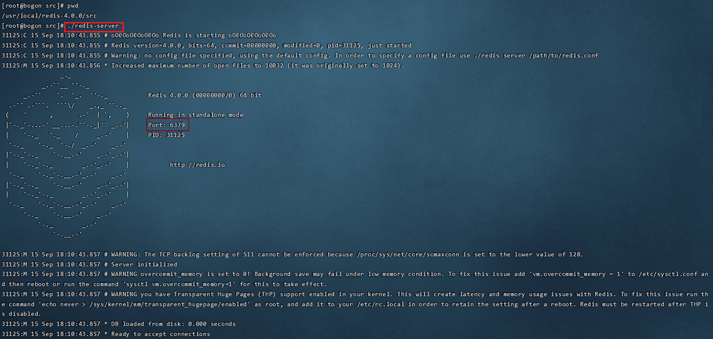
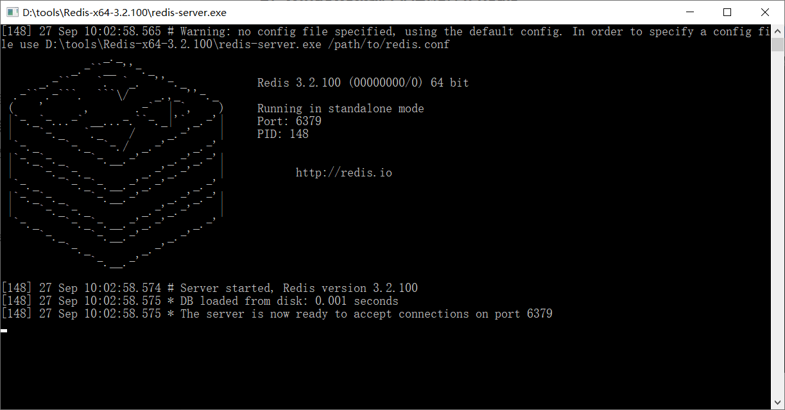
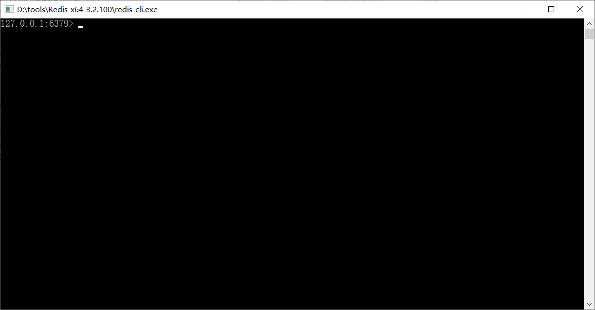
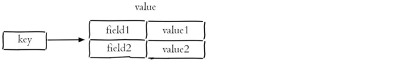
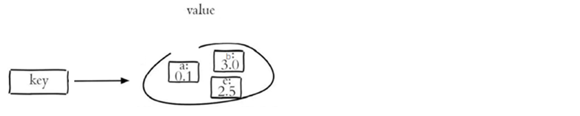

# Redis基础

## 内容

- Redis入门
- Redis数据类型
- Redis常用命令

## 1. 前言

### 1.1 什么是Redis

Redis是一个基于**内存**的key-value结构数据库。Redis 是互联网技术领域使用最为广泛的存储中间件，它是「**Re**mote **Di**ctionary **S**ervice」的首字母缩写，也就是「远程字典服务」。

- [ ] 基于内存存储，读写性能高

- [ ] 适合存储热点数据（热点商品、资讯、新闻）

- [ ] 企业应用广泛

### 1.2 使用Redis能做什么

- 数据缓存
- 消息队列
- 注册中心
- 发布订阅

## 2. Redis入门

### 2.1 Redis简介

Redis is an open source (BSD licensed), in-memory data structure store, used as a database, cache, and message broker. 翻译为：Redis是一个开源的内存中的数据结构存储系统，它可以用作：数据库、缓存和消息中间件。

官网：[https://redis.io](https://redis.io/)

Redis是用C语言开发的一个开源的高性能键值对(key-value)数据库，官方提供的数据是可以达到100000+的QPS（每秒内查询次数）。它存储的value类型比较丰富，也被称为结构化的NoSql数据库。

NoSql（Not Only SQL），不仅仅是SQL，泛指**非关系型数据库**。NoSql数据库并不是要取代关系型数据库，而是关系型数据库的补充。

关系型数据库(RDBMS)：

- Mysql
- Oracle
- DB2
- SQLServer

非关系型数据库(NoSql)：

- Redis
- Mongo db
- MemCached

### 2.2 Redis下载与安装

#### 2.2.1 Redis下载

Redis安装包分为windows版和Linux版：

- Windows版下载地址：https://github.com/microsoftarchive/redis/releases
- Linux版下载地址： https://download.redis.io/releases/ 

下载后得到下面安装包：

#### 2.2.2 Redis安装

**1）在Linux中安装Redis**

在Linux系统安装Redis步骤：

1. 将Redis安装包上传到Linux
2. 解压安装包，命令：==tar -zxvf redis-4.0.0.tar.gz -C /usr/local==
3. 安装Redis的依赖环境gcc，命令：==yum install gcc-c++==
4. 进入/usr/local/redis-4.0.0，进行编译，命令：==make==
5. 进入redis的src目录进行安装，命令：==make install==

安装后重点文件说明：

> /usr/local/redis-4.0.0/src/redis-server：Redis服务启动脚本
>
> /usr/local/redis-4.0.0/src/redis-cli：Redis客户端脚本
>
> /usr/local/redis-4.0.0/redis.conf：Redis配置文件

**2）在Windows中安装Redis**

Redis的Windows版属于绿色软件，直接解压即可使用，解压后目录结构如下：

### 2.3 Redis服务启动与停止

**1）Linux系统中启动和停止Redis**

执行Redis服务启动脚本文件==redis-server==：

通过启动日志可以看到，Redis默认端口号为==6379==。

==Ctrl + C==停止Redis服务

通过==redis-cli==可以连接到本地的Redis服务，默认情况下不需要认证即可连接成功。

退出客户端可以输入==exit==或者==quit==命令。

**2）Windows系统中启动和停止Redis**

Windows系统中启动Redis，直接双击redis-server.exe即可启动Redis服务，redis服务默认端口号为6379

==Ctrl + C==停止Redis服务

双击==redis-cli.exe==即可启动Redis客户端，默认连接的是本地的Redis服务，而且不需要认证即可连接成功。

退出客户端可以输入==exit==或者==quit==命令。

### 2.4 Redis配置文件

前面我们已经启动了Redis服务，默认情况下Redis启动后是在前台运行，而且客户端不需要密码就可以连接到Redis服务。如果我们希望Redis服务启动后是在后台运行，同时希望客户端认证通过后才能连接到Redis服务，应该如果做呢？

此时就需要修改Redis的配置文件：

- Linux系统中Redis配置文件：REDIS_HOME/redis.conf
- Windows系统中Redis配置文件：REDIS_HOME/redis.windows.conf

**通过修改Redis配置文件可以进行如下配置：**

**1）**设置Redis服务后台运行

​	将配置文件中的==daemonize==配置项改为yes，默认值为no。

​	注意：Windows版的Redis不支持后台运行。

**2）**设置Redis服务密码

​	将配置文件中的 ==# requirepass foobared== 配置项取消注释，默认为注释状态。foobared为密码，可以根据情况自己指定。

**3）**设置允许客户端远程连接Redis服务

​	Redis服务默认只能客户端本地连接，不允许客户端远程连接。将配置文件中的 ==bind 127.0.0.1== 配置项注释掉。

**解释说明：**

> Redis配置文件中 ==#== 表示注释
>
> Redis配置文件中的配置项前面不能有空格，需要顶格写
>
> daemonize：用来指定redis是否要用守护线程的方式启动，设置成yes时，代表开启守护进程模式。在该模式下，redis会在后台运行
>
> requirepass：设置Redis的连接密码
>
> bind：如果指定了bind，则说明只允许来自指定网卡的Redis请求。如果没有指定，就说明可以接受来自任意一个网卡的Redis请求。

**注意**：修改配置文件后需要重启Redis服务配置才能生效，并且启动Redis服务时需要显示的指定配置文件：

1）Linux中启动Redis服务

~~~
# 进入Redis安装目录
cd /usr/local/redis-4.0.0
# 启动Redis服务，指定使用的配置文件
./src/redis-server ./redis.conf
~~~

2）Windows中启动Redis服务

由于Redis配置文件中开启了认证校验，即客户端连接时需要提供密码，此时客户端连接方式变为：

**解释说明：**

> -h：指定连接的Redis服务的ip地址
>
> -p：指定连接的Redis服务的端口号
>
> -a：指定连接的Redis服务的密码

## 3. Redis数据类型

### 3.1 介绍

Redis存储的是key-value结构的数据，其中key是字符串类型，value有5种常用的数据类型：

- 字符串 string
- 哈希 hash
- 列表 list
- 集合 set
- 有序集合 sorted set / zset

### 3.2 Redis 5种常用数据类型

**解释说明：**

> 字符串(string)：普通字符串，常用
>
> 哈希(hash)：适合存储对象
>
> 列表(list)：按照插入顺序排序，可以有重复元素
>
> 集合(set)：无序集合，没有重复元素
>
> 有序集合(sorted set / zset)：集合中每个元素关联一个分数（score），根据分数升序排序，没有重复元素

## 4. Redis常用命令

### 4.1 字符串string操作命令

Redis 中字符串类型常用命令：

- **SET** key value 					         设置指定key的值
- **GET** key                                        获取指定key的值
- **SETEX** key seconds value         设置指定key的值，并将 key 的过期时间设为 seconds 秒
- **SETNX** key value 只有在 key    不存在时设置 key 的值

更多命令可以参考Redis中文网：https://www.redis.net.cn

### 4.2 哈希hash操作命令

Redis hash 是一个string类型的 field 和 value 的映射表，hash特别适合用于存储对象，常用命令：

- **HSET** key field value             将哈希表 key 中的字段 field 的值设为 value
- **HGET** key field                       获取存储在哈希表中指定字段的值
- **HDEL** key field                       删除存储在哈希表中的指定字段
- **HKEYS** key                              获取哈希表中所有字段
- **HVALS** key                              获取哈希表中所有值
- **HGETALL** key                         获取在哈希表中指定 key 的所有字段和值

### 4.3 列表list操作命令

Redis 列表是简单的字符串列表，按照插入顺序排序，常用命令：

- **LPUSH** key value1 [value2]         将一个或多个值插入到列表头部
- **LRANGE** key start stop                获取列表指定范围内的元素
- **RPOP** key                                       移除并获取列表最后一个元素
- **LLEN** key                                        获取列表长度
- **BRPOP** key1 [key2 ] timeout       移出并获取列表的最后一个元素， 如果列表没有元素会阻塞列表直到等待超    时或发现可弹出元素为止

### 4.4 集合set操作命令

Redis set 是string类型的无序集合。集合成员是唯一的，这就意味着集合中不能出现重复的数据，常用命令：

- **SADD** key member1 [member2]            向集合添加一个或多个成员
- **SMEMBERS** key                                         返回集合中的所有成员
- **SCARD** key                                                  获取集合的成员数
- **SINTER** key1 [key2]                                   返回给定所有集合的交集
- **SUNION** key1 [key2]                                 返回所有给定集合的并集
- **SDIFF** key1 [key2]                                      返回给定所有集合的差集
- **SREM** key member1 [member2]            移除集合中一个或多个成员

### 4.5 有序集合sorted set操作命令

Redis sorted set 有序集合是 string 类型元素的集合，且不允许重复的成员。每个元素都会关联一个double类型的分数(score) 。redis正是通过分数来为集合中的成员进行从小到大排序。有序集合的成员是唯一的，但分数却可以重复。

常用命令：

- **ZADD** key score1 member1 [score2 member2]     向有序集合添加一个或多个成员，或者更新已存在成员的 分数
- **ZRANGE** key start stop [WITHSCORES]                     通过索引区间返回有序集合中指定区间内的成员
- **ZINCRBY** key increment member                              有序集合中对指定成员的分数加上增量 increment
- **ZREM** key member [member ...]                                移除有序集合中的一个或多个成员

### 4.6 通用命令

Redis中的通用命令，主要是针对key进行操作的相关命令：

- **KEYS** pattern  查找所有符合给定模式( pattern)的 key 
- **EXISTS** key  检查给定 key 是否存在
- **TYPE** key  返回 key 所储存的值的类型
- **TTL** key  返回给定 key 的剩余生存时间(TTL, time to live)，以秒为单位
- **DEL** key  该命令用于在 key 存在是删除 key

