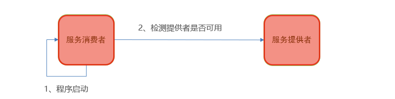

## 1、Dubbo的前世今生

2011年10月27日，阿里巴巴开源了自己的SOA服务化治理方案的核心框架Dubbo，服务治理和SOA的设计理念开始逐渐在国内软件行业中落地，并被广泛应用。

* 早期版本的dubbo遵循SOA的思想，是面向服务架构的重要组件。

* 如今版本的Dubbo作为Spring Cloud的二进制通信方案来发挥Dubbo的性能优势

## 2、Dubbo的快速入门

### 2.1、Dubbo的基本架构


节点角色说明：

| 节点     | 角色说明                                 |
| -------- | ---------------------------------------- |
| Provider | 暴露服务的服务提供方。                   |
| Consumer | 调用远程服务的服务消费方。               |
| Registry | 服务注册与发现的注册中心。               |
| Monitor  | 统计服务的调用次数和调用时间的监控中心。 |

调用关系说明：

1. 服务容器负责启动，加载，运行服务提供者。
2. 服务提供者在启动时，向注册中心注册自己提供的服务。
3. 服务消费者在启动时，向注册中心订阅自己所需的服务。
4. 注册中心返回服务提供者地址列表给消费者，如果有变更，注册中心将基于长连接推送变更数据给消费者。
5. 服务消费者，从提供者地址列表中，基于软负载均衡算法，选一台提供者进行调用，如果调用失败，再选另一台调用。
6. 服务消费者和提供者，在内存中累计调用次数和调用时间，定时每分钟发送一次统计数据到监控中心。

### 2.2、Nacos

[Nacos](https://nacos.io/)是阿里巴巴的产品，是一个集服务发现，配置管理的平台，在国内受欢迎程度较高。


1、找到今日资料中的nacos安装包


2、解压到没有中文和特殊字符的目录

3、进入bin目录，执行启动命令

```shell
#进入bin目录
cd bin
#启动
startup.cmd -m standalone

```

4、浏览器查看：http://127.0.0.1:8848/nacos

### 2.3、管理后台

[DubboAdmin](https://github.com/apache/dubbo-admin)是阿里巴巴管理提供的管理控制台，可以实现服务查询，详情展示,服务测试等功能。借由DubboAdmin可以更好的帮助开发人员对服务进行管理和监控

```shell
#1、下载代码: 
git clone https://github.com/apache/dubbo-admin.git
#2、在 dubbo-admin-server/src/main/resources/application.properties中指定注册中心地址
#3、构建
mvn clean package -D maven.test.skip=true
#4、启动
mvn --projects dubbo-admin-server spring-boot:run
#或者
cd dubbo-admin-distribution/target; java -jar dubbo-admin-0.1.jar
#5、访问 http://localhost:8080

```

### 2.4、入门案例

需求：使用Dubbo构建分布式架构，完成根据用户id查询用户


#### 2.4.1、服务提供者

##### 搭建环境

（1）创建user-provider模块导入依赖

```xml
<dependencies>
    <dependency>
        <groupId>org.projectlombok</groupId>
        <artifactId>lombok</artifactId>
    </dependency>
    <dependency>
        <groupId>org.springframework.boot</groupId>
        <artifactId>spring-boot-starter-web</artifactId>
    </dependency>
    <dependency>
        <groupId>mysql</groupId>
        <artifactId>mysql-connector-java</artifactId>
    </dependency>
    <!--mybatis-->
    <dependency>
        <groupId>org.mybatis.spring.boot</groupId>
        <artifactId>mybatis-spring-boot-starter</artifactId>
    </dependency>

    <!--dubbo的起步依赖-->
    <dependency>
        <groupId>org.apache.dubbo</groupId>
        <artifactId>dubbo-spring-boot-starter</artifactId>
        <version>2.7.8</version>
    </dependency>

    <dependency>
        <groupId>org.apache.dubbo</groupId>
        <artifactId>dubbo-registry-nacos</artifactId>
        <version>2.7.8</version>
    </dependency>
</dependencies>
```

（2）编写引导类

```java
package cn.itcast.user;

import org.mybatis.spring.annotation.MapperScan;
import org.springframework.boot.SpringApplication;
import org.springframework.boot.autoconfigure.SpringBootApplication;

@MapperScan("cn.itcast.user.mapper")
@SpringBootApplication
public class UserProviderApplication {

    public static void main(String[] args) {
        SpringApplication.run(UserProviderApplication.class, args);
    }

}
```

##### 代码实现

（1）UserServiceImpl

```java
package cn.itcast.user.service;


import cn.itcast.user.api.UserService;
import cn.itcast.user.domain.User;
import cn.itcast.user.mapper.UserMapper;
import org.apache.dubbo.config.annotation.DubboService;
import org.springframework.beans.factory.annotation.Autowired;

@DubboService
public class UserServiceImpl implements UserService {

    @Autowired
    private UserMapper userMapper;

	//根据id查询用户名称
    public String queryUsername(Long id) {
        return userMapper.findById(id).getUsername();
    }
}
```

##### 配置文件

```yml
server:
  port: 18081
spring:
  datasource:
    url: jdbc:mysql://localhost:3306/dubbo-demo?useSSL=false
    username: root
    password: root
    driver-class-name: com.mysql.jdbc.Driver
  application:
    name: user-provider
logging:
  level:
    cn.itcast: debug
  pattern:
    dateformat: HH:mm:ss:SSS
dubbo:
  protocol:
    name: dubbo
    port: 20881
  registry:
    address: nacos://127.0.0.1:8848
  scan:
    base-packages: cn.itcast.user.service
```

#### 2.4.2、服务消费者

##### 搭建环境

（1）创建user-consumer模块导入依赖

```xml
<dependencies>
    <dependency>
        <groupId>org.projectlombok</groupId>
        <artifactId>lombok</artifactId>
    </dependency>
    <dependency>
        <groupId>org.springframework.boot</groupId>
        <artifactId>spring-boot-starter-web</artifactId>
    </dependency>


    <!--dubbo的起步依赖-->
    <dependency>
        <groupId>org.apache.dubbo</groupId>
        <artifactId>dubbo-spring-boot-starter</artifactId>
        <version>2.7.8</version>
    </dependency>

    <dependency>
        <groupId>org.apache.dubbo</groupId>
        <artifactId>dubbo-registry-nacos</artifactId>
        <version>2.7.8</version>
    </dependency>
</dependencies>
```

（2）配置引导类

```java
package cn.itcast.user;

import org.springframework.boot.SpringApplication;
import org.springframework.boot.autoconfigure.SpringBootApplication;


@SpringBootApplication
public class UserConsumerApplication {

    public static void main(String[] args) {
        SpringApplication.run(UserConsumerApplication.class, args);
    }
}
```

##### 代码实现

```java
package cn.itcast.user.controller;


import cn.itcast.user.api.UserService;
import cn.itcast.user.domain.User;
import lombok.extern.slf4j.Slf4j;
import org.apache.dubbo.config.annotation.DubboReference;
import org.springframework.web.bind.annotation.GetMapping;
import org.springframework.web.bind.annotation.PathVariable;
import org.springframework.web.bind.annotation.RequestMapping;
import org.springframework.web.bind.annotation.RestController;

@Slf4j
@RestController
@RequestMapping("/user")
public class UserController {

    //引用远程服务
    @DubboReference
    private UserService userService;

    @GetMapping("/username/1")
    public String findUserName(@PathVariable("id") Long id) {
        return userService.queryUsername(id);
    }
}
```

##### 配置文件

```yml
server:
  port: 18080
spring:
  application:
    name: user-consumer
logging:
  level:
    cn.itcast: debug
  pattern:
    dateformat: HH:mm:ss:SSS
dubbo:
  registry:
    address: nacos://127.0.0.1:8848
```

### 2.5、代码优化

将接口抽取为独立模块，并且把接口有关的domain都放到这个模块中

（1）创建user-api模块引入依赖

（2）将UserService接口和User对象导入user-api模块下

（3）User对象实现序列化接口

```java
package cn.itcast.user.domain;

import lombok.Data;

import java.io.Serializable;

@Data
public class User implements Serializable {
    private Long id;
    private String username;
    private String address;
}
```

## 3、Dubbo高级特性

### 3.2、超时与重试

服务消费者在调用服务提供者的时候发生了阻塞、等待的情形，这个时候，服务消费者会一直等待下去。

在某个峰值时刻，大量的请求都在同时请求服务消费者，会造成线程的大量堆积，势必会造成雪崩。

* dubbo 利用超时机制来解决这个问题（使用timeout属性配置超时时间，默认值1000，单位毫秒）
* 若超时时间较短，当网络波动时请求就会失败，Dubbo通过重试机制避免此类问题的发生

user-consumer模块中添加配置信息

```yml
dubbo:
  registry:
    address: nacos://127.0.0.1:8848
  consumer:
    timeout: 3000
    retries: 0
```

### 3.3、启动检查

为了保障服务的正常可用，Dubbo 缺省会在启动时检查依赖的服务是否可用，不可用时会抛出异常



在正式环境这是很有必要的一项配置，可以保证整个调用链路的平稳运行

在开发时，往往会存在没有提供者的情况。由于启动检查的原因，可能导致开发测试出现问题

可以通过check=false关闭

user-consumer模块中添加配置信息

```yml
dubbo:
  registry:
    address: nacos://127.0.0.1:8848
  consumer:
    check: false
```

### 3.4、多版本

灰度发布：当出现新功能时，会让一部分用户先使用新功能，用户反馈没问题时，再将所有用户迁移到新功能。

Dubbo提供了提供者多版本的支持，平滑处理项目功能升级部署

（1）user-provider定义新的服务实现类UserServiceImpl2，指定版本

```java
@DubboService(version = “2.0.0”)
public class UserServiceImpl2 implements UserService {
    …………
}

```

（2）user-consumer消费者调用时，指定版本调用

```java
@RestController
@RequestMapping("/user")
public class UserController {
    //引用远程服务
    @DubboReference(version = "2.0.0")
    private UserService userService;    
    ………
}

```

### 3.5、负载均衡

在集群部署时，Dubbo提供了4种负载均衡策略，帮助消费者找到最优提供者并调用

* Random ：按权重随机，默认值。按权重设置随机概率。

* RoundRobin ：按权重轮询

* LeastActive：最少活跃调用数，相同活跃数的随机。

* ConsistentHash：一致性 Hash，相同参数的请求总是发到同一提供者。

```java
@RestController
@RequestMapping("/user")
public class UserController {
    //引用远程服务
    @DubboReference(loadbalance = "roundrobin")
    private UserService userService;
}
```

## 4、SpringCloud整合Dubbo

通常来说，RPC协议比REST具有更好的性能。很多开发人员希望享受Spring Cloud的生态，同时有兼顾PRC的效率的效率。SpringCloud Alibaba很好的解决了这个问题。

### 4.1、功能概述

将Dubbo集成至SpringCloud主要是替换Ribbo或者Feign实现远程调用。加入Dubbo后，整体的架构如下：


### 4.2、入门案例

#### 4.2.1、抽取接口

定义接口模块dubbo-api，并将UserService接口抽取到此模块下

```java
package cn.itcast.dubbo.api;


import cn.itcast.dubbo.domain.User;

public interface UserService {

    User queryById(Long id);
}

```

#### 4.2.2、项目依赖

父工程加入SpringCloud Alibaba依赖

```xml
<dependency>
    <groupId>com.alibaba.cloud</groupId>
    <artifactId>spring-cloud-alibaba-dependencies</artifactId>
    <version>2.2.5.RELEASE</version>
    <type>pom</type>
    <scope>import</scope>
</dependency>
```

消费者和提供者引入nacos注册中心和Dubbo依赖

```xml
<!--nacos注册中心的依赖-->
<dependency>
    <groupId>com.alibaba.cloud</groupId>
    <artifactId>spring-cloud-starter-alibaba-nacos-discovery</artifactId>
</dependency>

<!--springcloud alibaba dubbo依赖   -->
<dependency>
    <groupId>com.alibaba.cloud</groupId>
    <artifactId>spring-cloud-starter-dubbo</artifactId>
</dependency>

<dependency>
    <groupId>cn.itcast</groupId>
    <artifactId>dubbo-api</artifactId>
    <version>1.0-SNAPSHOT</version>
</dependency>

```

#### 4.2.3、服务提供者

修改UserService实现UserApi接口。并使用@DubboService注解替换@Service对外暴露dubbo服务

```java
package cn.itcast.user.service;

import cn.itcast.dubbo.api.UserService;
import cn.itcast.dubbo.domain.User;
import cn.itcast.user.mapper.UserMapper;
import org.apache.dubbo.config.annotation.DubboService;
import org.springframework.beans.factory.annotation.Autowired;

@DubboService
public class UserServiceImpl implements UserService {

    @Autowired
    private UserMapper userMapper;

    public User queryById(Long id) {
        return userMapper.findById(id);
    }
}
```

在application.yml中添加配置

```yml
spring:
  datasource:
    url: jdbc:mysql://localhost:3306/dubbo-demo?useSSL=false
    username: root
    password: root
    driver-class-name: com.mysql.jdbc.Driver
  application:
    name: user-service
  cloud:
    nacos:
      discovery:
        server-addr: localhost:8848
#配置dubbo，注册中心，暴露的端口和协议，dubbo注解的包扫描
dubbo:
  protocol:
    name: dubbo
    port: 20881
  registry:
    address: spring-cloud://localhost   #使用SpringCloud中的注册中心
  scan:
    base-packages: cn.itcast.user.service  #dubbo中包扫描
```

#### 4.2.4、服务消费者

在OrderController中引入dubbo服务。调用UserService查询用户

```java
package cn.itcast.order.controller;

import cn.itcast.dubbo.api.UserService;
import cn.itcast.dubbo.domain.Order;
import cn.itcast.dubbo.domain.User;
import cn.itcast.order.service.OrderService;
import org.apache.dubbo.config.annotation.DubboReference;
import org.springframework.beans.factory.annotation.Autowired;
import org.springframework.web.bind.annotation.GetMapping;
import org.springframework.web.bind.annotation.PathVariable;
import org.springframework.web.bind.annotation.RequestMapping;
import org.springframework.web.bind.annotation.RestController;

@RestController
@RequestMapping("order")
public class OrderController {

    @Autowired
    private OrderService orderService;

    @DubboReference
    private UserService userService;

    @GetMapping("{orderId}")
    public Order queryOrderByUserId(@PathVariable("orderId") Long orderId) {
        //根据id查询订单
        Order order = orderService.queryOrderById(orderId);
        //获取用户id
        Long userId = order.getUserId();
        //查询用户
        User user = userService.queryById(userId);
        //设置用户对象
        order.setUser(user);
        // 根据id查询订单并返回
        return order;
    }
}
```

在Order-service的模块中添加dubbo配置

```yml
spring:
  application:
    name: order-service
  cloud:
    nacos:
      discovery:
        server-addr: localhost:8848
#dubbo配置
dubbo:
  registry:
    address: spring-cloud://localhost  #使用cloud的注册中心
  consumer:
    check: false   #dubbo默认有启动检查
    retries: 0     #dubbo内置的重试机制
```